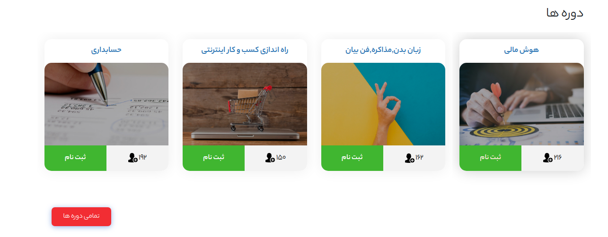
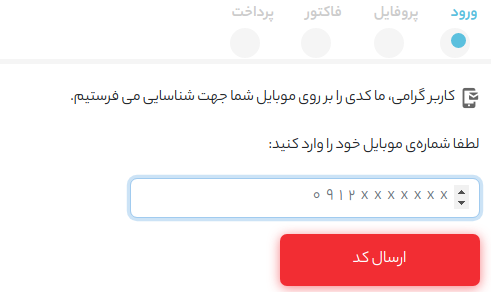
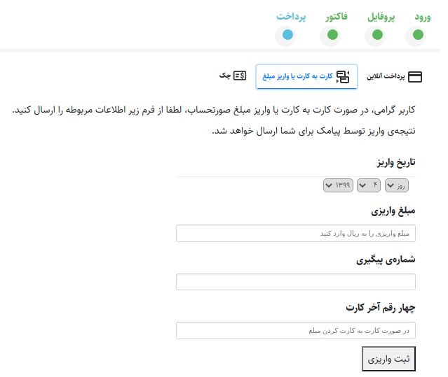
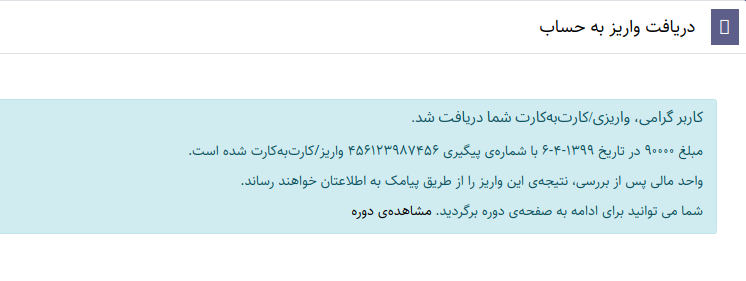
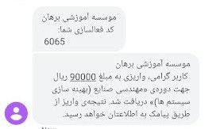

* [تراکنش](#تراکنش)

    * [آنلاین](#آنلاین)
    * [کارت به کارت](#کارت-به-کارت)
    * [چک](#چک)

* [صورتحساب](#صورتحساب)
* [کد تخفیف](#کد-تخفیف)

#### تراکنش  
پس از آنکه کاربران از سامانه خرید انجام می دهند رسید پرداخت آنها به صورت تراکنش در پنل کاربری ثبت می شود.
 تراکنش هادر سامانه مهر به سه شکل قابل انجام است:
چک،آنلاین،کارت به کارت.
وضعیت تراکنش هایی که در هریک از سه حالت ذکر شده انجام می شوند می تواند موفق،ناموفق،در انتظار تکمیل و لغو شده باشد.

در ادامه با انواع تراکنش ها،نحوه ایجاد و وضعیت هریک از آنها آشنا می شوید. سپس می توانید دیگر امکانات این بخش یعنی عملیات ها،ویرایش،فیلتر و حذف را مشاهده نمایید.

  

[بالا↑](#)

*****

#### انواع تراکنش ها 

##### آنلاین
۱. برای خرید دوره موردنظر ،ابتدا روی گزینه ثبت نام کلیک می کنیم

۲. .در انتهای صفحه باز شده گزینه خرید را انتخاب می کنیم

۳. در قسمت(ورود)، شماره موبایل را وارد می کنیم.

۴. کد فعالسازی که ارسال شده است در فیلد موردنظر وارد می کینم

۵. در قسمت(پروفایل)، اطلاعات خواسته شده را وارد می کنیم.

۶. در قسمت(فاکتور) جزئيات صورتحساب را بررسی کرده و در صورت تأیید گزینه ادامه را انتخاب می کنیم.

۷. .در قسمت (پرداخت)، نحوه پرداخت را انتخاب می کنیم. در حالت آنلاین روی درگاه بانکی مورد نظر کلیک می کنیم.

۸. در درگاه پرداختی اطلاعات خواسته شده را وارد میکنیم.

۹. در انتها نتیجه تراکنش را مشاهده خواهید کرد و با انتخاب (مشاهده دوره) به صفحه دوره مورد نظر دسترسی خواهید یافت.

#####   وضعیت تراکنش های آنلاین
**تکمیل نشده:**

تراکنش های آنلاینی که به صورت کامل انجام نمی شوند در قسمت وضعیت تکمیل نشده ثبت می شوند.

**موفق :**

وضعیت تراکنش های آنلاینی که با موفقیت انجام می شوند"موفق" ثبت می شود.

صورتحسابی که برای این تراکنش ها ایجاد می شود هم "تکمیل شده" ثبت می شود. 
 
**ناموفق:**

در این نوع از تراکنش ها کاربر به دوره دسترسی نخواهند داشت و فقط در صورتی که تراکنش دیگری با وضعیت موفق انجام دهد صورتحساب این خرید تکمیل شده خواهد بود.

><i class='fas fa-exclamation-triangle' style='font-size:20px;color:gray;margin-left:15px'></i>
> پس از تکمیل خریدهای آنلاین نتیجه این تراکنش از طریق پیامک و ایمیل برای کاربران ارسال می شود.

[بالا↑](#)

##### عملیات
##### دانلود اکسل 

برای دانلود تراکنش ها به صورت اکسل تراکنش های موردنظرتان را انتخاب و از باکس عملیات گزینه دانلود اکسل را بزنید.
در صورتی که می خواهید کاربر به محصول موردنظر دسترسی یابد باید وضعیت صورتحساب را هم تغییر دهید. در ادامه می توانید روش تغییر وضعیت صورتحساب ها را هم ببینید.

درصورتی که می خواهید کاربر به محصول دسترسی داشته باشد به بخش صورتحساب رفته و وضعیت صورتحساب کاربر را به تکمیل شده تغییر دهید.
نتیجه تغییر وضعیت صورتحساب به تکمیل شده برای کاربران پیامک می شود.

******

#### کارت به کارت 
برای خرید کارت به کارت مراحل ۱ تا ۶ مشابه می باشد.

۷. در قسمت پرداخت، نحوه پرداخت را کارت به کارت انتخاب می کنیم و به صفحه زیر منتقل می شویم و اطلاعات لازم را وارد می کنیم.

۸. پس از ثبت، صفحه زیر نمایش داده خواهد شد. در این مرحله اطلاعات وارد شده بررسی خواهد شد و نتیجه از طریق پیامک ارسال می شود.

۹. در تصویر زیر نمونه ای از پیامک های ارسال شده را می بینید.

##### عملیات 

###### تغییر وضعیت 

پس از آنکه تراکنش های کارت به کارت بررسی شدند برای تغییر وضعیت آنها، تراکنش موردنظر را تیک زده و از باکس عملیات ها تغییر وضعیت را انتخاب نمایید.

###### دانلود اکسل

برای دانلود تراکنش ها به صورت اکسل تراکنش های موردنظرتان را انتخاب و از باکس عملیات گزینه دانلود اکسل را بزنید.
در صورتی که می خواهید کاربر به محصول موردنظر دسترسی یابد باید وضعیت صورتحساب را هم تغییر دهید. در ادامه می توانید روش تغییر وضعیت صورتحساب ها را هم ببینید.

 درصورتی که می خواهید کاربر به محصول دسترسی داشته باشد به بخش صورتحساب رفته و وضعیت صورتحساب کاربر را به تکمیل شده تغییر دهید.
نتیجه تغییر وضعیت صورتحساب به تکمیل شده برای کاربران پیامک می شود.

><i class='fas fa-info' style='font-size:20px;color:gray;margin-left:15px'></i>
> در نظر داشته باشید که پس از نمایش هر تراکنش می توانید منابع مرتبط با آن تراکنش را ببینید.عملیات های انجام شده روی هر تراکنش در این بخش قابل مشاهده هستند.

##### وضعیت تراکنش های کارت به کارت 
**درحال تکمیل:**

تراکنش هایی که به صورت کارت به کارت انجام می شوند ابتدا وضعیت “در حال تکمیل” دارند. وضعیت صورتحساب مربوط به این پرداخت ها نیز “در حال بررسی” می باشد.

**موفق:**

پس از آنکه تراکنش تایید شد باید وضعیت تراکنش به “موفق” و وضعیت صورتحساب به “تکمیل شده” تغییر یابند.

**ناموفق:**

 وضعیت تراکنش های تایید نشده کارت به کارت به "ناموفق" تغییر می باند.
 
**لغو شده:**

وضعیت خرید های کارت به کارتی که لغو می شوند به "لغو شده" تغییر می یابند.
 
><i class='fas fa-exclamation-triangle' style='font-size:20px;color:gray;margin-left:15px'></i>
> پس از تغییر وضعیت صورتحساب پیامک به صورت اتوماتیک برای کاربر ارسال می شود.

[بالا↑](#)

********

#### چک 
برای خرید از طریق چک در قسمت پرداخت، گزینه چک را انتخاب می کنیم. سپس اطلاعات چک را وارد می کنیم.

نتیجه بررسی چک نیز در نهایت از طریق پیامک ارسال خواهد شد.
><i class='fas fa-info' style='font-size:20px;color:gray;margin-left:15px'></i>
> پس از تغییر وضعیت تراکنش پیامک نتیجه به صورت اتوماتیک برای کاربر ارسال می شود.

[بالا↑](#)

##### عملیات
###### تغییر وضعیت
اگر اطلاعات چک بررسی و قصد تغییر وضعیت تراکنش را دارید تراکنش موردنظر را انتخاب کنید و از باکس عملیات گزینه تغییر وضعیت را انتخاب نمایید.

###### دانلود اکسل

برای دانلود تراکنش ها به صورت اکسل تراکنش های موردنظرتان را انتخاب و از باکس عملیات گزینه دانلود اکسل را بزنید.
در صورتی که می خواهید کاربر به محصول موردنظر دسترسی یابد باید وضعیت صورتحساب را هم تغییر دهید. در ادامه می توانید روش تغییر وضعیت صورتحساب ها را هم ببینید.

##### وضعیت تراکنش های چک 
**در حال تکمیل:**

تراکنش هایی که به صورت چک ایجاد می شوند ابتدا وضعیت "در حال تکمیل" دارند. وضعیت صورتحساب مربوط به این تراکنش ها نیز "در حال بررسی" می باشد.

**موفق:**

پس از آنکه تراکنش تایید شد وضعیت تراکنش به "موفق" و وضعیت صورتحساب به "تکمیل شده" تغییر می یابند.

**ناموفق:**

در صورتی که این تراکنش مورد تایید حسابدار نبود وضعیت این تراکنش به "ناموفق" تغییر می یابد.

**لغو شده:**
اگر این خرید لغو شد باید وضعیت صورتحساب به "لغو شده" تغییر یابد.

****

#### صورتحساب 
صورتحساب ها فاکتور خرید محصولات وب سایت هستند که با خرید محصول توسط کاربران، ایجاد می شوند.
صورتحساب ها با نام کاربر و آی دی قابل جستجو هستند.

همچنین می توانید هنگام بررسی صورتحساب ها از قابلیت فیلتر بر اساس وضعیت،تاریخ و کد رهگیری پستی استفاده نمایید.

><i class='fas fa-info' style='font-size:20px;color:gray;margin-left:15px'></i>
>با نمایش هر صورتحساب منابع مرتبط با آن قابل مشاهده هستند و می توانید دوره ها، پرداخت ها،عملیات ها و جزئیات صورتحساب را بررسی نمایید.

><i class='fas fa-exclamation-triangle' style='font-size:20px;color:gray;margin-left:15px'></i>
اگر صورتحساب های شما نمایش داده نمی شوند فیلتر وضعیت را تغییر دهید. 

در ادامه به بررسی امکانات این منبع می پردازیم.

 
 
 
[بالا↑](#)

##### ایجاد صورتحساب 
پس از آنکه محصول توسط کاربران خریداری می شود، صورتحساب مربوطه نیز ایجاد می شود. 
صورتحساب ها مطابق تراکنش های انجام شده توسط کاربر در وضعیت های تکمیل شده، در انتظار پرداخت، در حال بررسی، لغو شده و ناموفق ایجاد می شوند.

##### ویرایش 
برای ویرایش هر صورتحساب روی آیکون ویرایش که در تصویر زیر مشخص شده است کلیک کنید. در قسمت ویرایش صورتحساب ها می توانید تغییرات زیر را اعمال کنید:

_ ضمیمه کردن دوره

_ تغییر وضعیت صورتحساب ها

_ دانلود اکسل جزئیات صورتحساب 

##### حذف 
برای حذف صورتحساب ها به صورت جداگانه می توانید از آیکون حذف هر منبع استفاده کنید. همچنین می توانید تعدادی صورتحساب که قصد حذف آنها را دارید انتخاب کنید و روی گزینه حذف کلیک کنید.

##### دانلود اکسل
برای دانلود چند صورتحساب به صورت اکسل ابتدا باید صورتحساب های موردنظرتان را انتخاب نمایید و از باکس عملیات ها "دانلود اکسل" را انتخاب نمایید. 

##### لنز

برای بررسی و مشاهده میزان فروش بر اساس دوره از لنز استفاده نمایید. 

هنگام استفاده از لنز می توانید فیلتر اطلاعات را مطابق نیاز خود تغییر دهید.

##### عملیات 

عملیات های قابل انجام در این منبع مطابق موارد زیر می باشند :

دانلود اکسل:
صورتحساب های موردنظر را انتخاب کرده و از باکس عملیات ها، عملیات موردنظر را انتخاب و دکمه انجام عملیات را انتخاب می کنید.

تغییر وضعیت:
برای تغییر وضعیت صورتحساب ها(مثلا برای تغییر وضعیت صورتحساب های در حال بررسی به تکمیل شده) ،ابتدا صورتحساب های موردنظر را انتخاب کنید و سپس عملیات تغییر وضعیت را انجام دهید.

><i class='fas fa-info' style='font-size:20px;color:gray;margin-left:15px'></i>
>پس از تغییر وضعیت صورتحساب ها به تکمیل شده نتیجه به صورت پیامک برای کاربر ارسال می شود.

کد رهگیری پستی:
پس از ارسال محصول برای فراگیران کد رهگیری پستی به اطلاعات صورتحساب کاربر افزوده می شود. این کد برای بررسی وضعیت مرسوله، به صورت ایمیل و پیامک برای کاربران ارسال می شود.
برای افزودن کد پستی به صورتحساب ها می توانید فیلتر منابع را تغییر دهید و صورتحساب های تکمیل شده که کد پستی ندارند را نمایش دهید.

متن پیام ارسال شده برای کاربران:

نمونه ایمیل ارسال شده برای کاربران:

[بالا↑](#)

*****

##### کد تخفیف

برای ثبت کد تخفیف مطابق تصویر لازم است یک کد تخفیف با استفاده از حروف انگلیسی و اعداد تعریف نمایید .

درنظر داشته باشید که:

* کد تخفیف ها فقط در بازه ی زمانی تعریف شده معتبر هستند و بعد از آن منقضی خواهند شد.
* درصورتی که هنگام تعریف کد تخفیف، هیچ دوره ای را انتخاب نکنید کد تخفیف قابل استفاده نخواهد بود.
* کد تخفیف های تعریف شده باید یکتا باشند.
* مبلغ تخفیف باید به ریال وارد شود.
* امکان ویرایش و حذف  کد تخفیف وجود دارد.

><i class='fas fa-info' style='font-size:20px;color:gray;margin-left:15px'></i>
>  با نمایش هر کد تخفیف می توانید صورتحساب هایی که با احتساب آن کد ثبت شده اند را مشاهده نمایید.

 
کاربران برای استفاده از کد تخفیف باید هنگام ثبت نام آنلاین دوره ها و پیش از پرداخت، کد تخفیف را وارد و اعمال نمایند.

