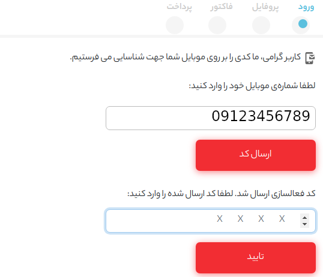
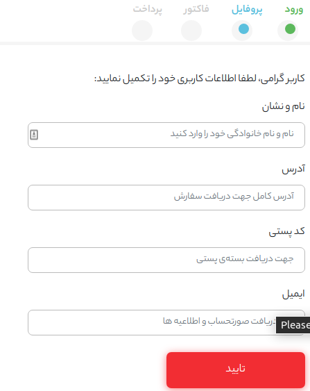
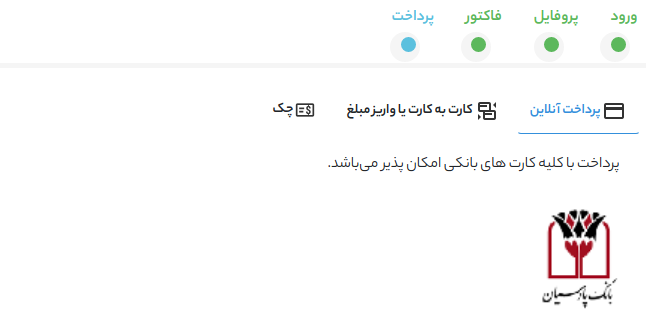

* [تراکنش](#تراکنش)

* [عملیات](#عملیات)

* [انواع تراکنش](#انواع-تراکنش)

     * [آنلاین](#آنلاین)
    
     * [کارت به کارت](#کارت-به-کارت)
    
     * [چک](#چک)
    
* [صورتحساب](#صورتحساب)
     * [عملیات ها](#عملیات-ها)

### تراکنش  
پس از آنکه کاربران از سامانه خرید انجام می دهند رسید پرداخت آنها به صورت تراکنش در پنل کاربری ثبت می شود.
 تراکنش هادر سامانه مهر به سه شکل قابل انجام است:
چک،آنلاین،کارت به کارت.
وضعیت تراکنش هایی که در هریک از سه حالت ذکر شده انجام می شوند می تواند موفق،ناموفق،در انتظار تکمیل و لغو شده باشد.

در ادامه با انواع تراکنش ها،نحوه ایجاد و وضعیت هریک از آنها آشنا می شوید. سپس می توانید دیگر امکانات این بخش یعنی عملیات ها،ویرایش،فیلتر و حذف را مشاهده نمایید.

  

[بالا↑](#)

### انواع تراکنش ها 

#### آنلاین
1. برای خرید دوره موردنظر ،ابتدا روی گزینه ثبت نام کلیک می کنیم

2. .در انتهای صفحه باز شده گزینه خرید را انتخاب می کنیم

3. در قسمت(ورود)، شماره موبایل را وارد می کنیم.

4. کد فعالسازی که ارسال شده است در فیلد موردنظر وارد می کینم

5. در قسمت(پروفایل)، اطلاعات خواسته شده را وارد می کنیم.

6. در قسمت(فاکتور) جزئيات صورتحساب را بررسی کرده و در صورت تأیید گزینه ادامه را انتخاب می کنیم.

7. .در قسمت (پرداخت)، نحوه پرداخت را انتخاب می کنیم. در حالت آنلاین روی درگاه بانکی مورد نظر کلیک می کنیم.

8. در درگاه پرداختی اطلاعات خواسته شده را وارد میکنیم.

9. در انتها نتیجه تراکنش را مشاهده خواهید کرد و با انتخاب (مشاهده دوره) به صفحه دوره مورد نظر دسترسی خواهید یافت.

##### وضعیت تراکنش های آنلاین
**تکمیل نشده:**

تراکنش های آنلاینی که به صورت کامل انجام نمی شوند در قسمت وضعیت تکمیل نشده ثبت می شوند.
برای تراکنش های آنلاینی که تکمیل نشده هستند صورتحساب ایجاد نمی شود.

**موفق :**

وضعیت تراکنش های آنلاینی که با موفقیت انجام می شوند"موفق" ثبت می شود.
صورتحسابی که برای این تراکنش ها ایجاد می شود هم "تکمیل شده" ثبت می شود. 
 
**ناموفق:**

در این نوع از تراکنش ها کاربر به دوره دسترسی نخواهند داشت و فقط در صورتی که تراکنش دیگری با وضعیت موفق انجام دهد صورتحساب این خرید تکمیل شده خواهد بود.

[بالا↑](#)

#### کارت به کارت 
برای خرید کارت به کارت مراحل ۱ تا ۶ مشابه می باشد.

7. در قسمت پرداخت، نحوه پرداخت را کارت به کارت انتخاب می کنیم و به صفحه زیر منتقل می شویم و اطلاعات لازم را وارد می کنیم.

8. پس از ثبت، صفحه زیر نمایش داده خواهد شد. در این مرحله اطلاعات وارد شده بررسی خواهد شد و نتیجه از طریق پیامک ارسال می شود.

9. در تصویر زیر نمونه ای از پیامک های ارسال شده را می بینید.

##### وضعیت تراکنش های کارت به کارت 
**درحال تکمیل:**

تراکنش هایی که به صورت کارت به کارت انجام می شوند ابتدا وضعیت “در حال تکمیل” دارند. وضعیت صورتحساب مربوط به این پرداخت ها نیز “در حال بررسی” می باشد.

**موفق:**

پس از آنکه تراکنش تایید شد باید وضعیت تراکنش به “موفق” و وضعیت صورتحساب به “تکمیل شده” تغییر یابند.

**ناموفق:**

 وضعیت تراکنش های تایید نشده کارت به کارت به "ناموفق" تغییر می باند.
 
**لغو شده:**

وضعیت خرید های کارت به کارتی که لغو می شوند به "لغو شده" تغییر می یابند.
 
> پس از تغییر وضعیت صورتحساب پیامک نتیجه به صورت اتوماتیک برای کاربر ارسال می شود.

[بالا↑](#)

#### چک 
برای خرید از طریق چک در قسمت پرداخت، گزینه چک را انتخاب می کنیم. سپس اطلاعات چک را وارد می کنیم.

نتیجه بررسی چک نیز در نهایت از طریق پیامک ارسال خواهد شد.

> پس از تغییر وضعیت صورتحساب پیامک نتیجه به صورت اتوماتیک برای کاربر ارسال می شود.

[بالا↑](#)

#### وضعیت تراکنش های چک 
**در حال تکمیل:**

تراکنش هایی که به صورت چک ایجاد می شوند ابتدا وضعیت "در حال تکمیل" دارند. وضعیت صورتحساب مربوط به این تراکنش ها نیز "در حال بررسی" می باشد.

**موفق:**

پس از آنکه تراکنش تایید شد وضعیت تراکنش به "موفق" و وضعیت صورتحساب به "تکمیل شده" تغییر می یابند.

**ناموفق:**

در صورتی که این تراکنش مورد تایید حسابدار نبود وضعیت این تراکنش به "ناموفق" تغییر می یابد.

**لغو شده:**
اگر این خرید لغو شد باید وضعیت صورتحساب به "لغو شده" تغییر یابد.

##### عملیات 
 
پس از تیک زدن تراکنش های موردنظر، باکس عملیات ها نمایش داده می شود. عملیات موردنظر را انتخاب و سپس روی انجام عملیات کلیک کنید.

عملیات های قابل انجام در این منبع:

* تغییر وضعیت

### صورتحساب 
فاکتور خرید دوره ها در سامانه صورتحساب ها می‌باشند که در وضعیت‌های مختلف قابل ایجاد و ویرایش هستند. پس از ایجاد صورتحساب دوره های خریداری شده توسط کاربر را میتوان به آن ضمیمه کرد.

در این بخش امکان بررسی وضعیت صورت حساب‌ها وجود دارد.
  توجه داشته باشید که هنگام بررسی صورتحساب ها قابلیت فیلتر نوع صورتحساب ها و تاریخ آن‌ها وجود دارد.
  

 صورتحساب ها می توانند در پنج وضعیت مختلف (تکمیل شده،در حال بررسی،در انتظار پرداخت،لغو شده،ناموفق) ایجاد شوند.

> هنگام بررسی صورتحساب ها نیز می توانید آنها را بر اساس وضعیت فیلتر کنید.
>اگر صورتحساب های شما نمایش داده نمی شوند فیلتر وضعیت را روی همه قرار دهید.
 

[بالا↑](#)

#### جزئیات صورتحساب 
 پس از ایجاد صورتحساب، در صورت نیاز امکان ضمیمه کردن دوره ها و ایجاد پرداخت میباشد.

#### عملیات ها 
دانلود اکسل:
صورتحساب های موردنظر را انتخاب کرده و از باکس عملیات ها، عملیات موردنظر را انتخاب و دکمه انجام عملیات را انتخاب می کنید.

تغییر وضعیت:
برای تغییر وضعیت صورتحساب ها(مثلا برای تغییر وضعیت صورتحساب های در حال بررسی به تکمیل شده) ،ابتدا صورتحساب های موردنظر را انتخاب کنید و سپس عملیات تغییر وضعیت را انجام دهید.

[بالا↑](#)

