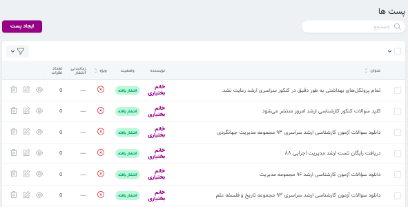

- [دوره](#دوره)

  - [ایجاد دوره جدید](#ایجاد-دوره-جدید)

  - [عملیات ها](#عملیات-ها)

  - [سرفصل](#سرفصل)

  - [اساتید](#اساتید)

  - [مباحث](#مباحث)

  - [آروان](#آروان)

  - [آزمون ها](#آزمون-ها)

- [ کلاس آنلاین](#کلاس-آنلاین)
- [ BigBlueButton](#BigBlueButton)
- [ گروه ها](#گروه-ها)
- [دسته بندی](#دسته-بندی)

- [پست ها](#پست-ها)

- [تگ](#تگ-ها)

- [نظرات](#نظرات)

- [صفحات](#صفحات)

---

#### دوره

محتوای آموزشی این سامانه در قالب دوره ارائه می گردد. هر دوره شامل سرفصل هایی است که مباحث و آزمون ها را دربر دارند. در ادامه با ایجاد دوره، ویرایش دوره، حذف دوره و عملیات های این منبع آشنا می شوید.

> <i class='fas fa-exclamation-triangle' style='font-size:20px;color:gray;margin-left:15px'></i>
> امکان تعریف کد تخفیف برای دوره ها وجود دارد. می توانید در بخش حسابداری درباره کد تخفیف بخوانید. [بیشتر](../accounting/#کد-تخفیف)

##### ایجاد دوره جدید

هنگام ایجاد دوره جدید سه بخش مشخصات، مدیا، سئو، جزئیات باید تکمیل گردند. در قسمت _جزئیات_ نیز زیر هر فیلد توضیحات تکمیلی افزوده شده است. در نظر داشته باشید تنها دوره هایی که تیک "امکان نظر دهی" دارند قابلیت ایجاد دیدگاه را برای کاربران نمایش می دهند. می توانید قسمت [نظرات](#نظرات) را هم مطالعه نمایید.

> <i class='fas fa-exclamation-triangle' style='font-size:20px;color:gray;margin-left:15px'></i>
> توجه کنید نمایش یا عدم نمایش دوره ایجاد شده در وبسایت به وضعیت انتشار آن بستگی دارد.

[بالا↑](#)

###### سئو

کلمه seo معادل عبارت Search Engine Optimization است که به معنی بهینه سازی موتور جستجو است. ایجاد Meta tag یکی از راه های بهبود رويت و ارتباط وب سايت‌ها در نتايج جستجوي طبيعي است.

"description Meta tag"به گوگل و دیگر موتورهای جستجو خلاصه ای از محتوای پیج ارائه می دهد. "description Meta tag" می تواند شامل یک یا دو جمله و حتی یک پاراگراف باشد.

> <i class='fas fa-info' style='font-size:20px;color:gray;margin-left:15px'></i>
> برای تکمیل فیلد اول (تگ) در سئو دوره ها از کلمات کلیدی استفاده نمایید.این قسمت می تواند شامل بیش از یک تگ هم باشد.

> <i class='fas fa-exclamation-triangle' style='font-size:20px;color:gray;margin-left:15px'></i>
> در نوشتن توضیح مختصر(description) از موارد زیر پرهیز نمایید:
>
> نوشتن توصیفی که به محتوای دوره ربطی ندارد
>
> نوشتن توضیحات کلی مثل "این دوره درباره...”

در بخش [تگ](#تگ-ها) می توانید روش ضمیمه کردن دوره و پست به تگ را مشاهده نمایید.

###### مدیا

در قسمت _مدیا_ امکان انتخاب و تغییر تصویر و آواتار مربوط به دوره وجود دارد.

[بالا↑](#)

###### مدرسین

برای افزودن مدرس دوره لازم است ابتدا در بخش کاربران، هر استاد را به عنوان یک کاربر تعریف نمایید. سپس در بخش جزئيات، مشخصات استاد را در متا های مختلف تعریف نمایید.
برای اطلاعات بیشتر درباره متاهای هر قالب به بخش [ قالب ها](../../themes) مراجعه نمایید.

برای مثال دو متا زیر را می توانید مشاهده نمایید:

- avatar:
  برای آپلود تصویر استاد، به مدیریت فایل بروید و تصویر موردنظر را در پوشه (theme) آپلود نمایید.
  سپس لینک تصویر را کپی و مقدار این متا قرار دهید.
- biography:
  این متا مربوط به بیوگرافی استاد می باشد.

در انتها به قسمت مدرس دوره بروید و کاربری که تعریف کرده اید را ضمیمه نمایید.

###### جزئیات

جزئیات هر دوره از جمله ویژه بودن دوره،دسترسی عمومی، امکان نظردهی،لینک خرید دوره، تعداد افراد دوره، حداکثر تعداد مشارکت، تعداد خرید دوباره ... در این بخش مشخص می شوند.

همچنین در قسمت متا می توان جزئیات دیگری برای دوره تعریف نمود.

با استفاده از کلید
capacity می توان ظرفیت باقی مانده دوره را مشخص نمود.

کلید dpeac_id کد قفل دوره می باشد.
برای استفاده از کد قفل دوره های قدیمی لازم است کد قفل دوره ،که یک کد منحصر به فرد برای هر دوره می باشد را در این متا قرار دهید.

کلید future برای تعریف مشاغل مربوط به هر رشته استفاده می شود.

> <i class='fas fa-exclamation-triangle' style='font-size:20px;color:gray;margin-left:15px'></i>
> در نگارش هر متا توجه فرمایید و کلید هر متا را به طور دقیق وارد نمایید.

###### ضمیمه کردن دسته بندی

در بخش دسته بندی ها امکان ضمیمه کردن دسته بندی وجود دارد.

[بالا↑](#)

#### حذف

حذف در این منبع به دو نوع است: حدف قابل برگشت، حذف اجباری
درصورتی که دوره ای را حذف اجباری کنید امکان بازگردانی وجود ندارد. در قسمت ویرایش می توانید دکمه حذف اجباری را ببنید.

#### ویرایش

برای ویرایش دوره ها از صفحه 'خانه' ، وارد سامانه شوید و روی آیکون ویرایش که در مجاورت دوره موردنظرتان وجود دارد کلیک کرده و سپس به صفحه ویرایش دوره منتقل خواهید شد.
همچنین می توانید به پنل بروید و دوره را از طریق پنل ویرایش کنید.

#### عملیات ها

پس از تیک زدن دوره های موردنظر باکس (عملیات) نمایش داده می شود. ابتدا عملیات موردنظر و سپس انجام عملیات را انتخاب کنید.

عملیات های این منبع:

- دانلود اکسل
- تغییر وضعیت
- وارد کردن تگ دوره ها
- وارد کردن دسته بندی دوره ها

[بالا↑](#)

---

#### سرفصل

برای طبقه بندی بهتر محتوای آموزشی هر دوره شامل سرفصل ها(برنامه ریزی آموزشی) می باشد که مباحث و ازمون ها را در بر می گیرند.

###### ایجاد برنامه ریزی آموزشی

پس از ایجاد دوره در قسمت نمایش یک دوره و سپس در بخش **برنامه‌ریزی آموزشی** امکان ایجاد سرفصل ها برای هر دوره امکان‌پذیر میباشد.

دوره /نمایش / برنامه ریزی آموزشی / ایجاد برنامه ریزی آموزشی

> <i class='fas fa-info' style='font-size:20px;color:gray;margin-left:15px'></i>
> در تصویر زیر می توانید نمونه ای از جزئیات یک برنامه ریزی آموزشی (سرفصل) و منابع مرتبط با هر سرفصل (آزمون،مباحث) را ببینید.

> <i class='fas fa-film' style='font-size:20px;color:gray;margin-left:20px'></i>
> در ویدئو زیر می توانید نحوه ایجاد برنامه ریزی آموزشی را ببینید:
>
> [ایجاد برنامه ریزی آموزشی](https://www.aparat.com/v/6f5Av)

###### ضمیمه کردن مبحث

در قسمت نمایش هر برنامه‌ریزی آموزشی امکان ضمیمه کردن مبحث برای آن برنامه‌ریزی آموزشی یا به عبارتی آن سرفصل وجود دارد.
در بخش مباحث نیز می‌توانید [ضمیمه کردن فصل](#ضمیمه-کردن-فصل) (برنامه ریزی آموزشی) را ببنید.

دوره /نمایش / برنامه ریزی آموزشی / نمایش / مبحث

###### ضمیمه کردن آزمون ها

آزمون های موجود در سرفصل را میتوان ویرایش کرد. برای ضمیمه کردن آزمون به سرفصل ها از مسیر زیر اقدام کنید.

دوره / نمایش / برنامه ریزی آموزشی / نمایش / ضمیمه کردن آزمون

###### عملیات

با مشاهده هر سرفصل و انتخاب عملیات مشاهده سرفصل ها می توانید نحوه نمایش سرفصل های یک دوره در داشبورد کاربران را مشاهده نمایید.

[بالا↑](#)

---

#### مباحث

مباحث زیر مجموعه سرفصل ها محسوب می شوند و قابلیت ضمیمه شدن به سرفصل ها را دارند.
در این منبع، مباحث منتشر شده قابل بررسی و ویرایش هستند. همچنین امکان ایجاد مبحث جدید نیز وجود دارد.
در نظر داشته باشید مبحاث نیز امکان نظر دهی دارند و در صورت لزوم باید این قابلیت را فعال کنید.
از باکس جستجو نیز می توانید برای یافتن مباحث مورد نظرتان استفاده کنید.

> <i class='fas fa-film' style='font-size:20px;color:gray;margin-left:20px'></i>
> در ویدئو زیر می توانید نحوه ایجاد مبحث را ببینید:
>
> [ایجاد مبحث](https://www.aparat.com/v/DEB2x)

###### ضمیمه کردن سرفصل

پس از ایجاد مبحث در قسمت نمایش امکان ضمیمه کردن سرفصل ها (برنامه ریزی آموزشی) وجود دارد.

مباحث / نمایش / ضمیمه کردن فصل ها

در بخش برنامه ریزی آموزشی نحوه [ضمیمه کردن مبحث](#ضمیمه-کردن-مبحث) را مشاهده نمودید.

###### شناسه ویدئو آروان

در قسمت مباحث سامانه مهر امکان افزودن شناسه سریال ویدئوهای آروان وجود دارد.
در ادامه نحوه افزودن ویدئو توضیح داده خواهد شد.

[بالا↑](#)

---

#### آروان

برای آپلود ویدئو های هر مبحث در سامانه مهر هنگام ایجاد هر مبحث یا ویرایش آن، روی گزینه انتخاب فایل کلیک کنید و فایل ویدئو موردنظرتان را انتخاب کنید. سپس ایجاد مبحث و یا به روزرسانی مبحث را انتخاب نمایید.

> <i class='fas fa-info' style='font-size:20px;color:gray;margin-left:15px'></i>
> توجه داشته باشید که فرمت های قابل قبول برای ویدئوهای شما avi ، m4v و mp4 هستند.

پس از آپلود شدن ویدئو در آروان می توانید در جزيیات هر مبحث و در قسمت آروان جزئیات ویدئو خود را مشاهده فرمایید.

###### حذف و آپلود مجدد ویدئو

در تصویر مربوط به بخش مباحث مشاهده می کنید که هر مبحث در بخش عملیات شامل آپلود مجدد ویدئو در آروان و حذف ویدئو از آروان می باشد. در صورتی که ویدئوی شما با موفقیت در آروان آپلود نشده است می توانید از عملیات "آپلود مجدد ویدئو در آروان" استفاده نمایید. همچنین اگر قصد حذف ویدئو از پنل آروان را دارید می توانید از عملیات "حذف ویدئو" استفاده نمایید.

> <i class='fas fa-exclamation-triangle' style='font-size:20px;color:gray;margin-left:15px'></i>
> در نظر داشته باشید فرآیند آپلود شدن ویدئو به حجم آن بستگی دارد و ممکن است مدتی طول بکشد؛ به همین دلیل پیشنهاد می شود برای آپلود ویدئوهایی با حجم بالا از اینترنت پر سرعت استفاده نمایید.

> <i class='fas fa-exclamation-triangle' style='font-size:20px;color:gray;margin-left:15px'></i>
> در نظر داشته باشید تنها ویديو هایی که کمتر از 350 مگابایت حجم دارند را می توانید آپلود کنید و ویدئو هایی با حجم بیشتر را باید در چند پارت آپلود نمایید.

##### وضعیت آروان

در بخش وضعیت آروان می توانید ویدئوهای آپلود شده در سامانه را مشاهده و بررسی نمایید. نام هر ویدئو،حجم کل آن بعد از آپلود،وضعیت آپلود و نوع تبدیل آن را می توانید در این بخش مشاهده کنید.

همچنین امکان مشاهده،حذف و دانلود ویدئوها از آروان در این قسمت فراهم شده است.

[بالا↑](#)

---

#### آزمون ها

برای آزمون ها ۵ ویدیو آموزشی تهیه شده است.برای مشاهده بر روی لینک کلیک کنید:

<a href="/mehr-doc/video/1-question_import.mp4" class="video-pop"><i class='ti-video-clapper'></i> وارد کردن سوالات</a>

<a href="/mehr-doc/video/2-question_tag.mp4" class="video-pop"><i class='ti-video-clapper'></i> برچسب زدن سوالات</a>

<a href="/mehr-doc/video/3-quiz_maker.mp4" class="video-pop"><i class='ti-video-clapper'></i> ایجاد آزمون</a>

<a href="/mehr-doc/video/4-quiz_options.mp4" class="video-pop"><i class='ti-video-clapper'></i> تنظیمات آزمون</a>

<a href="/mehr-doc/video/5-quiz_result.mp4" class="video-pop"><i class='ti-video-clapper'></i> نتایج آزمون</a>

[بالا↑](#)

---

####BigBlueButton

برای برگزاری کلاس آنلاین با BigBlueButton ویدیو آموزشی را ببینید.برای مشاهده بر روی لینک کلیک کنید:

<a href="/mehr-doc/video/bbb/1-mehr_bbb_config.mp4" class="video-pop"><i class='ti-video-clapper'></i> تنظیم BigBlueButton</a>

<a href="/mehr-doc/video/bbb/2-mehr_bbb_create.mp4" class="video-pop"><i class='ti-video-clapper'></i> ایجاد کلاس آنلاین</a>

<a href="/mehr-doc/video/bbb/3-mehr_bbb_dispaly.mp4" class="video-pop"><i class='ti-video-clapper'></i> نحوه‌ی نمایش کلاس</a>

<a href="/mehr-doc/video/bbb/4-mehr_bbb_section.mp4" class="video-pop"><i class='ti-video-clapper'></i> استفاده از کلاس در گروه ها</a>

<a href="/mehr-doc/video/bbb/5-mehr_bbb_join.mp4" class="video-pop"><i class='ti-video-clapper'></i> اجرای کلاس آنلاین و حضور و غیاب</a>

[بالا↑](#)

---

#### کلاس آنلاین

لینک برگزاری کلاس های آنلاین را می توانید در این قسمت قرار دهید. این لینک مطابق تصویر زیر در داشبورد کاربران نمایش داده میشود.

---

#### گروه ها

گروه ها شامل اعضای گروه و مباحث یک دوره می باشند. به هر گروه می توانید یک دوره اضافه نموده و سپس مباحث مورد نظر از آن دوره را به گروه اضافه نمایید.
اعضای هر گروه می توانند مباحث افزوده شده به گروه را در پنل کاربری خود مشاهده نمایند.

> <i class='fas fa-info' style='font-size:20px;color:gray;margin-left:15px'></i>
> گروه ها قابلیت فعال و غیرفعال کردن دارند.
>  </i>
> امکان پرینت اعضای گروه به سامانه اضافه شده است.

###### اطلاعیه

برای ارسال اطلاعیه برای کاربران یک گروه به گروه موردنظر رفته و اطلاعیه را در این فیلد نگارش نمایید. این فیلد شامل یک ادیتور نیز می باشد.
تصویر زیر نحوه نمایش اطلاعیه در داشبورد کاربران را نشان می دهد.

---

#### دسته بندی

به وجود آمده است.دسته بندی یکی از امکاناتی است که برای سهولت دسترسی به دوره ها و پست ها و همچنین ایجاد نظم در این بخش ها
در این بخش امکان ویرایش، حذف،نمایش و ایجاد دسته بندی ها وجود دارد. در قسمت منوی اصلی سایت با کلیک روی گزینه دوره می‌توانید دسته بندی های موجود را ببنید.‌‌
برای یافتن پست ها و دوره هایی که به هر دسته بندی ضمیمه شده اند گزینه نمایش دسته بندی را انتخاب نموده و می توانید در قسمت جستجو آن را پیدا کنید.

[بالا↑](#)

###### ایجاد دسته بندی

برای ایجاد دسته بندی تکمیل فیلد عنوان الزامی است. همچنین می‌توانید توضیحاتی برای هر دسته بندی آپلود کنید.
راهنمای استفاده از [ادیتور](system) را میتوانید مشاهده کنید.

##### زیرمجموعه دسته بندی

درصورتی که می خواهید یک دسته بندی زیر مجموعه دسته بندی دیگری باشد. در هنگام ایجاد یا ویرایش آن، برای پر کردن فیلد "زیر مجموعه دسته بندی" ،اصطلاحا دسته بندی مادر را باید انتخاب نمایید.
توجه نمایید که دسته بندی مادر را باید از پیش ایجاد کرده باشید.

برای مثال در دو تصویر زیر می توانید مشاهده نمایید که "مدیریت" زیر مجوعه دسته بندی "دوره های حضوری" است و شامل دوره های "بازرگانی بین الملل"، "مدیریت پروژه" و ... می باشد.

[بالا↑](#)

###### ضمیمه کردن پست و دوره

با نمایش هر دسته بندی امکان افزودن پست و دوره ها به دسته بندی ها می باشد.

---

#### پست ها

در این قسمت میتوان وضعیت پست های منتشر شده را بررسی کرد. همچنین میتوان پست های منتشر
شده را ویرایش و پست جدید ایجاد کرد.
درنظر داشته باشید که پست ها در قسمت وبلاگ نمایش داده می شوند. هر پست در دسته بندی مربوطه نیز قابل نمایش است.
برای آشنایی بیشتر با امکانات پست ها پیشنهاد می شود [سئو](#سئو) ، [مدیا](#مدیا)، [ضمیمه کردن دسته بندی](#ضمیمه-کردن-دسته-بندی) را مطالعه نمایید.

[بالا↑](#)

---

#### تگ ها

در بخش تگ ها امکان نمایش تگ ها و همچنین ایجاد تگ های جدید وجود دارد. در قسمت وبلاگ سایت با کلیک روی تگ های محبوب(در سمت چپ) می‌توانید پست های مربوط به آن تگ را مشاهده کنید.

ایجاد Meta tag یکی از راه های بهبود رويت و ارتباط وب سايت‌ها در نتايج جستجوي طبيعي است.پیشنهاد می شود توضیحات مربوط به [سئو](#سئو) را هم مطالعه نمایید .

پس از نمایش هر تگ دوره ها و پست هایی که به آن تگ ضمیمه شده اند را می توانید ببینید و با نمایش هر دوره یا پست در بخش سئو امکان افزودن توضیحی مختصر از محتوای آن وجود دارد.

###### ضمیمه کردن دوره ها و پست ها

با انتخاب گزینه نمایش هر تگ میتوان پست ها و دوره های مربوط به آن تگ را ضمیمه کرد.

[بالا↑](#)

---

#### نظرات

در این قسمت نظراتی که کاربران برای پست ها و دوره ها ایجاد کرده اند را مشاهده می نمایید.در این بخش امکان تایید و رد نظرات وجود دارد.نظراتی که تایید می شوند در سایت نمایش داده خواهند شد.
توجه کنید که کاربران تنها برای مباحث و دوره هایی که تیک "امکان نظردهی" را دارندمی توانند نظر ارسال کنند.
به بخش جزئیات هنگام ایجاد دوره توجه کنید.

برای پاسخ دادن به نظرات کاربران، لازم است کامنت کاربر موردنظرتان را در فیلد (در پاسخ به کامنت) وارد نمایید.

[بالا↑](#)

---

#### صفحات

صفحات معمولا شامل محتوای ثابت سایت می شوند. در این قسمت میتوان یک صفحه بر حسب نیاز ایجاد کرد. برای مثال: صفحه سؤالت متداول، صفحه اطلاعیه.

##### ایجاد صفحه

برای افزودن صفحه به منوی اصلی، پس از ایجاد صفحه، درخواست موردنظر را به دپارتمان فنی ارسال فرمائید. همچنین میتوان از این صفحات در ادیتور پست ها و دوره ها به عنوان یک لینک استفاده نمود.

> <i class='fas fa-info' style='font-size:20px;color:gray;margin-left:15px'></i>
> درنظر داشته باشید که صفحات نیز قابلیت نظر دهی دارند. ولی امکان دسته بندی کردن ندارند.

[بالا↑](#)
