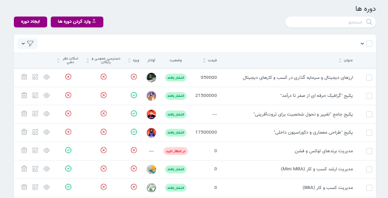
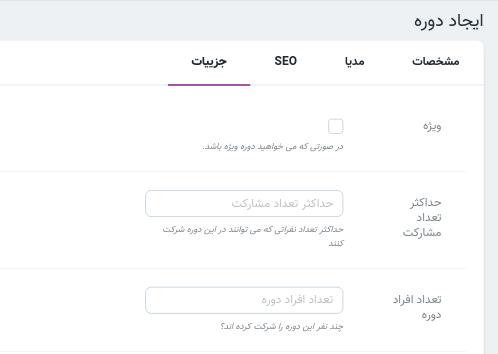
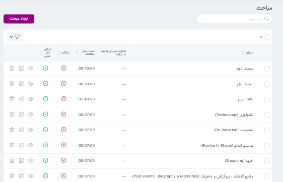
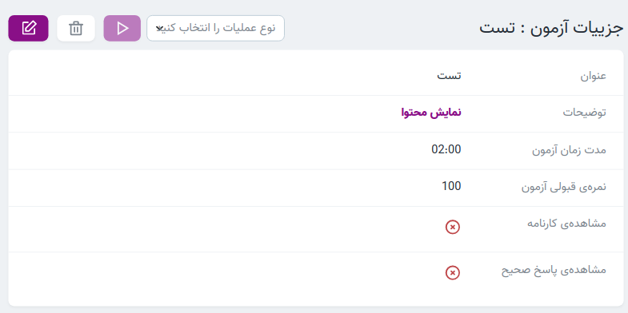
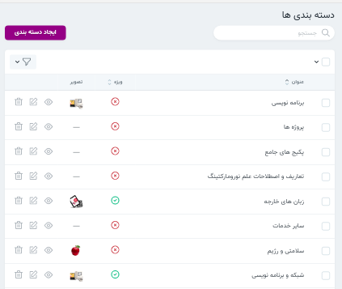

* [دوره](#دوره)

     * [ایجاد دوره جدید](#ایجاد-دوره-جدید)
    
     * [عملیات ها](#عملیات-ها)
    
     * [سرفصل](#سرفصل)

     * [مباحث](#مباحث)

     * [آزمون ها](#آزمون-ها)

    
* [دسته بندی](#دسته-بندی)

* [پست ها](#پست-ها)

* [تگ](#تگ-ها)

* [نظرات](#نظرات)

* [صفحات](#صفحات)

****
#### دوره 
محتوای آموزشی این سامانه در قالب دوره ارائه می گردد. هر دوره شامل سرفصل هایی است که مباحث و آزمون ها را دربر دارند. در ادامه با ایجاد دوره، ویرایش دوره، حذف دوره و عملیات های این منبع آشنا می شوید.

##### ایجاد دوره جدید
هنگام ایجاد دوره جدید سه بخش مشخصات، مدیا، سئو، جزئیات را باید تکمیل گردند. در قسمت *جزئیات* نیز زیر هر فیلد توضیحات تکمیلی افزوده شده است. در نظر داشته باشید تنها دوره هایی که تیک "امکان نظر دهی" دارند قابلیت ایجاد دیدگاه را برای کاربران نمایش می دهند. می توانید قسمت [نظرات](#نظرات) را هم مطالعه نمایید.

><i class='fas fa-exclamation-triangle' style='font-size:20px;color:red;margin-left:15px'></i>
>توجه کنید نمایش یا عدم نمایش دوره ایجاد شده در وبسایت به وضعیت انتشار آن بستگی دارد. 

[بالا↑](#)

######  سئو 
کلمه seo معادل عبارت Search Engine Optimization است که به معنی بهینه سازی موتور جستجو است.  ایجاد Meta tag  یکی از راه های بهبود رويت و ارتباط وب سايت‌ها در نتايج جستجوي طبيعي است.
description Meta tag  .به گوگل و دیگر موتورهای جستجو خلاصه ای از محتوای پیج ارائه می دهد.   description meta tag می تواند شامل یک یا دوجمله و حتی یک پاراگراف باشد.
 

 
 ><i class='fas fa-info' style='font-size:20px;color:red;margin-left:15px'></i>
> برای تکمیل فیلد اول (تگ) در سئو دوره ها از کلمات کلیدی استفاده نمایید.این قسمت می تواند شامل بیش از یک تگ هم باشد. 

 ><i class='fas fa-exclamation-triangle' style='font-size:20px;color:red;margin-left:15px'></i>
> در نوشتن توضیح مختصر(description) از موارد زیر پرهیز نمایید:
>
>   نوشتن توصیفی که به محتوای دوره ربطی ندارد 
>
>نوشتن توضیحات کلی مثل "این دوره درباره..”  

 

 در بخش [تگ](#تگ-ها) می توانید روش ضمیمه کردن دوره و پست به تگ را مشاهده نمایید.

###### مدیا 
در قسمت *مدیا* امکان انتخاب و تغییر تصویر و آواتار مربوط به دوره وجود دارد.

[بالا↑](#)

###### ضمیمه کردن دسته بندی 
همانگونه که ملاحضه نمودید برای دسترسی راحت تر به دوره و طبقه بندی آنها امکان دسته بندی دوره ها وجود دارد. در بخش جزئیات دوره امکان ضمیمه کردن دسته بندی وجود دارد. [ضمیمه کردن دوره](#ضمیمه-کردن-دوره-ها) به دسته بندی را نیز مشاهده نمایید.

[بالا↑](#)

#### حذف 
حذف در این منبع به دو نوع است: حدف قابل برگشت، حذف اجباری
درصورتی که دوره ای را حذف اجباری کنید امکان بازگردانی وجود ندارد. در قسمت ویرایش می توانید دکمه حذف اجباری را ببنید.

#### عملیات ها 
پس از تیک زدن دوره های موردنظر باکس (عملیات) نمایش داده می شود. ابتدا عملیات موردنظر و سپس انجام عملیات را انتخاب کنید.

عملیات های این منبع:
* دانلود اکسل
* تغییر وضعیت
* وارد کردن تگ دوره ها 
* وارد کردن دسته بندی دوره ها 

[بالا↑](#)

****
#### سرفصل 
برای طبقه بندی بهتر محتوای آموزشی هر دوره شامل سرفصل ها(برنامه ریزی آموزشی) می باشد که مباحث و ازمون ها را در بر می گیرند. در ادامه نحوه ایجاد برنامه ریزی آموزشی را مشاهده خواهید کرد.

###### ایجاد برنامه ریزی آموزشی 
پس از ایجاد دوره در قسمت نمایش یک دوره و سپس در بخش **برنامه‌ریزی آموزشی** امکان ایجاد سرفصل ها برای هر دوره امکان‌پذیر میباشد.

دوره /نمایش / برنامه ریزی آموزشی / ایجاد برنامه ریزی آموزشی 

[بالا↑](#)

###### ضمیمه کردن مبحث 
 در قسمت نمایش هر برنامه‌ریزی آموزشی امکان ضمیمه کردن مبحث برای آن برنامه‌ریزی آموزشی یا به عبارتی آن سرفصل وجود دارد.
 در بخش مباحث نیز می‌توانید [ضمیمه کردن فصل](#ضمیمه-کردن-فصل) (برنامه ریزی آموزشی) را ببنید.

دوره /نمایش / برنامه ریزی آموزشی / نمایش / مبحث 

[بالا↑](#)

###### ضمیمه کردن آزمون ها

همچنین آزمون های موجود در سرفصل را میتوان ویرایش کرد. برای ضمیمه کردن آزمون به سرفصل ها از مسیر زیر اقدام کنید.

دوره / نمایش / برنامه ریزی آموزشی / نمایش / ضمیمه کردن آزمون 

[بالا↑](#)
*****

#### مباحث 
مباحث زیر مجموعه سرفصل ها محسوب می شوند و قابلیت ضمیمه شدن به سرفصل ها را دارند.
در این منبع، مباحث منتشر شده  قابل بررسی و ویرایش هستند. همچنین امکان ایجاد مبحث جدید نیز وجود دارد. 
در نظر داشته باشید مبحاث نیز امکان نظر دهی دارند و در صورت لزوم باید این قابلیت را فعال کنید.
از باکس جستجو نیز می توانید برای یافتن مباحث مورد نظرتان استفاده کنید.

[بالا↑](#)

###### ضمیمه کردن فصل 
پس از ایجاد مبحث در قسمت نمایش امکان ضمیمه کردن سرفصل ها (برنامه ریزی آموزشی) وجود دارد.

مباحث / نمایش / ضمیمه کردن فصل ها 

در بخش برنامه ریزی آموزشی نحوه [ضمیمه کردن مبحث](#ضمیمه-کردن-مبحث) را مشاهده نمودید.

[بالا↑](#)
*****

#### آزمون ها 
آزمون زیرمجموعه سرفصل ها محسوب می شوند و همراه با مباحث قابلیت ضمیمه شدن به سرفصل ها را دارند.
در این منبع می توانید آزمون جدید ایجاد کنید. همچنین در قسمت نمایش آزمون امکان ضمیمه کردن سؤالات وجود دارد.

[بالا↑](#)

##### سوالات 

در این قسمت امکان مشاهده سوالات و امکان ایجاد سوال وجود دارد.

[بالا↑](#)

##### ایجاد پاسخ 
پس از اینکه سؤال مورد نظر ایجاد شد در قسمت نمایش سوال بخش پاسخ‌های سؤال را می‌بینید که گزینه های سؤال را میتوانید در آن ایجاد کنید 
توجه داشته باشید که تنها یکی از پاسخ‌ها تیک پاسخ صحیح را باید داشته باشد

 سوالات / نمایش سوال / پاسخ های سوال / ایجاد پاسخ سوال  

[بالا↑](#)

****

#### دسته بندی 
به وجود آمده است.دسته بندی یکی از امکاناتی است که برای سهولت دسترسی به دوره ها و پست ها و همچنین ایجاد نظم در این بخش ها 
در این بخش امکان ویرایش، حذف،نمایش و ایجاد دسته بندی ها وجود دارد. در قسمت منوی اصلی سایت با کلیک روی گزینه دوره می‌توانید دسته بندی های موجود را ببنید.‌‌
برای یافتن پست ها و دوره هایی که به به هر دسته بندی ضمیمه شده اند گزینه نمایش دسته بندی را انتخاب نموده و می توانید در قسمت جستجو آن را پیدا کنید.  

[بالا↑](#)

######  ایجاد دسته بندی 
برای ایجاد دسته بندی تکمیل فیلد عنوان الزامی است. همچنین می‌توانید توضیحاتی برای هر دسته بندی آپلود کنید. 
راهنمای استفاده از  [ادیتور](system) را میتوانید مشاهده کنید.

[بالا↑](#)

###### ضمیمه کردن پست 
در قسمت نمایش هر دسته بندی امکان افزودن پست و دوره ها به دسته بندی ها می باشد.

  در بخش دوره می‌توانید نحوه [ضمیمه کردن دسته بندی](#ضمیمه-کردن-دسته-بندی) را ببنید.

###### ضمیمه کردن دوره 

  در بخش پست ها می‌توانید نحوه [ضمیمه کردن دسته بندی](#پست-ها) را ببنید.

[بالا↑](#)

****

#### پست ها 
  در این قسمت میتوان وضعیت پست های منتشر شده را بررسی کرد. همچنین میتوان پست های منتشر 
  شده را ویرایش و پست جدید ایجاد کرد. 
  درنظر داشته باشید که پست ها در قسمت وبلاگ نمایش داده می شوند. هر پست در دسته بندی مربوطه نیز قابل نمایش است.
برای آشنایی بیشتر با امکانات پست ها پیشنهاد می شود [سئو](#سئو) ، [مدیا](#مدیا)، [ضمیمه کردن دسته بندی](#ضمیمه-کردن-دسته-بندی) را مطالعه نمایید.

[بالا↑](#)

****

#### تگ ها 

در بخش تگ ها امکان نمایش تگ ها و همچنین ایجاد تگ های جدید وجود دارد. در قسمت وبلاگ سایت با کلیک روی تگ های محبوب(در سمت چپ) می‌توانید پست های مربوط به آن تگ را مشاهده کنید.

 ایجاد Meta tag  یکی از راه های بهبود رويت و ارتباط وب سايت‌ها در نتايج جستجوي طبيعي است.پیشنهاد می شود توضیحات مربوط به [سئو](#سئو) را هم مطالعه نمایید .
 
پس از نمایش هر تگ دوره ها و پست هایی که به آن تگ ضمیمه شده اند را می توانید ببینید و با نمایش هر دوره یا پست در بخش سئو امکان افزودن توضیحی مختصر از محتوای آن وجود دارد.

###### ضمیمه کردن دوره ها و پست ها 
 با انتخاب گزینه نمایش هر تگ میتوان پست ها و دوره های مربوط به آن تگ را ضمیمه کرد.

[بالا↑](#)

****

#### نظرات 

 در این قسمت نظراتی که کاربران برای پست ها و دوره ها ایجاد کرده اند را مشاهده می نمایید.در این بخش امکان تایید و رد نظرات وجود دارد.نظراتی که تایید می شوند در سایت نمایش داده خواهند شد.
 توجه کنید که کاربران تنها برای مباحث و دوره هایی که تیک "امکان نظردهی" را دارندمی توانند نظر ارسال کنند.
به بخش جزئیات هنگام ایجاد دوره توجه کنید.

[بالا↑](#)

*****

#### صفحات 
صفحات معمولا شامل محتوای ثابت سایت می شوند. در این قسمت میتوان یک صفحه بر حسب نیاز ایجاد کرد. برای مثال: صفحه سؤالت متداول، صفحه اطلاعیه.

##### ایجاد صفحه 
   برای افزودن صفحه به منوی اصلی، پس از ایجاد صفحه، درخواست موردنظر را به دپارتمان فنی ارسال فرمائید. همچنین میتوان از این صفحات در ادیتور پست ها و دوره ها به عنوان یک لینک استفاده نمود.
 
 ><i class='fas fa-info' style='font-size:20px;color:red;margin-left:15px'></i>
>  درنظر داشته باشید که صفحات نیز قابلیت نظر دهی دارند. ولی امکان دسته بندی کردن ندارند.

[بالا↑](#)
