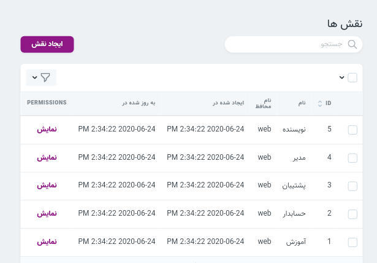

* [تنظیمات](#تنظیمات)

* [مدیریت فایل](#مدیریت-فایل)

* [داشبورد](#داشبورد)

* [کاربران](#کاربران)

    * [بازیابی پسورد](#بازیابی-پسورد)
    
    * [عملیات ها](#عملیات-ها)
    
* [مجوزها](#مجوز-ها)

* [نقش ها](#نقش-ها)
    
* [پیام ها](#پیام-ها)

* [ادیتور](#ادیتور)

### تنظیمات 
 قالب ها در قسمت تنظیمات تفاوت هایی دارند که می توانید در فایل readme هر قالب این موارد را مشاهده نمایید.برای ویرایش  متغیرها در نمای وبسایت از جمله شعار سایت،آدرس باید از این منبع استفاده کرد.
 تنظیمات صفحه های "درباره ما" و"تماس با ما" در این بخش قابل تغییر هستند. برای تغییر هریک از این تنظیمات عنوان موردنظر را پیدا کرده و گزینه ویرایش را انتخاب کنید. سپس فیلد **مقدار** را تغییر دهید.

>بعد از ویرایش هر یک از متغیرهای تنظیمات در صورتی که تغییر اعمال شده در وبسایت نمایش داده نمی شود در مرورگر chrome از میانبر ctrl + shift + N استفاده نمایید و سامانه را در پنجره incognito باز کنید. 

##### سئو 
هنگام ویرایش "seo" به مواردی که درباره متا تگ در [سئو](../instruction/#سئو) گفته شده است توجه فرمایید. 
	
##### آدرس 
 برای تغییر "آدرس روی نقشه" در فیلد مقدار باید مختصات لوکیشن موردنظر را از  [گوگل مپ](https://www.google.com/maps/preview) بیابید و وارد نمایید.

##### صفحات اجتماعی 
در تنظیمات "صفحات اجتماعی" در فیلد مقدار لینک صفحه موردنظر را وارد نمایید.
##### شعار 
 هنگام تغییر شعار های سامانه توجه نمایید که شعار سایت با شعارهای اسلایدر متفاوت است.
##### آیکون های درباره ما 
در فیلد مقدار این منبع تیتر هر آیکون وارد می شود.
##### لوگوی سایت
برای تغییر این تصویر از مدیریت فایل اقدام کنید.
##### favicon 
برای تغییر این تصویر از مدیریت فایل اقدام کنید.
##### کد matomo 
کد matomo در آنالیزگر اختصاصی دانش پژوهان
##### کد گوگل وبمستر 
کد وبسایت برای ثبت در سرچ کنسول گوگل
##### قیمت کلی پکیج ها
این متغیر قیمت اصلی پکیج قبل از تخفیف می باشد
##### قیمت دوره با تخفیف 
این قیمت بعد از اعمال تخفیف می باشد
##### کد محصول 
کد محصول پیش فرض سازمان در آوا ویرایش سه
##### کد ورودی 
کد ورودی سازمان در آوا ویرایش سه
##### کد و تصویر اینماد
کد و تصویر ثبت شده سایت در اینماد
##### آدرس 
آدرس موردنظر برای ثبت در صفحه درباره ما
##### شماره تماس 
شماره تماس موردنظر برای صفحه ارتباط با ما
##### عنوان سایت
عنوان سایت در صفحه خانه

[بالا↑](#)

### مدیریت فایل 
در قسمت مدیریت فایل می توانید آواتار و تصاویر مربوط به دوره ها، پست ها و صفحات را مشاهده کنید. اما توجه فرمایید که تنها تصاویر مربوط به قالب مانند اسلایدر و لوگو را می توانید از این منبع تغییر دهید.

برای تغییر تصاویر مربوط به قالب به پوشه theme رفته و تصویر موردنظر را با فرمت و نام مشخص شده آپلود کنید
برای مثال اگر در قالب شما نام لوگو logo.png ثبت شده است ، هنگام تغییر تصویر نیز باید تصویر شما دقیقاً با همین نام در این قسمت آپلود گردد.

[بالا↑](#)

### داشبورد 

 در این قسمت میتوانید وضعیت دوره ها و پست ها کنید. همچنین میتوانید تعداد کاربران و پست های جدید را در بازه های زمانی مختلف و از طریق نموداربررسی کنید.

[بالا↑](#)

### کاربران 
 
 
##### ایجاد کاربر 
 برای ایجاد کاربر جدید تکمیل همه موارد خواسته شده الزامی است و توجه داشته باشید که پس از ایجاد کاربر جدید نقش آن را تعیین کنید.

[بالا↑](#)

##### تعیین نقش کاربر 
 پس از ایجاد کاربر، روی قسمت نمایش کلیک کرده و نقش‌ها و مجوز های کاربر را ضمیمه می کنید.

 کاربران / نمایش کاربر / ضمیمه کردن نقش ها

[بالا↑](#)

##### تعیین مجوز کاربران 
 
 برای ضمیمه کردن مجوز کاربران روی قسمت نمایش کلیک کردن و از آیکون ضمیمه کردن مجوز ها برای افزودن مجوزهای لازم به کاربر استفاده میکنیم.
 
 کاربران / نمایش / ضمیمه کردن مجوزها
  

> توجه داشته باشید که یک کاربر میتواند چند نقش و چند مجوز داشته باشد.

[بالا↑](#)
##### بازیابی پسورد 

 برای اینکار:

هنگام ورورد به ناحیه کاربری، گزینه(پسورد خود را فراموش کرده اید؟) را انتخاب کنید. 

 سپس ایمیل خود را وارد کرده و گزینه(ارسال دستورلعمل تغییر پسورد) را انتخاب کنید.

 وارد اکانت ایمیل خود شوید،لینک تغییر پسورد به ایمیل شما ارسال شده است.

روی لینک کلیک کرده و پسورد خود را تغییر دهید. 

>توجه کنید اگر ایمیل را در پوشه inbox دریافت نکردید، پوشه spam اکانت خود را بررسی کنید.
توجه کنید که لینک تغییر پسورد تا ۶۰ دقیقه دارای اعتبار است و پس از این زمان باید مراحل ذکر شده را دوباره انجام دهید.

[بالا↑](#)

##### عملیات ها 
پس از تیک زدن کاربران موردنظر باکس (عملیات) نمایش داده می شود. ابتدا عملیات موردنظر و سپس انجام عملیات را انتخاب کنید.

*  ارسال پیامک به کاربر
* دانلود اکسل 
*   وارد کردن کاربران
* تغییر پسورد و ایمیل

[بالا↑](#)

### مجوزها 
 
در این صفحه امکان بررسی انواع مجوزها وجود دارد.همچنین  این قسمت قابلیت ضمیمه کردن کابر به مجوزهای موجود را دارد.

[بالا↑](#)

### نقش ها 

در قسمت نقش‌ها میتوان تمامی نقش‌های موجود را همراه با مجوزها و کابران آن نقش بررسی کرد. همچنین میتوان نقش جدید با مجوزهای موردنیاز ایجاد کرد. در قسمت نمایش امکان بررسی مجوزهای آن نقش وجود دارد.

##### ضمیمه کردن کاربر 
 در انتهای صفحه جزئیات هر نقش، امکان ضمیمه کردن کاربران به آن نقش موجود است.

##### ایجاد نقش 
برای ایجاد نقش‌های جدید روی گزینه ایجاد نقش کلیک کرده و نقش مورد نظر را با عنوان و مجوزهای مناسب ایجاد کنید.

[بالا↑](#)

### پیام ها 
 در این قسمت امکان بررسی پیام‌هایی که کاربران ارسال کرده اند وجود دارد. همچنین توجه داشته باشید پیام هایی که حذف اجباری می شوند قابل بازگردانی نیستند.

[بالا↑](#)

### ادیتور 

 در بخش صفحات، پست ها و دوره ها برای محتوا یک فیلد ورودی شبیه به تصویر مشاهده میکنید. این ورودی شامل امکاناتی همچون افزودن لینک، افزودن تصویر ، افزودن لیست ها و ... می باشد. همانگونه که در راهنمای این فیلد ورودی هم نوشته شده است ، برای استفاده از تصاویر میتوانید از کشیدن تصویر در ادیتور (drop and drag )استفاده نمایید.
 
 [بالا↑](#)