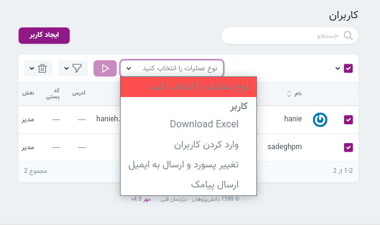

* [تنظیمات](#تنظیمات)

* [مدیریت فایل](#مدیریت-فایل)

* [داشبورد](#داشبورد)

* [کاربران](#کاربران)

    * [بازیابی پسورد](#بازیابی-پسورد)
    
    * [امکانات](#امکانات)
    
* [مجوزها](#مجوز-ها)

* [نقش ها:](#نقش-ها)
    
* [پیام ها](#پیام-ها)

* [ادیتور](#ادیتور)

### تنظیمات 
برای تغییر شعارهای سایت و متون قابل تغییر میتوان از این بخش استفاده کرد. همچنین تمامی این موارد در فایل readme قالب‌ها قابل مشاهده می باشد.

[بالا↑](#)

### مدیریت فایل 

برای تغییر تصاویر مربوط به قالب به پوشه theme رفته و تصویر موردنظر را با فرمت و نام مشخص شده آپلود کنید
برای مثال اگر در قالب شما نام لوگو logo.png ثبت شده است , هنگام تغییر تصویر نیز باید تصویر شما دقیقاً با همین نام در این قسمت آپلود گردد.
[بالا↑](#)

### داشبورد 

 در این قسمت میتوانید وضعیت دوره ها و پست ها کنید. همچنین میتوانید تعداد کاربران و پست های جدید را در بازه های زمانی مختلف و از طریق نموداربررسی کنید.

[بالا↑](#)

### کاربران 
 
#### ایجاد کاربر 
 برای ایجاد کاربر جدید تکمیل همه موارد خواسته شده الزامی است و توجه داشته باشید که پس از ایجاد کاربر جدید نقش آن را تعیین کنید.

[بالا↑](#)
### تعیین نقش کاربر 
 پس از ایجاد کاربر, روی قسمت نمایش کلیک کرده و نقش‌ها و مجوز های کاربر را ضمیمه می کنید.

 کاربران / نمایش کاربر / ضمیمه کردن نقش ها

[بالا↑](#)
#### تعیین مجوز کاربران 
 برای ضمیمه کردن مجوز کاربران روی قسمت نمایش کلیک کردن و از آیکون ضمیمه کردن مجوز ها برای افزودن مجوزهای لازم به کاربر استفاده میکنیم.
 کاربران / نمایش / ضمیمه کردن مجوزها 

> توجه داشته باشید که یک کاربر میتواند چند نقش و چند مجوز داشته باشد.

[بالا↑](#)
#### بازیابی پسورد 

 برای اینکار:

هنگام ورورد به ناحیه کاربری, گزینه(پسورد خود را فراموش کرده اید؟) را انتخاب کنید. 

 سپس ایمیل خود را وارد کرده و گزینه(ارسال دستورلعمل تغییر پسورد) را انتخاب کنید.

 وارد اکانت ایمیل خود شوید,لینک تغییر پسورد به ایمیل شما ارسال شده است.

روی لینک کلیک کرده و پسورد خود را تغییر دهید. 

>توجه کنید اگر ایمیل را در پوشه inbox دریافت نکردید, پوشه spam اکانت خود را بررسی کنید.
توجه کنید که لینک تغییر پسورد تا ۶۰ دقیقه دارای اعتبار است و پس از این زمان باید مراحل ذکر شده را دوباره انجام دهید.

[بالا↑](#)
### امکانات 
#### ارسال پیامک به کاربر 

در قسمت کاربان امکاناتی وجود دارد که بررسی و مدیریت این بخش را بسیار راحت تر می کند. برای ارسال پیامک به کاربران مورد نظر ابتدا آنها را انتخاب کرده و سپس از باکس سمت چپ عملیات مورد نظر یعنی ارسال پیامک را انتخاب میکنیم.
سپس روی مثلث کنار باکس کلیک و در صفحه باز شده متن پیام را می نویسیم.

[بالا↑](#)
#### download excel
با انتخاب این عملیات می توانید اطلاعات کاربرانی که تیک زده اید را به صورت فایل اکسل دانلود کنید.

[بالا↑](#)
#### import users
با انتخاب این گزینه می توانید کاربران جدیدی که در فایل اکسل(excel) و یا (csv) ایجاد کرده اید را به لیست کاربران اضافه نمایید.

[بالا↑](#)
#### تغییر پسورد و ایمیل 
در این عملیات پسورد و ایمیل کاربران تیک خورده را می توان تغییر داد.

[بالا↑](#)

### مجوزها 
 
در این صفحه امکان بررسی انواع مجوزها وجود دارد.همچنین  این قسمت قابلیت ضمیمه کردن کابر به مجوزهای موجود را دارد.

[بالا↑](#)

### نقش ها 

در قسمت نقش‌ها میتوان تمامی نقش‌های موجود را همراه با مجوزها و کابران آن نقش بررسی کرد. همچنین میتوان نقش جدید با مجوزهای موردنیاز ایجاد کرد. در قسمت نمایش امکان بررسی مجوزهای آن نقش وجود دارد.

#### ضمیمه کردن کاربر 
 در انتهای صفحه جزئیات هر نقش, امکان ضمیمه کردن کاربران به آن نقش موجود است.

#### ایجاد نقش 
برای ایجاد نقش‌های جدید روی گزینه ایجاد نقش کلیک کرده و نقش مورد نظر را با عنوان و مجوزهای مناسب ایجاد کنید.

[بالا↑](#)

### پیام ها 
 در این قسمت امکان بررسی پیام‌هایی که کاربران ارسال کرده اند وجود دارد. همچنین توجه داشته باشید پیام هایی که حذف اجباری می شوند قابل بازگردانی نیستند.

[بالا↑](#)

### ادیتور 

 در بخش صفحات, پست ها و دوره ها برای محتوا یک فیلد ورودی شبیه به تصویر مشاهده میکنید. این ورودی شامل امکاناتی همچون افزودن لینک, افزودن تصویر , افزودن لیست ها و ... می باشد. همانگونه که در راهنمای این فیلد ورودی هم نوشته شده است , برای استفاده از تصاویر میتوانید از کشیدن تصویر در ادیتور (drop and drag )استفاده نمایید.
 
 [بالا↑](#)