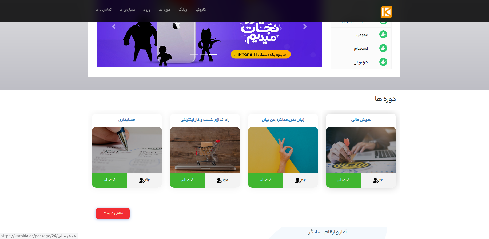
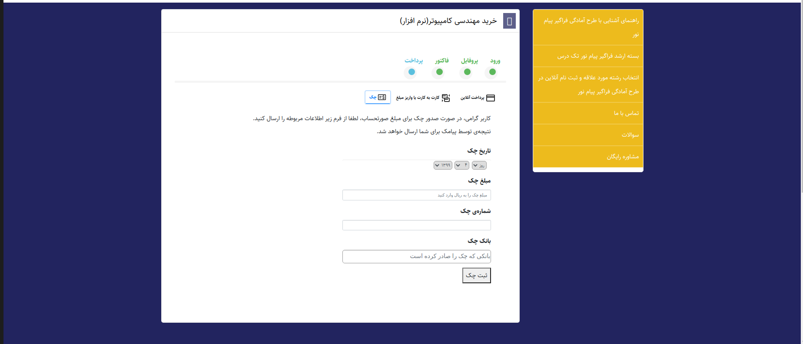

#### خرید آنلابن
1. برای خرید دوره موردنظر ,ابتدا روی گزینه ثبت نام کلیک می کنیم

2. .در انتهای صفحه باز شده گزینه خرید را انتخاب می کنیم

3. در قسمت(ورود), شماره موبایل را وارد می کنیم.

4. کد فعالسازی که ارسال شده است در فیلد موردنظر وارد می کینم

5. در قسمت(پروفایل), اطلاعات خواسته شده را وارد می کنیم.

6. در قسمت(فاکتور) جزئيات صورتحساب را بررسی کرده و در صورت تأیید گزینه ادامه را انتخاب می کنیم.

7. .در قسمت (پرداخت), نحوه پرداخت را انتخاب می کنیم. در حالت آنلاین روی درگاه بانکی مورد نظر کلیک می کنیم.

8. در درگاه پرداختی اطلاعات خواسته شده را وارد میکنیم.

9. در انتها نتیجه تراکنش را مشاهده خواهید کرد و با انتخاب (مشاهده دوره) به صفحه دوره مورد نظر دسترسی خواهید یافت.

#### خرید کارت به کارت 
> برای خرید کارت به کارت مراحل ۱ تا ۶ مشابه می باشد
7. در قسمت پرداخت, نحوه پرداخت را کارت به کارت انتخاب می کنیم و به صفحه زیر منتقل می شویم و اطلاعات لازم را وارد می کنیم.

8. پس از ثبت, صفحه زیر نمایش داده خواهد شد. در این مرحله اطلاعات وارد شده بررسی خواهد شد و نتیجه از طریق پیامک ارسال می شود.

9. در تصویر زیر نمونه ای از پیامک های ارسال شده را می بینید.

#### خرید از طریق چک 
برای خرید از طریق چک در قسمت پرداخت, گزینه چک را انتخاب می کنیم. سپس اطلاعات چک را وارد می کنیم.

نتیجه بررسی چک نیز در نهایت از طریق پیامک ارسال خواهد شد.
