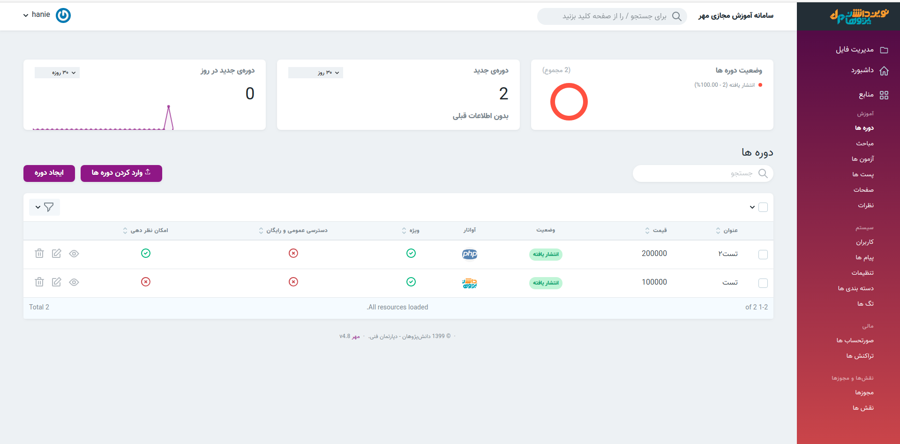
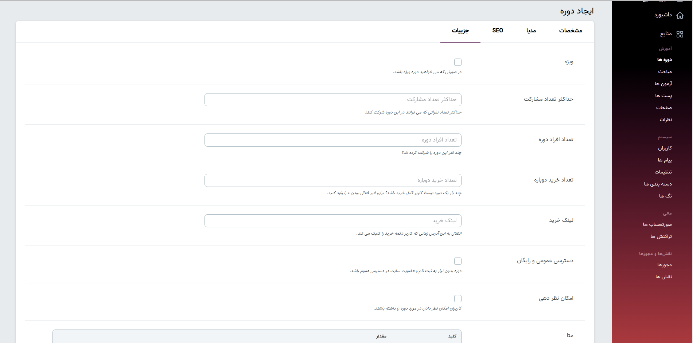
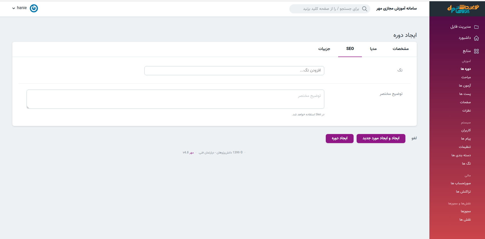
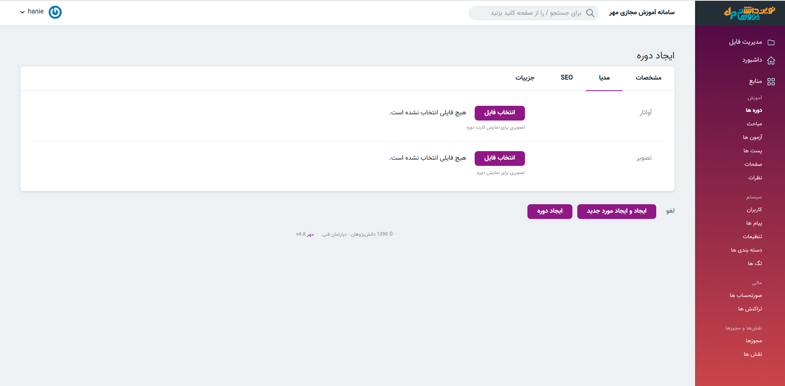
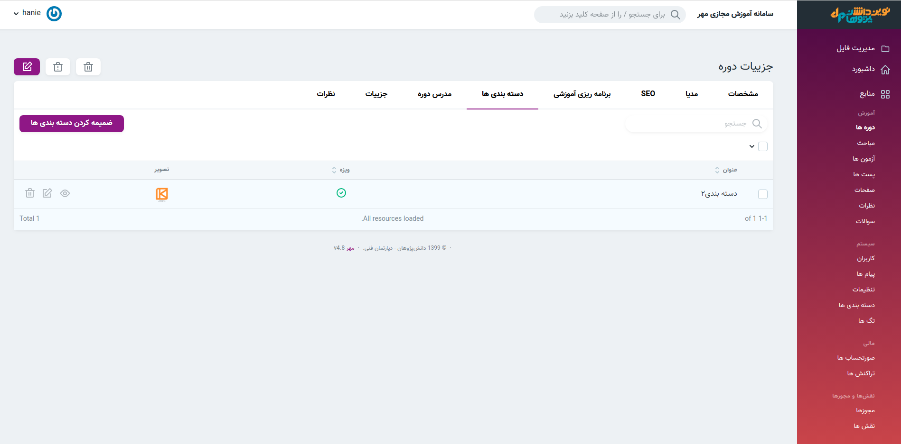

#### ایجاد دوره جدید
>برای ایجاد دوره جدید تکمیل قسمت عنوان و وضعیت در بخش مشخصات الزامی است. در قسمت *جزئیات* زیر هر فیلد توضیحات تکمیلی افزوده شده است.

####  سئو 
>  در قسمت *seo* میتوان تگ مربوط به دوره موردنظر را با توضیح مختصر افزود.
>

#### مدیا 
> در قسمت *مدیا* امکان انتخاب و تغییر تصویر و آواتار مربوط به دوره وجود دارد.
>در قسمت [مدیریت فایل](../system/filemanager/) نیز می‌توانید تصویر و آواتار مربوط به دوره را تغییر دهید.
>

#### ضمیمه کردن دسته بندی 
> در بخش جزئیات دوره امکان ضمیمه کردن دسته بندی وجود دارد. [ضمیمه کردن دوره](categories) به دسته بندی را نیز مشاهده نمایید.

