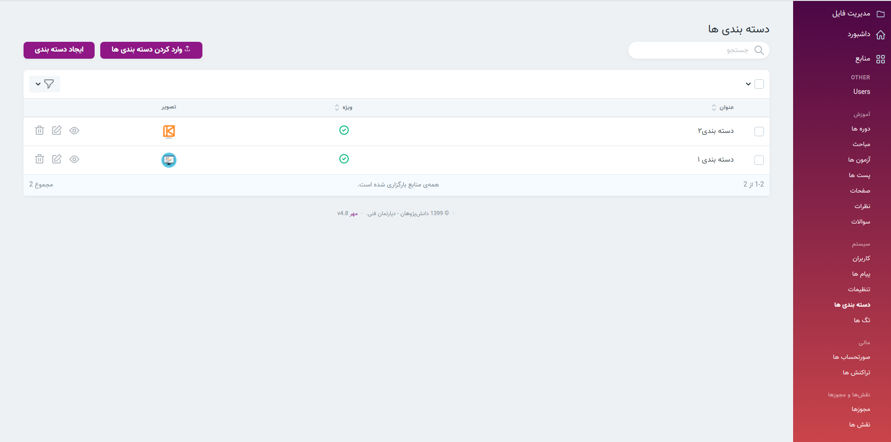

> در این بخش امکان ویرایش, حذف,نمایش و ایجاد دسته بندی ها وجود دارد. در قسمت منوی اصلی سایت با کلیک روی گزینه دوره می‌توانید دسته بندی های موجود را ببنید.‌‌
>

####  ایجاد دسته بندی 
>برای ایجاد دسته بندی تکمیل فیلد عنوان الزامی است. همچنین می‌توانید توضیحاتی برای هر دسته بندی آپلود کنید. 
>راهنمای استفاده از  [ادیتور](../../system/editor) را میتوانید مشاهده کنید.
#### ضمیمه کردن پست ها و دوره ها 
> در قسمت نمایش هر دسته بندی امکان افزودن پست و مجوز به دسته بندی ها می باشد.
>
>  در بخش دوره می‌توانید نحوه [ضمیمه کردن دسته بندی](../) را ببنید.
>
>  در بخش پست ها می‌توانید نحوه [ضمیمه کردن دسته بندی](../../posts) را ببنید.
