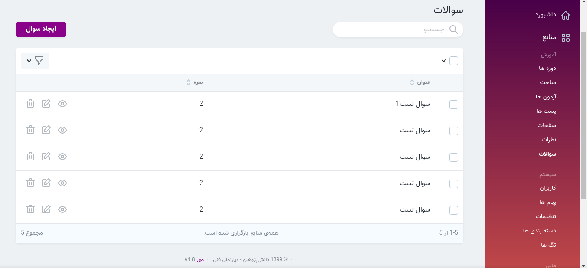
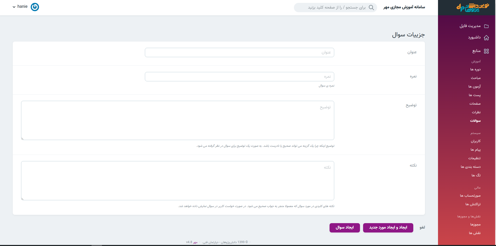
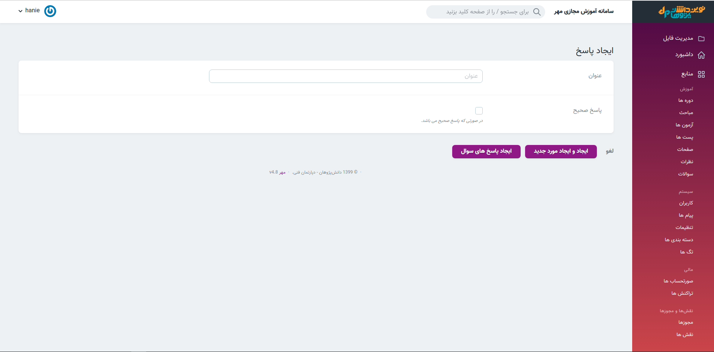

> در این قسمت امکان مشاهده سوالات و امکان ایجاد سوال وجود دارد.

#### ایجاد سوال 
در تصویر زیر صفحه ایجاد سوال را می بینید.

#### ایجاد پاسخ 
> پس از اینکه سؤال مورد نظر ایجاد شد در قسمت نمایش سوال بخش پاسخ‌های سؤال را می‌بینید که گزینه های سؤال را میتوانید در آن ایجاد کنید 
توجه داشته باشید که تنها یکی از پاسخ‌ها تیک پاسخ صحیح را باید داشته باشد
1. سوالات
2. نمایش سوال
3. پاسخ های سوال
4. ایجاد پاسخ سوال

