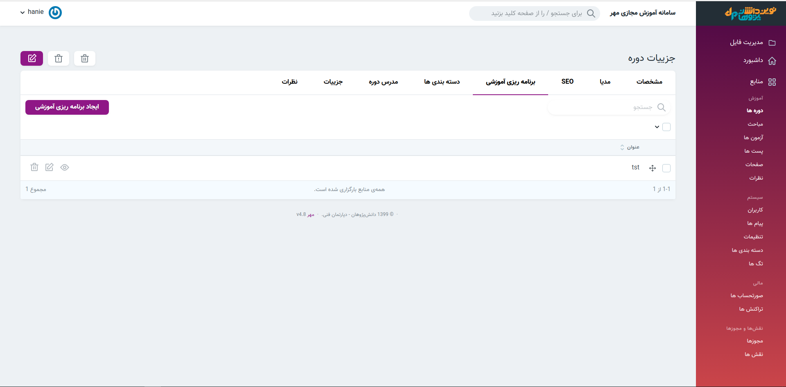
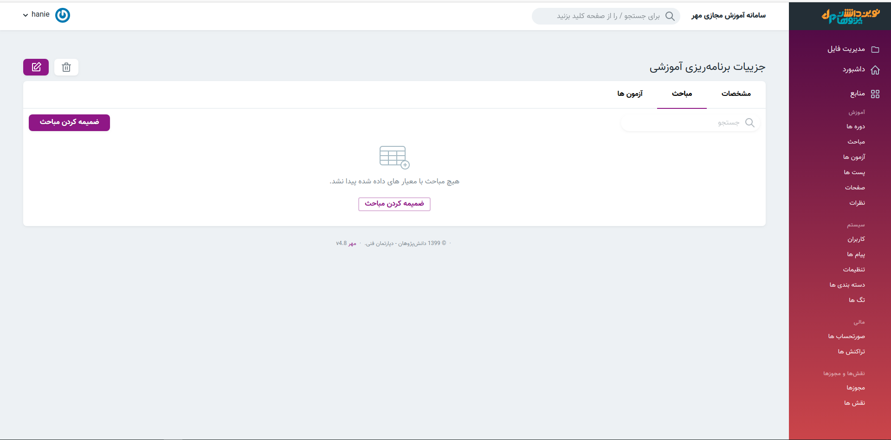
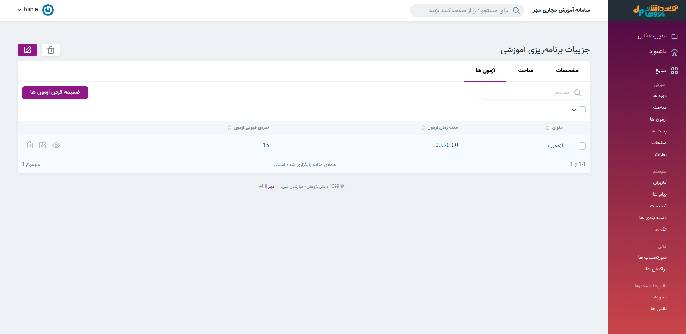

#### ایجاد برنامه ریزی آموزشی 
> پس از ایجاد دوره در قسمت نمایش یک دوره و سپس در بخش **برنامه‌ریزی آموزشی** امکان ایجاد سرفصل ها برای هر دوره امکان‌پذیر میباشد.
1. دوره
2. نمایش
3. برنامه‌ریزی آموزشی
4. ایجاد برنامه‌ریزی آموزشی

#### ضمیمه کردن مبحث 
> در قسمت نمایش هر برنامه‌ریزی آموزشی امکان ضمیمه کردن مبحث برای آن برنامه‌ریزی آموزشی یا به عبارتی آن سرفصل وجود دارد.
>در بخش مباحث نیز می‌توانید [ضمیمه کردن فصل](مباحث) (برنامه ریزی آموزشی) را ببنید.
1. دوره
2. نمایش
3. برنامه ریزی آموزشی
4. نمایش
5. مبحث

#### ضمیمه کردن آزمون ها

> در این بخش امکان ضمیمه کردن آزمون به برنامه‌ریزی آموزشی یا سرفصل ها میباشد.
1. دوره
2. نمایش
3. برنامه ریزی آموزشی
4. نمایش
5. ضمیمه کردن آزمون

