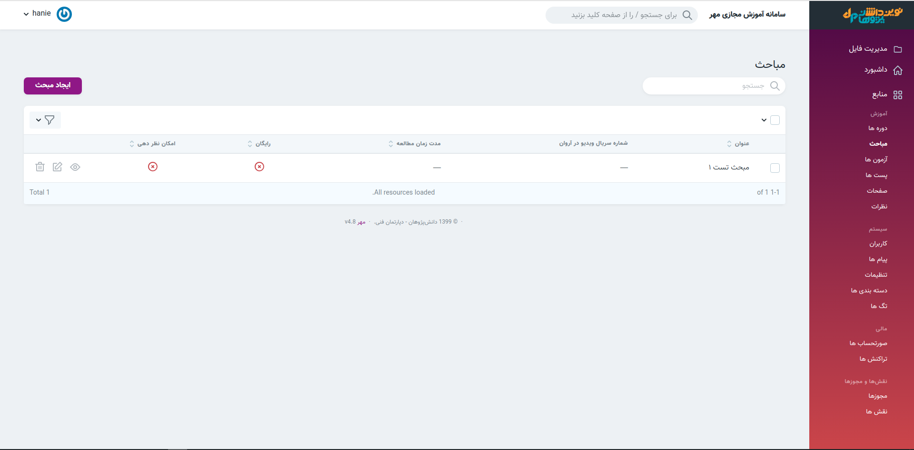
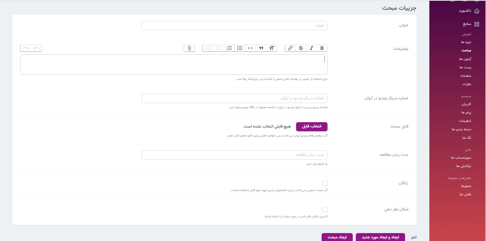
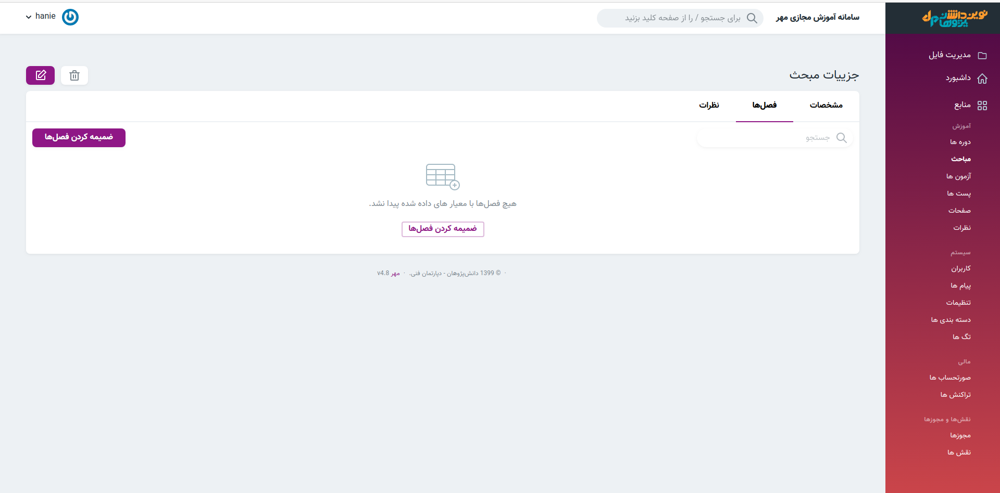

> در این بخش , مباحث منتشر شده  قابل بررسی و ویرایش هستند. همچنین امکان ایجاد مبحث جدید  نیز در این بخش وجود دارد.

#### ایجاد مبحث 
> راهنمای استفاده از [ادیتور]( ../../../system/editor) را میتوانید مطالعه کنید.
>

#### ضمیمه کردن فصل 
> پس از ایجاد مبحث در قسمت نمایش امکان ضمیمه کردن فصل ها (برنامه ریزی آموزشی) وجود دارد.
1. مباحث
2. نمایش
3. ضمیمه کردن فصل ها
> در بخش برنامه ریزی آموزشی نحوه [ضمیمه کردن مبحث](../) را مشاهده نمودید.

>