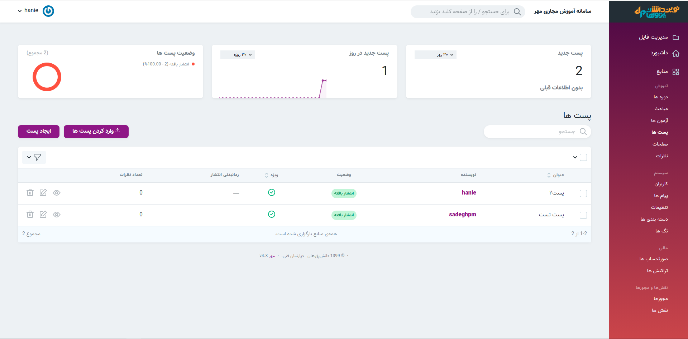
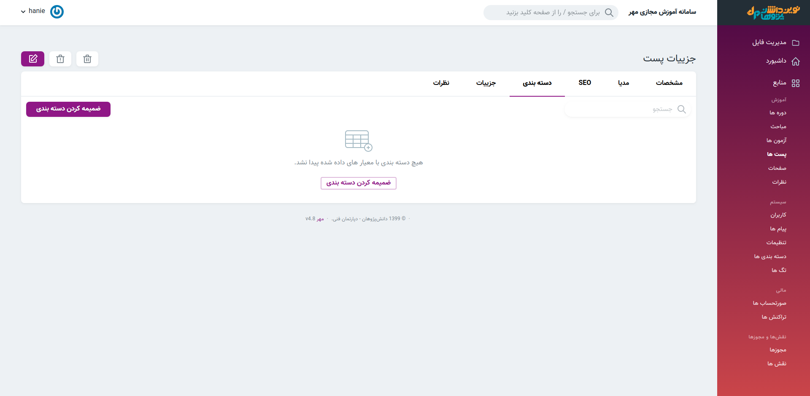

>  در این قسمت میتوان وضعیت پست های منتشر شده را بررسی کرد. همچنین میتوان پست های منتشر 
  شده را ویرایش و پست جدید ایجاد کرد. 
  درنظر داشته باشید که پست ها در قسمت وبلاگ نمایش داده می شوند. هر پست در دسته بندی مربوطه نیز قابل نمایش است.

#### ضمیمه کردن دسته بندی
> در قسمت نمایش پست و سپس دسته بندی امکان ضمیه کردن دسته بندی به پست موردنظر وجود دارد
  این قسمت برای نمایش پست ها بر اساس دسته بندی های موجود در وبلاگ ایجاد شده است.
> در بخش دسته بندی نحوه [ضمیمه کردن پست](../courses/categories) را مشاهده نمودید.

>