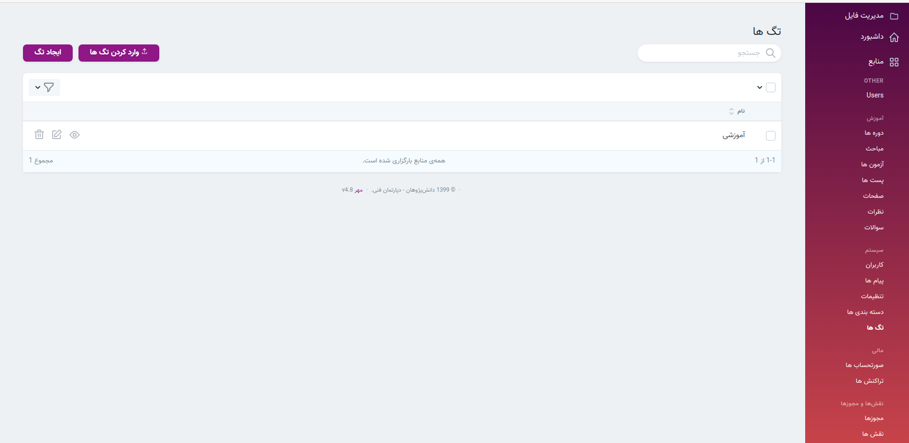
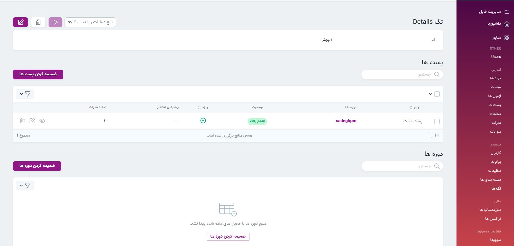

> در بخش تگ ها امکان نمایش تگ ها و همچنین ایجاد تگ های جدید وجود دارد. در قسمت وبلاگ سایت با کلیک روی تگ های محبوب(در سمت چپ) می‌توانید پست های مربوط به آن تگ را مشاهده کنید.
> می‌توانید در بخش seo مربوط به دوره ها [ضمیمه کردن تگ](../../courses) را ببینید.
می‌توانید در بخش seo مربوط به پست ها ضمیمه کردن تگ را ببینید.

#### ضمیمه کردن دوره ها و پست ها 
> در بخش جزئیات هر تگ میتوان پست ها و دوره های مربوط به آن تگ را ضمیمه کرد.

