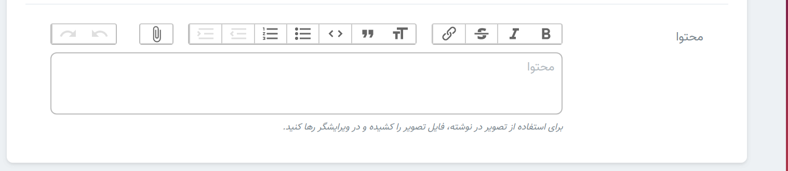

> در بخش صفحات, پست ها و دوره ها برای محتوا یک فیلد ورودی شبیه به تصویر مشاهده میکنید. این ورودی شامل امکاناتی همچون افزودن لینک, افزودن تصویر , افزودن لیست ها و ... می باشد. همانگونه که در راهنمای این فیلد ورودی هم نوشته شده است , برای استفاده از تصاویر میتوانید از کشیدن تصویر در ادیتور (drop and drag )استفاده نمایید.