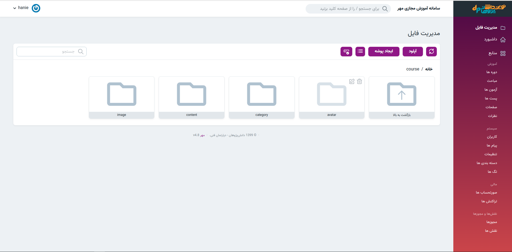

> برای تغییر تصاویر مربوط به قالب به پوشه theme رفته و تصویر موردنظر را با فرمت و نام مشخص شده آپلود کنید.
>برای مثال اگر در قالب شما نام لوگو logo.png ثبت شده است , هنگام تغییر تصویر نیز باید تصویر شما دقیقاً با همین نام در این قسمت آپلود گردد.

