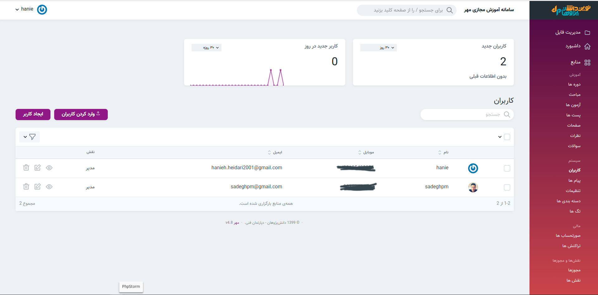
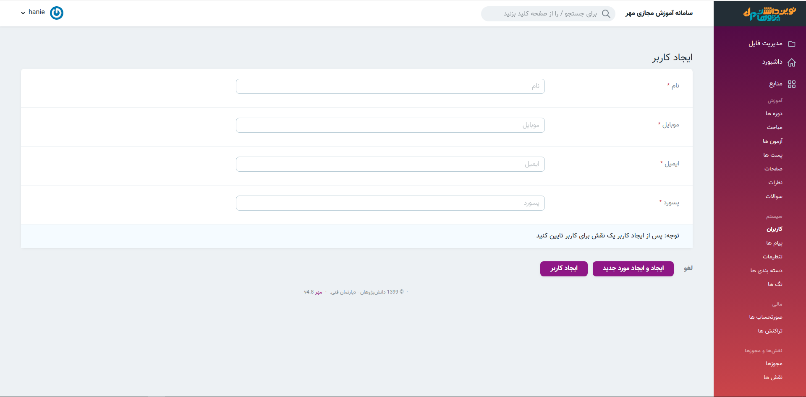
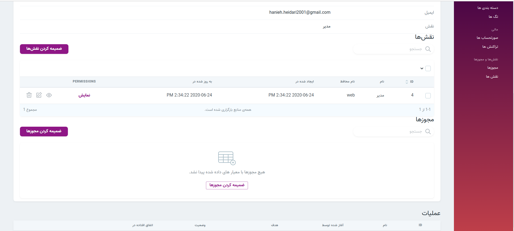

 > در این قسمت میتوانید وضعیت کاربران را بررسی کنید

#### ایجاد کاربر 
> برای ایجاد کاربر جدید تکمیل همه موارد خواسته شده الزامی است و توجه داشته باشید که پس از ایجاد کاربر جدید نقش آن را تعیین کنید.

### تعیین نقش کاربر 
> پس از ایجاد کاربر, روی قسمت نمایش کلیک کرده و نقش‌ها و مجوز های کاربر را ضمیمه می کنید.
1. کاربران
2. نمایش کاربر
3. ضمیمه کردن نقش ها

#### تعیین مجوز کاربران 
> برای ضمیمه کردن مجوز کاربران روی قسمت نمایش کلیک کردن و از آیکون ضمیمه کردن مجوز ها برای افزودن مجوزهای لازم به کاربر استفاده میکنیم.
1. کاربران
2. نمایش
3. ضمیمه کردن مجوزها

توجه داشته باشید که یک کاربر میتواند چند نقش و چند مجوز داشته باشد.

#### بازیابی پسورد 

> برای اینکار:
>
>  هنگام ورورد به ناحیه کاربری, گزینه(پسورد خود را فراموش کرده اید؟) را انتخاب کنید. 
>
> سپس ایمیل خود را وارد کرده و گزینه(ارسال دستورلعمل تغییر پسورد) را انتخاب کنید.
>
> وارد اکانت ایمیل خود شوید,لینک تغییر پسورد به ایمیل شما ارسال شده است.
>
>روی لینک کلیک کرده و پسورد خود را تغییر دهید.
>
* توجه کنید اگر ایمیل را در پوشه inbox دریافت نکردید, پوشه spam اکانت خود را بررسی کنید

* توجه کنید که لینک تغییر پسورد تا ۶۰ دقیقه دارای اعتبار است و پس از این زمان باید مراحل ذکر شده را دوباره انجام دهید.

#### ارسال پیامک به کاربر 

> برای ارسال پیامک به کاربران مورد نظر ابتدا آنها را انتخاب کرده و سپس از باکس سمت چپ عملیات مورد نظر یعنی ارسال پیامک را انتخاب میکنیم.
>سپس روی مثلث کنار باکس کلیک و در صفحه باز شده متن پیام را می نویسیم. 

#### download excel
> با انتخاب این عملیات می توانید اطلاعات کاربرانی که تیک زده اید را به صورت فایل اکسل دانلود کنید.

#### import users
>  با انتخاب این گزینه می توانید کاربران جدیدی که در فایل اکسل(excel) و یا (csv) ایجاد کرده اید را به لیست کاربران اضافه نمایید.

#### تغییر پسورد و ایمیل 
> در این عملیات پسورد و ایمیل کاربران تیک خورده را می توان تغییر داد.

