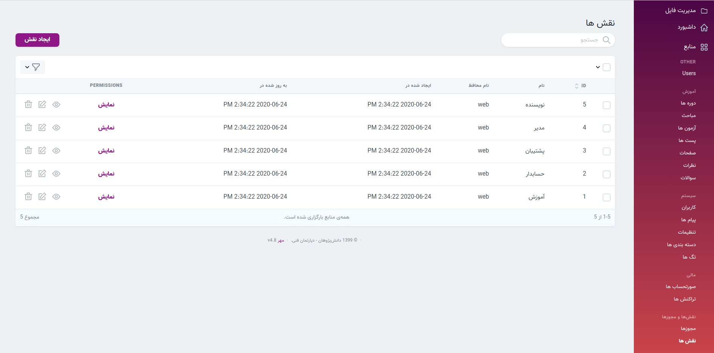
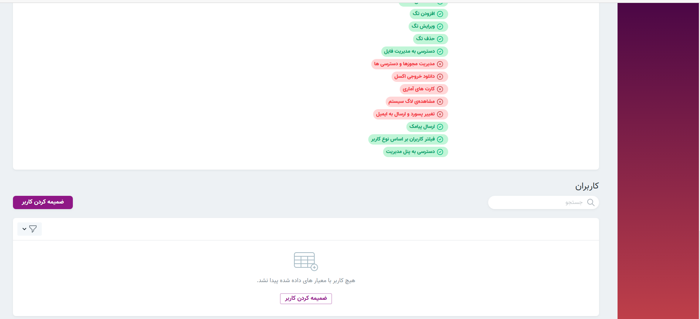
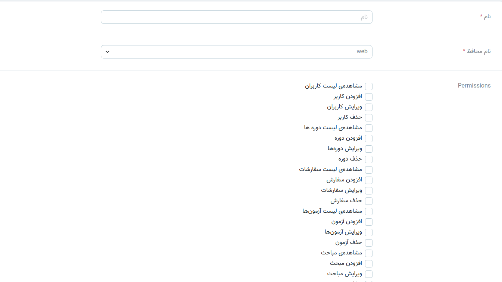

> در قسمت نقش‌ها میتوان تمامی نقش‌های موجود را همراه با مجوزها و کابران آن نقش بررسی کرد. همچنین میتوان نقش جدید با مجوزهای موردنیاز ایجاد کرد.

>در قسمت نمایش امکان بررسی مجوزهای آن نقش وجود دارد.

#### ضمیمه کردن کاربر 
> در انتهای صفحه جزئیات هر نقش, امکان ضمیمه کردن کاربران به آن نقش موجود است.

#### ایجاد نقش 
> برای ایجاد نقش‌های جدید روی گزینه ایجاد نقش کلیک کرده و نقش مورد نظر را با عنوان و مجوزهای مناسب ایجاد کنید.

>