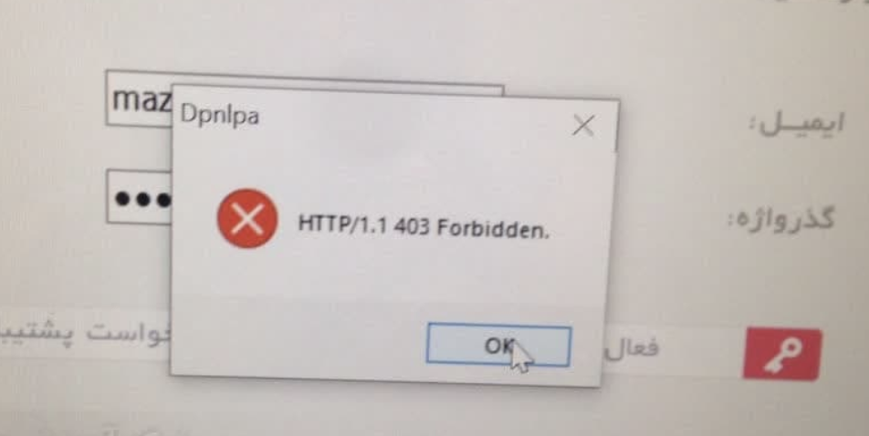
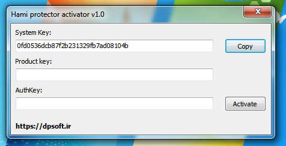
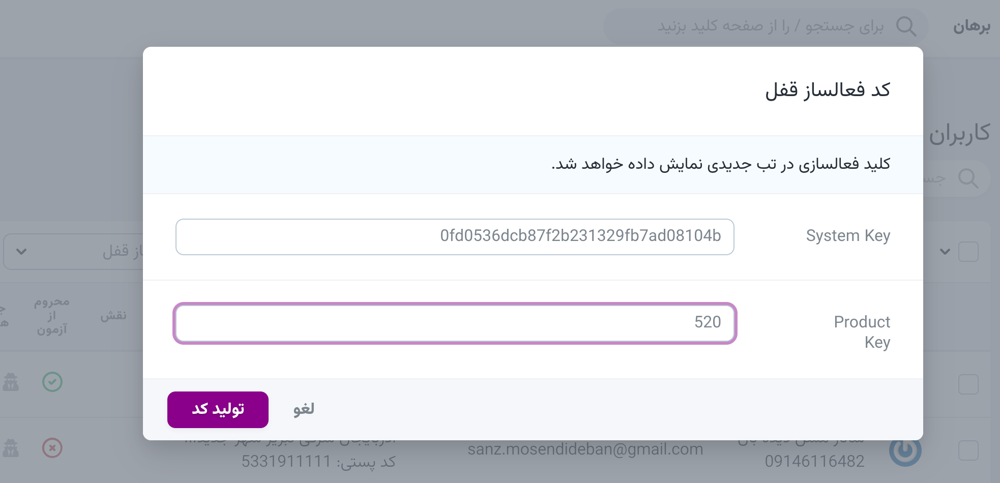
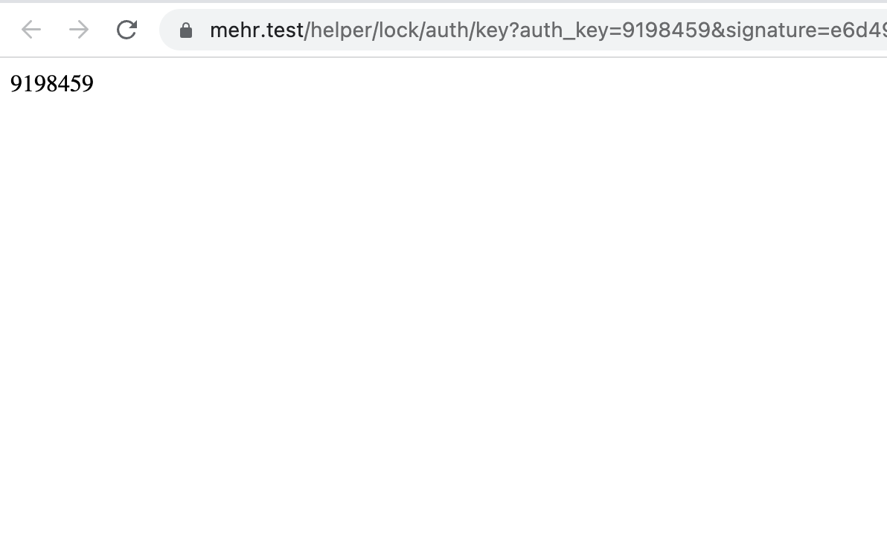
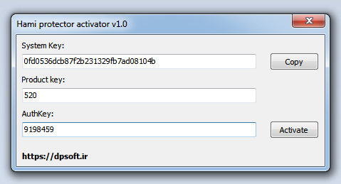
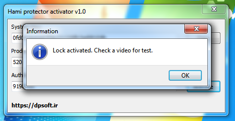

- [خطای ارتباط سرور](#خطا)

#### خطا

اگر در هنگام فعالسازی قفل بر روی سیستم کاربر با خطای زیر مواجه شدید. از این روش برای فعالسازی کمک بگیرید. این خطا به دلیل عدم برقراری ارتباط با سایت موسسه می‌باشد.

برای فعالسازی این کارها را به ترتیب انجام دهید:

- اجرای فایل زیر بر روی سیستم کاربر:
  - [hami_activator_v1.zip](hami_activator_v1.zip)
  - 
- یادداشت کردن system key
- در سامانه آموزشی مهر به منوی کاربران رفته و از منوی عملیات «کد فعالسازی قفل» را اجرا میکنیم:

  - 

- در قسمت system key مقدار یادداشت شده از سیستم کاربر را وارد می‌کنیم.
- در قسمت product key کد قفل محصول مورد نظر برای فعالسازی را وارد میکنیم.
- دکمه‌ی تولید کد را کلیک کرده و در صفحه‌ی جدید عدد تولید شده را یادداشت می‌کنیم.
  - 
- به سیستم کاربر برگشته و در قسمت AuthKey کد تولید شده در مرحله‌ی قبل را وارد میکنیم. و در قسمت product key کد قفل مورد نظر را وارد می‌کنیم:
  - 
- دکمه‌ی Activate را کلیک میکنیم. پیغام فعالسازی ظاهر خواهد شد و کاربر می تواند به مشاهده‌ی دوره بر روی سیستم بپردازد:
  - 

> **توجه**  > _این فایل فعالسازی را بر روی DVD دوره ها قرار ندهید._  > _فایل فعالسازی که بر روی سیستم کاربر اجرا شده را پاک کنید._
