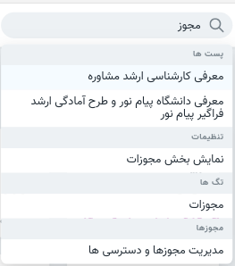
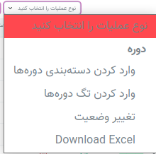

* [امکانات سامانه](#امکانات-سامانه)
* [مفاهیم سامانه](#مفاهیم-سامانه)
* [رابط کاربری پنل](#رابط-کاربری-پنل)

#### امکانات سامانه 

سامانه آموزش مجازی مهر با هدف سهولت هر چه بیشتر 
 آموزش توسعه یافته است.  این سامانه به گونه ای طراحی شده است که کاربری روان و ساده ای را فراهم کند و کاربران به تمامی بخش هادسترسی راحتی داشته باشند.
سامانه مهر با امکانات نوینی که در بخش های مختلف ایجاد کرده است.  به بسیاری از نیازهای سامانه های آموزش مجازی فارسی زبان پاسخ داده است. 
در موارد زیر به برخی امکانات این سامانه اشاره شده است:

* با انتخاب وضعیت های مختلف(تکمیل شده،در انتظار پرداخت ...)  برای صورتحساب ها میتوان طبقه بندی منظم و سازمان یافته ای برای آنها ساخت.
* قابلیت سرچ در قسمت های مختلف سایت امکان دسترسی راحت به بخش های مختلف را ایجاد کرده است
* فیلتر کردن صورتحساب ها،کاربران و تراکنش ها موجب سهولت در بررسی هر بخش می گردد.
* امکان ایجاد کاربرهای مختلف با نقش های متفاوت وجود دارد.  همچنین میتوان سطوح دسترسی مورد نیاز را به هر نقش اختصاص داد.
* در هنگام ایجاد دوره ها و پست ها نیز وضعیت های متفاوتی را میتوان به آنها افزود.
* در سامانه مهر برای خرید دوره ها سه روش مختلف پرداخت  (آنلاین،کارت به کارت،چک)وجود دارد و در روش آنلاین درگاه های پرداختی مختلف برای انتخاب وجود دارند.
* قالب های مختلف برای سایت های این سامانه وجود دارند که میتوان تنها در چند دقیقه هر قالب را نصب نمود.

*****
#### مفاهیم سامانه 

###### وبلاگ 
 وبلاگ ها شکلی از «سیستم مدیریت محتوا» هستند که ویکی پدیا آن را «یک  سیستم برای تشکیل و تسهیل تولید محتوا مشارکتی» میداند. وبلاگ ها و  سیستم‌های مدیریت محتوا هردو می‌توانند نقش یک وب سایت را ایفا کنند. 
 در‌واقع اصطلاح وبلاگ برای وبسایت هایی استفاده می‌شود که اطلاعات را به صورت یک رویدادنامه و بر حسب زمان در صفحه اصلی نشان می دهد.
محتوای وبلاگ ها شامل پست ها می باشد.

###### پست ها 
پست ها که گاهی اوقات به عنوان مقالات نیز شناخته می‌شوند محتوای  اصلی بلاگ ها شناخته می شوند. یکی از ویژگی‌های  اصلی پست ها قابلیت ایجاد کامنت یا اصطلاحاً دیدگاه برای پست ها می باشد.
کامنت 
پس ازاینکه پست ها در وبلاگ منتشر می‌شوند خواننده‌های آن پست می‌توانند نظرات خود را در غالب وبلاگ منتشر کنند و  نویسنده‌های پست نیز  می‌توانند پاسخ خود را در جواب کاربر منتشر کنند.
درنظر داشته باشید در سامانه مهر دوره ها و مباحث مربوط به دوره ها نیز امکان نظر دهی دارند و فعال کردن این قابلیت هنگام انتشار آن بر عهده 
نویسنده آن است.
###### دسته بندی 
مرحله مهم در انتشار پست ها ضمیمه کردن دسته بندی به پست ها می
باشد. دسته بندی ها می‌توانند به صورت ترتیبی در یک سلسه مراتب ظاهر شوند یعنی هر دسته بندی می‌تواند شامل دسته بندی های دیگری به عنوان زیر شاخه باشد.
تمامی دوره های این سامانه نیز در دسته بندی مربوط به خود قرار می گیرند. این طبقه بندی محتوایی در وبلاگ و صفحه اصلی سایت باعث تسهیل استفاده از سامانه می شوند.
###### تگ 
علاوه بر دسته بندی،کلمات کلیدی و اصطلاحات که به عنوان تگ شناخته می‌شوند می‌توانند به پست ها و دوره ها ضمیمه می شوند.
تگ ها به عنوان یک ابزار راهنمایی در کنار دسته بندی استفاده کابران را راحت می‌کنند با این تفاوت که تگ ها نمی‌توانند به صورت سلسه مراتب ظاهر شوند.

###### صفحات 
صفحات معمولاً اطلاعات ثابت ارائه می دهند. برای مثال صفحه درباره ما.
صفحات قابلیت نظردهی دارند ولی امکان دسته بندی کردن ندارند.
###### قالب 
قالب (theme) دیزاین نهایی یک وب سایت می‌باشد که گرافیک،متون و رنگ‌های یک سایت را ارائه می دهند. قالب‌ها نحوه نمایش اطلاعات و محتوای یک سایت در مرورگر می باشند. نحوه نصب هر قالب برای این سامانه در بخش قالب‌ها توضیح داده شده است.

###### تنظیمات 
جزئیات مربوط به نمای سایت را در این بخش می توان تنظیم نمود. برای مثال تغییر شعار سایت از این قسمت انجام می شود.
##### کاربر 
ورود کاربر به قسمت مدیریت با ایمیل و پسورد امکان‌پذیر است.پس از ورود به ناحیه کاربری امکان مدیریت سایت توسط کاربر وجود دارد. برای مدیریت بهتر سایت می‌توان به کاربران مختلف نقش‌ها متفاوتی ضمیمه کرد. 
###### نقش 
هر کاربر در وبسایت بر حسب نقشی که دارد محدوده دسترسی متفاوتی به بخش‌های مختلف دارد. برای مثال نقش پشتیبان در سامانه به دوره ها و آزمون ها دسترسی ندارد و تنها امکان مشاهده لیست دوره ها برای این نقش وجود دارد. پس از ایجاد کاربر جدید در وب سایت باید نقش آن کاربر را مشخص نمود.
###### مجوز 
مجوزات هر نقش محدوده ی دسترسی آن نقش به سامانه را مشخص می کند. هنگام ایجاد نقش در سامانه مجوز های موردنیاز آن نقش نیز ضمیمه می شوند.

##### حسابداری 

###### صورتحساب 
فاکتور خرید دوره ها در سامانه صورتحساب ها می‌باشند که در وضعیت‌های مختلف قابل ایجاد و ویرایش هستند. پس از ایجاد صورتحساب دوره های خریداری شده توسط کاربر را میتوان به آن ضمیمه کرد. 
###### تراکنش 
 رسید خرید های سامانه (تراکنش ها) به سه شکل قابل انجام است:
چک،آنلاین،کارت به کارت .
*******

#### رابط کاربری پنل 

###### جستجو درکل پنل 
باکس جستجو در بالای صفحه قرار دارد.

###### جستجو منبع 
 قسمت میانی صفحه سمت راست از طریق باکس جستجو امکان یافتن منبع موردنظر وجود دارد.

><i class='fas fa-exclamation-triangle' style='font-size:20px;color:gray;margin-left:15px'></i> 
> درنظر داشته باشید هنگام جستجو در منابع، فیلتر در چه حالتی است. منبع جستجو شده فقط از بین موارد فیلتر شده پیدا می شود.
 
###### ایجاد منبع جدید 
  از گوشه سمت چپ صفحه امکان پذیر می باشد.

><i class='fas fa-info' style='font-size:20px;color:gray;margin-left:15px'></i> 
> برای وارد کردن کاربران از فایل اکسل (excel) و یا (csv) باید عملیات "وارد کردن کاربران " را انتخاب نمود. [عملیات ها](#عملیات-ها)

###### ارتباط منابع با یکدیگر 
با نمایش هر منبع می توانید دیگر منبع های مرتبط به آن را نیز مشاهده نمایید. برای مثال با نمایش هر صورتحساب می توانید دوره ها، پرداخت ها و عملیات های مربوط به آن صورتحساب را مشاهده نمایید.

###### فیلتر 
 هر منبع را می توان با ویژگی هایی که دارد فیلتر کرد.برای مثال تراکنش ها را می توان براساس نوع تراکنش ها و وضعیت آنها فیلتر نمود. دوره ها مطابق تصویر قابل فیلتر کردن هستند.

><i class='fas fa-exclamation-triangle' style='font-size:20px;color:gray;margin-left:15px'></i> 
>فیلتر نمایش همراه حذف شده ها، منابعی که حذف اجباری شده اند را نمایش نمی دهد. 

برای نمایش،ویرایش و حذف هر منبع می توان از سه دکمه موجود برای هر منبع استفاده نمود.

###### عملیات ها
برای انجام عملیات های مختلف روی منابع ابتدا منابع موردنظر را تیک بزنید سپس از باکسی که نمایش داده می شود عملیات موردنظر را انتخاب کنید و دکمه کنار این باکس (انجام عملیات) را انتخاب کنید.

><i class='fas fa-info' style='font-size:20px;color:gray;margin-left:15px'></i> 
> برای انتخاب همه موارد از مربع بالای منبع ها استفاده نمایید.

عملیات های قابل انجام در بخش های مختلف پنل کاربری شامل موارد زیر می باشد:

کاربران: دانلود اکسل، وارد کردن کاربران، تغییر پسورد و ارسال ایمیل،ارسال پیامک

دوره ها: وارد کردن دسته بندی دوره ها،وارد کردن تگ دوره ها، تغییر وضعیت، دانلود اکسل

دسته بندی ها: واردکردن دسته بندی

پست ها: تغییر وضعیت، دانلود اکسل،وارد کردن دسته بندی پست ها، وارد کردن تگ پست ها

صورتحساب: دانلود اکسل، تغییر وضعیت

تراکنش: تغییر وضعیت

><i class='fas fa-info' style='font-size:20px;color:gray;margin-left:15px'></i> 
> با نمایش هر منبع تب های مرتبط به آن منبع را می بینید و می توانید عملیات های مختلف را در آن قسمت نیز انجام بدهید.مثلا با نمایش هر دوره می توانید عملیات تغییر وضعیت را برای ان دوره انجام دهید.

