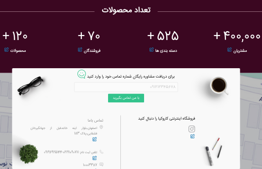

برای این برنامه قالبهای متعددی تا کنون آماده شده است که متناسب با ماهیت های مختلف شغلی میباشند.
هر قالب برای شخصی سازی در پوشه theme ممکن است تنظیمات خاصی نیاز داشته باشد که با کلیک روی نام هر قالب میتوانید این تنظیمات را مشاهده فرمایید

> <i class='fas fa-info' style='font-size:20px;color:gray;margin-left:15px'></i>
> برای تغییر مقادیر تعریف شده در تنظیمات که مربوط به قالب سایت هستند، می توانید از گزینه ویرایش هر مورد، در صفحه 'خانه' استفاده نمایید.

