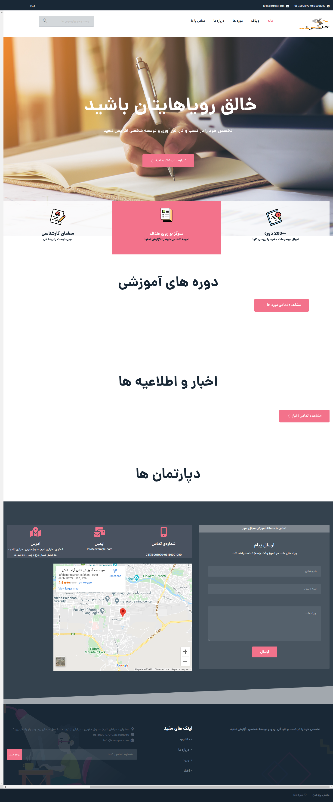

---

## تغییر تصاویر

### تغییر لوگو

جهت تغییر لوگوی سایت ،ابتدا وارد سامانه می شویم و در سامانه از طریق منوی سمت راست ،در قسمت مدیریت فایل وارد پوشه theme شوید و فایل مربوط به لوگو را در این قسمت اپلود کنید.اسم فایل باید logo.png باشد و سایز عکس 49\*126 باشد.

---

### تغییر بکگراند

جهت تغییر بکگراند صفحه اصلی در همین مسیر بالا فایل مربوط به نام bg-home-1.png را آپلود می کنیم.سایز تصویر باید 939\*1920 باشد.

---

### تغییر بکگراند footer

جهت تغییر بکگراند footer در همین مسیر بالا فایل مربوط به نام bg-footer.png را آپلود می کنیم.سایز تصویر باید 500\*1920 باشد.

---

### تغییر عکس ارتباط با ما در صفحه اصلی

جهت تغییر عکس در همین مسیر بالا فایل مربوط به نام bg-contact.jpg را آپلود می کنیم.سایز تصویر باید 1000\*1400 باشد.

---

### تغییر عکس درباره ما در صفحه درباره ما

جهت تغییر عکس در همین مسیر بالا فایل مربوط به نام bg-about.jpg را آپلود می کنیم.سایز تصویر باید 400\*1400 باشد.

---

### تغییر عکس بکگراند در صفحه وبلاگ و پست

جهت تغییر عکس در همین مسیر بالا فایل مربوط به نام bg-blog.jpgباید باشد را آپلود می کنیم.سایز تصویر باید 1200\*2440 باشد.

---

### تغییر عکس بکگراند body در صفحه سوالات متداول

جهت تغییر عکس در همین مسیر بالا فایل مربوط به نام bg-body.pngباید باشد را آپلود می کنیم.سایز تصویر باید 3387\*1920 باشد.

---

### تغییر عکس بکگراند هدر در صفحه دوره ها و سوالات متداول

جهت تغییر عکس در همین مسیر بالا فایل مربوط به نام bg-courses.pngباید باشد را آپلود می کنیم.سایز تصویر باید 1106\*1920 باشد.

---

### تغییر عکس بکگراند در صفحه دوره

جهت تغییر عکس در همین مسیر بالا فایل مربوط به نام bg-courses-2.pngباید باشد را آپلود می کنیم.سایز تصویر باید 322\*1920 باشد.

---

### تغییر عکس های تیم ما در صفحه درباره ما

جهت تغییر تصاویر در همین مسیر بالا فایل های مربوط به نام های person1.jpg،person2.jpg،...person5.jpgباید باشد را آپلود می کنیم.سایز تصویر باید 500\*350 باشد.

---

## تغییر شعار،عناوین اسلایدر ،درباره ما

جهت تغییر متن های سایت ، بعد از وارد شدن در سامانه،در منوی سمت راست قسمت تنظیمات را زده و تمام متن های سایت مانند شعار،درباره ما،متن های روی اسلایدر،متن های صفحه درباره ما،آدرس،شماره تلفن،لینک شبکه های اجتماعی و .... را تغییر دهید.
همچنین تغییر آدرس در گوگل و توضیح کوتاه برای SEO در این قسمت امکان پذیر است.

---

### تغییر عنوان مشخصات در صفحه درباره ما

جهت تغییر در همین مسیر بالا متغییرهای مربوط به نام های info.title1 تا info.title6 را تغییر دهید.

---

### تغییر متن مشخصات در صفحه درباره ما

جهت تغییر در همین مسیر بالا متغییرهای مربوط به نام های info.text1 تا info.text6 را تغییر دهید.

---

### تغییر نام اعضای تیم ما در صفحه درباره ما

جهت تغییر در همین مسیر بالا متغییرهای مربوط به نام های person.name1 تا person.name5 را تغییر دهید.

---

### تغییر موقعیت اعضای تیم ما در صفحه درباره ما

جهت تغییر در همین مسیر بالا متغییرهای مربوط به نام های person.position1 تا person.position5 را تغییر دهید.

---

### تغییر توضیح اعضای تیم ما در صفحه درباره ما

جهت تغییر در همین مسیر بالا متغییرهای مربوط به نام های person.text1 تا person.text5 را تغییر دهید.

---

### تغییر محتوای درس در صفحه دوره

جهت تغییر در همین مسیر بالا متغییرهای مربوط به نام های course.content1 تا course.content4 را تغییر دهید.

---

### تغییر عنوان مشخصات دوره ها در صفحه دوره ها

جهت تغییر در همین مسیر بالا متغییرهای مربوط به نام های courseinfo.title1 تا courseinfo.title3 را تغییر دهید.

---

### تغییر متن مشخصات دوره ها در صفحه دوره ها

جهت تغییر در همین مسیر بالا متغییرهای مربوط به نام های courseinfo.text1 تا courseinfo.text3 را تغییر دهید.

---

### تغییر عنوان مشخصات سایت در صفحه صفحه اصلی

جهت تغییر در همین مسیر بالا متغییرهای مربوط به نام های siteinfo.title1 تا siteinfo.title3 را تغییر دهید.

---

### تغییر متن مشخصات سایت در صفحه صفحه اصلی

جهت تغییر در همین مسیر بالا متغییرهای مربوط به نام های siteinfo.text1 تا siteinfo.text3 را تغییر دهید.

---
