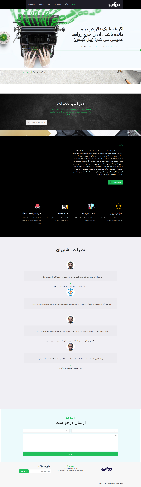

## Installation

:You can install the package via composer

```bash
composer require dpsoft/mehr4-theme-davaatdpr
```
```bash
php artisan mehr4-theme-davaatdpr:install
```

## Usage

**راهنمای  مدیریت سایت davaatdpr**
____
## تغییر تصاویر

### تغییر آیکون سایت

جهت تغییر آیکون سایت ،ابتدا وارد سامانه می شویم و در سامانه از طریق منوی سمت راست ،در قسمت مدیریت فایل وارد پوشه theme شوید و فایل مربوط به آیکون را در این قسمت اپلود کنید.اسم فایل باید favicon.ico باشد.
___
### تغییر لوگو header

جهت تغییر لوگوی سایت ،ابتدا وارد سامانه می شویم و در سامانه از طریق منوی سمت راست ،در قسمت مدیریت فایل وارد پوشه theme شوید و فایل مربوط به لوگو را در این قسمت اپلود کنید.اسم فایل باید logo-header.png باشد و سایز عکس 50*148 باشد.
___

### تغییر لوگو footer

جهت تغییر لوگوی سایت ،ابتدا وارد سامانه می شویم و در سامانه از طریق منوی سمت راست ،در قسمت مدیریت فایل وارد پوشه theme شوید و فایل مربوط به لوگو را در این قسمت اپلود کنید.اسم فایل باید logo-footer.png باشد و سایز عکس 50*212 باشد.
___

### تغییر بکگراند header

جهت تغییر بکگراند صفحه اصلی در همین مسیر بالا فایل مربوط به نام homebg-header.jpg را آپلود می کنیم.سایز تصویر باید 670*1920 باشد.
___

### تغییر بکگراند وبلاگ در صفحه اصلی
جهت تغییر عکس در همین مسیر بالا فایل مربوط به نام homebg-section1.jpg را آپلود می کنیم.سایز تصویر باید 813*1920 باشد.
___
### تغییر بکگراند تعرفه خدمات در صفحه اصلی 
جهت تغییر عکس در همین مسیر بالا فایل مربوط به نام homebg-section2.jpg را آپلود می کنیم.سایز تصویر باید 1080*1920 باشد.
___
### تغییر آیکون تعرفه خدمات در صفحه اصلی 
جهت تغییر عکس در همین مسیر بالا فایل مربوط به نام icon-course.png را آپلود می کنیم.سایز تصویر باید 100*72 باشد.
___
### تغییر بکگراند درباره ما در صفحه اصلی
جهت تغییر عکس در همین مسیر بالا فایل مربوط به نام homebg-section3.jpgباید باشد را آپلود می کنیم.سایز تصویر باید 1070*1920 باشد.
___
### تغییر آیکون های زیر بخش درباره ما درصفحه اصلی
جهت تغییر عکس ها در همین مسیر بالا فایل های مربوطه را به ترتیب از راست به چپ صحفه icon1.png،icon2.pn،icon3.png،icon4.png باید باشد را آپلود می کنیم.سایز تصاویر باید 72*72 باشد.
___
### تغییر عکس بکگراند نظرات مشتریان در صفحه اصلی
جهت تغییر عکس در همین مسیر بالا فایل مربوط به نام homebg-section4.jpg باید باشد را آپلود می کنیم.سایز تصویر باید 700*1920 باشد.
___
### تغییر عکس بکگراند هدر در صفحه وبلاگ  
جهت تغییر عکس در همین مسیر بالا فایل مربوط به نام blog-header.jpgباید باشد را آپلود می کنیم.سایز تصویر باید 463*1920 باشد.
___
### تغییر عکس بکگراند هدر در صفحه درباره ما  
جهت تغییر عکس در همین مسیر بالا فایل مربوط به نام about-header.jpgباید باشد را آپلود می کنیم.سایز تصویر باید 636*1920 باشد.
___
### تغییر عکس داستان ما در صفحه درباره ما  
جهت تغییر عکس در همین مسیر بالا فایل مربوط به نام about-picture.pngباید باشد را آپلود می کنیم.سایز تصویر باید 636*536 باشد.
___
### تغییر تصاویر زیر متن درباره ما در صفحه درباره ما  
جهت تغییر تصاویر در همین مسیر بالا فایل های مربوط به ترتیب به نام های about-pic1.png، about-pic2.png ، about-pic3.pngباید باشد را آپلود می کنیم.سایز تصاویر باید 221*221 باشد.
___
### تغییر تصاویر نظرات مشتریان در صفحه درباره ما  و صفحه اصلی
جهت تغییر تصاویر در همین مسیر بالا فایل های مربوط به ترتیب به نام های person1.jpg و person2.jpg و person3.jpg و person4.jpg باید باشد را آپلود می کنیم.سایز تصاویر باید 85*85 باشد.
___
### تغییر عکس بکگراند فرم ارسال پیام در صفحه تماس با ما  
جهت تغییر عکس در همین مسیر بالا فایل مربوط به نام bg-contact.pngباید باشد را آپلود می کنیم.سایز تصویر باید 519*995 باشد.
___
## تغییر شعار،عناوین اسلایدر ،درباره ما  
جهت تغییر متن های سایت ، بعد از وارد شدن در سامانه،در منوی سمت راست قسمت تنظیمات را زده و تمام متن های سایت مانند شعار،درباره ما،متن های روی اسلایدر،متن های صفحه درباره ما،آدرس،شماره تلفن،لینک شبکه های اجتماعی و .... را تغییر دهید.
	
___
### تغییر نام مشتری در نظرات مشتریان 
جهت تغییر در همین مسیر بالا متغییرهای مربوط به نام های person.name1 تا person.name4 را تغییر دهید.
___
### تغییر نظر مشتری در نظرات مشتریان 
جهت تغییر در همین مسیر بالا متغییرهای مربوط به نام های person.comment1 تا person.comment4 را تغییر دهید.
___
### تغییر نام نویسنده متن در صفحه درباره ما 
جهت تغییر در همین مسیر بالا متغییر مربوط به نام admin را تغییر دهید.
___
### تغییر محتوای درس در صفحه دوره 
جهت تغییر در همین مسیر بالا متغییرهای مربوط به نام های course.content1 تا course.content4 را تغییر دهید.
___
### تغییر توضیح تعرفه خدمات در صفحه اصلی
جهت تغییر در همین مسیر بالا متغییر مربوط به نام course.summary را تغییر دهید.
___
### تغییر متن زیر شعار در صفحه اصلی
جهت تغییر در همین مسیر بالا متغییر مربوط به نام summary را تغییر دهید.
___
### تغییر عنوان زیر آیکون درباره مادر صفحه اصلی
جهت تغییر در همین مسیر بالا متغییرهای مربوط به نام های icon.title1 تا icon.title4 را تغییر دهید.
___
### تغییر متن زیر آیکون درباره مادر صفحه اصلی
جهت تغییر در همین مسیر بالا متغییرهای مربوط به نام های icon.text1 تا icon.text4 را تغییر دهید.
___
### تغییر عنوان تصاویر زیر متن در صفحه درباره ما 
جهت تغییر در همین مسیر بالا متغییرهای مربوط به نام های about_tit1 تا about_tit3 را تغییر دهید.
___
### تغییر متن تصاویر زیر متن در صفحه درباره ما 
جهت تغییر در همین مسیر بالا متغییرهای مربوط به نام های about_text1 تا about_text3 را تغییر دهید.
___
### تغییر عنوان درباره ما در صفحه درباره ما
جهت تغییر در همین مسیر بالا متغییر مربوط به نام about را تغییر دهید.
___
### تغییر توضیح تعرفه خدمات در صفحه خدمات
جهت تغییر در همین مسیر بالا متغییر مربوط به نام course-list.summary را تغییر دهید.
___
