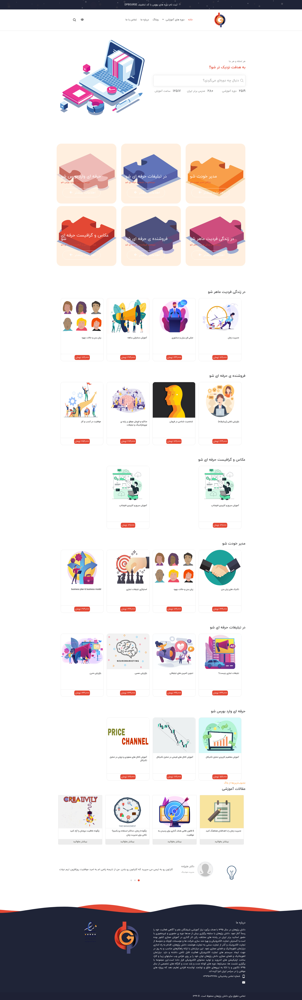

____
### تغییر تصاویر

#### تغییر لوگو
جهت تغییر لوگوی سایت ،ابتدا وارد سامانه می شویم و در سامانه از طریق منوی سمت راست ،در قسمت مدیریت فایل وارد پوشه theme شوید و فایل مربوط به لوگو را در این قسمت اپلود کنید.اسم فایل باید logo.png باشد و سایز عکس 100*420 باشد
___

#### تغییر هدر 
جهت تغییر هدر در همین مسیر بالا فایل مربوط به هدر که نام آن header.jpg باید باشد را آپلود می کنیم.سایز تصویر باید 100*2800 باشد.
___

#### تغییر آیکون سرفصل ها

برای تغییر آیکون سرفصل ها در مسیر توضیح داده شده فایل مربوط به آیکون را که نام آن section-icon.png می باشد آپلود می کنیم.
سایز تصویر باید
120*119
باشد.

---
#### متا های ویژگی دوره در صفحه دوره

برای تغییر کلیدهای متا مربوط به ویژگی دوره ها به داشبورد سامانه و بخش جزئیات دوره موردنظر بروید.
متا های تعریف شده به ترتیب زیر می باشند:

مدت زمان آموزش:

learning_duration

نحوه برگزاری دوره:

course_holding

ظرفیت باقی مانده:

maximum_students

تعداد افراد دوره:

enrolled_students

---

### تغییر اسلایدر
جهت تغییر اسلایدر در همین مسیر بالا فایل مربوط یه اسلایدر که نام آن slider.png باید باشد را آپلود می کنیم.سایز تصویر باید 750*830 باشد.

---
#### تغییر عکس  نظردهندگان در صفحه اصلی

سایز:300*300  

نام عکس:comment-person1.jpg

نام عکس:comment-person2.jpg

نام عکس:comment-person3.jpg
  ___

#### تغییر عکس  درباره ما در صفحه درباره ما

سایز:497*560  
نام عکس:about.jpg
___
#### تغییر عکس کنار  صفحه دوره ها

سایز:200*600  
نام عکس:side.png
___

#### تغییر عکس متحرک نظرات در صفحه اصلی

سایز:512*512  
نام عکس:comment.gif
___
#### تغییرشمارنده های آیکن شمارنده ها در صفحه اصلی

جهت تغییر در همین مسیر بالا متغیرهای مربوط به نام شمارنده 1 و 2 و3 عنوان شمارنده 1 و3,2
را تغییر دهید.
___

#### تغییرعنوان های مربوط به دپارتمان ها در صفحه اصلی

جهت تغییر در همین مسیر بالا متغیرهای مربوط به نام  عنوان معرفی دپارتمان ها
را تغییر دهید.
___

#### تغییرمتن اسلایدر در صفحه اصلی

جهت تغییر در همین مسیر بالا متغیرهای مربوط به نام شعار اول اسلایدر و شعار دوم اسلایدر  
را تغییر دهید.
___

#### تغییر عنوان نظرات در بخش پایین صفحه اصلی

جهت تغییر در همین مسیر بالا متغیرهای مربوط به نام و شغل و نظر نظر دهنده اول تا سوم را تغییر دهید.
___

#### تغییرعنوان بالای صفحات

جهت تغییر در همین مسیر بالا متغیرهای مربوط به نام شعار اول اسلایدر و شعار دوم اسلایدر  
را تغییر دهید.
___

#### تغییرعنوان بالای صفحه

جهت تغییر در همین مسیر بالا متغیرهای مربوط به نام شعار نام دوره-لینک دوره و کد تخفیف  
را تغییر دهید.
___

#### تغییر متن درباره ما در بخش فوتر

جهت تغییر در همین مسیر بالا متغیرهای مربوط به نام درباره ما فوتر  
را تغییر دهید.
___
#### تغییر عنوان ویژگی های دوره ها در صفحه دوره ها

جهت تغییر در همین مسیر بالا متغیرهای مربوط عنوان اول تا سوم صفحه خرید  
را تغییر دهید.
___

#### تغییر عنوان های صفحه تماس با ما 
جهت تغییر در همین مسیر بالا متغیرهای مربوط به عنوان اول صفحه تماس با ما  
را تغییر دهید.
___
#### تغییر عنوان های قوانین ثبت دیدگاه در بخش نظرات
جهت تغییر در همین مسیر بالا متغیرهای مربوط به متن توضیحی ثبت نظرات و قوانین اول تا چهارم ثبت نظرات  
را تغییر دهید.
___

#### انتصاب مدرسان دوره در صفحه دوره ها

تصویر آواتار مدرس را در قسمت مدیریت فایل آپلود کنید.

در صفحه مدیریت کاربران ، ویرایش کاربر را زده و در قسمت متا ،متایی به نام avatar تعریف کرده و مقدار آن متا را آدرس تصویر آواتار مدرس در قسمت مدیریت فایل درج کنید.

همچنین برای  تعریف مشخصات مدرس ،کافیست متای
description1 و description2 وdescription3 وdescription4 وdescription5 را تعریف کنید.

---
### آواتار کاربران در بخش نظرات و ..
برای تغییر آواتار به مدیریت فایل و پوشه theme بروید. سپس تصویر موردنظر را با نام user.png آپلود نمایید.

این آواتار به صورت یک تنظیمات در سامانه تعریف شده است.
نام این تنظیمات
site.user-icon
می باشد.

مقدار آن لینک آواتار آپلود شده در پوشه theme در بخش مدیریت فایل می باشد.