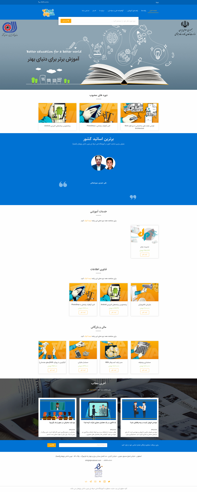

#### تغییر تصاویر

##### تغییر لوگو

جهت تغییر لوگوی سایت تصویر را در قسمت مدیریت فایل سایت آپلود کرده و آدرس لوگو را در قسمت تنظیمات مربوط به لوگو جایگزین می کنیم.
246\*100 سایز لوگوی پیش فرض
می باشد.
favicon تغییر لوگوی موبایل و
از همین طریق
امکان پذیر است.

##### تغییر اسلایدر

جهت تغییر اسلایدر سایت تصویر را در قسمت مدیریت فایل سایت آپلود کرده و آدرس تصویر اسلایدر را در قسمت تنظیمات مربوط به اسلایدر جایگزین می کنیم.
1920\*680 سایز پیش فرض
می باشد.

##### تغییر تصویر زمینه وبلاگ

جهت تغییر تصویر زمینه وبلاگ سایت تصویر را در قسمت مدیریت فایل سایت آپلود کرده و آدرس تصویر زمینه وبلاگ را در قسمت تنظیمات مربوط به تصویر زمینه وبلاگ جایگزین می کنیم.
1366\*611 سایز پیش فرض
می باشد.

##### تغییر طول دوره و ساعت آموزشی

جهت تغییر این اعداد باید برای هر دوره متای مربوط به
learn_time_houre , learn_time_houre
را تغییر دهید.در غیر اینصورت از اعداد پیش فرض استفاده می شود.

##### تغییر شعار،عناوین اسلایدر ،درباره ما ،توکن سازمانی

جهت تغییر متن های سایت ، بعد از وارد شدن در سامانه،در منوی سمت راست قسمت تنظیمات را زده و تمام متن های سایت مانند شعار،درباره ما،متن های روی اسلایدر،متن های صفحه درباره ما،آدرس،شماره تلفن،لینک شبکه های اجتماعی و توکن سازمانی , .... را تغییر دهید.
همچنین تغییر آدرس در گوگل و توضیح کوتاه برای SEO در این قسمت امکان پذیر است.

##### تغییر بخش های صفحه اول

دوره های محبوب در صفحه اول دوره هایی هستند که
متای featured-home آن ها true باشد.
دوره ها و دسته بندی ها شامل دوره های ویژه و دسته بندی های ویژه می باشد.
اساتید از طریق بخش کاربران قابل تغییر می باشد و جهت تغییر اطلاعات آن متاهای هر استاد را تغییر دهید.مثلا برای تغییر آواتار کافیست ابتدا تصویر را در قسمت مدیریت فایل آپلود کرده و آدرس آن را در متای avatar قرار دهید.

## تغییر سایزهای مختلف اسلایدر

برای تغییر اندازه های تصاویر در سایز تبلت و گوشی
کافیست آدرس تصویر اسلایدر مربوط به گوشی و تبلت را در قسمت تنظیمات مهر قرار دهید.
