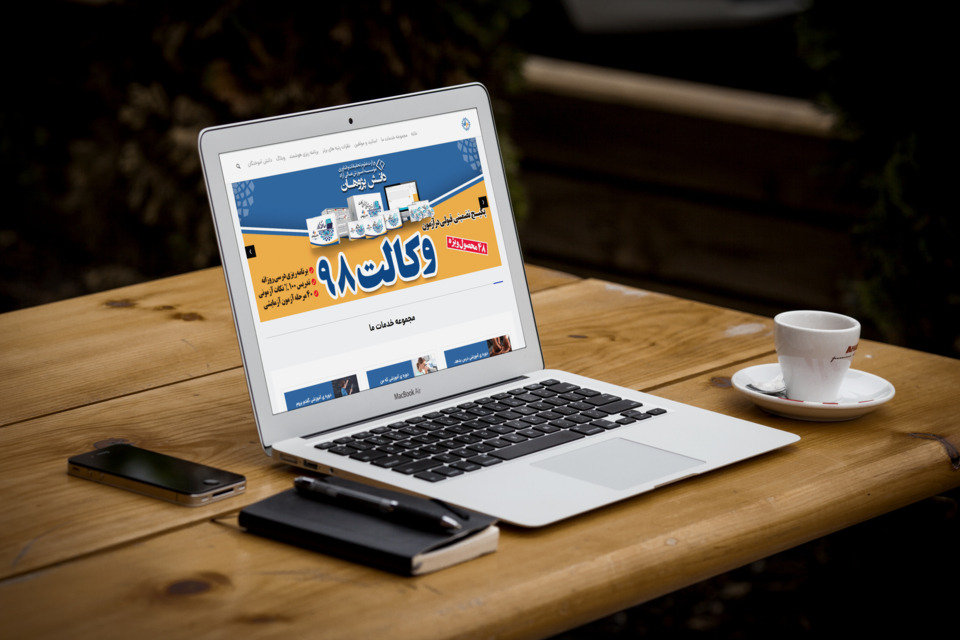

[](https://packagist.org/packages/dpsoft/mehr4-theme-dpvekalat)
[](https://packagist.org/packages/dpsoft/mehr4-theme-dpvekalat)



## Installation

:You can install the package via composer

```bash
composer require dpsoft/mehr4-theme-dpvekalat
```
```bash
php artisan mehr4-theme-dpvekalat:install
```

## Usage

**راهنمای  مدیریت سایت dpvekalat**
____
## تغییر تصاویر

### تغییر لوگو

جهت تغییر لوگوی سایت ،ابتدا وارد سامانه می شویم و در سامانه از طریق منوی سمت راست ،در قسمت مدیریت فایل وارد پوشه theme شوید و فایل مربوط به لوگو را در این قسمت اپلود کنید.اسم فایل باید logo.png باشد و سایز عکس 49*133 باشد.
___
### تغییر favicon

جهت تغییر favicon  سایت ،درهمین مسیر بالا فایل مربوطه  را در این قسمت اپلود کنید.اسم فایل باید favicon.co باشد.
___

###  تغییر بکگراند اسلایدر

جهت تغییر بکگراند اسلایدر صفحه اصلی در همین مسیر بالا فایل های مربوط به نام های background_home3.png ، background_home2.png، background_home1.png را آپلود می کنیم.سایز تصویر باید 562*1600 باشد.
___


### تغییر بکگراند هدر بقیه صفحات به غیر از صفحه اصلی 
جهت تغییر عکس در همین مسیر بالا فایل مربوط به نام headerbg.jpg را آپلود می کنیم.سایز تصویر باید 900*1901 باشد.
___
### تغییر عکس درباره ما در صفحه درباره ما 
جهت تغییر عکس در همین مسیر بالا فایل مربوط به نام bg-about.jpg را آپلود می کنیم.سایز تصویر باید 400*1400 باشد.
___
### تغییر عکس های تیم ما در صفحه درباره ما 
جهت تغییر تصاویر در همین مسیر بالا فایل های مربوط به نام های person1.jpg،person2.jpg،...person5.jpgباید باشد را آپلود می کنیم.سایز تصویر باید 500*350 باشد.

___


## تغییر متن های ثابت مانند اسامی اساتید و ...
جهت تغییر متن های سایت ، بعد از وارد شدن در سامانه،در منوی سمت راست قسمت تنظیمات را زده و تمام متن های سایت مانند شعار،درباره ما،متن های صفحه درباره ما،آدرس،شماره تلفن،لینک شبکه های اجتماعی و .... را تغییر دهید.
همچنین تغییر آدرس در گوگل  و توضیح کوتاه برای SEO در این قسمت امکان پذیر است.

برای تغییر اسامی اساتید،متغییرهای teacher.name1 تا teacher.name10 را تغییر دهید.
برای تغییر موارد محتوای درس در صفحه course متغییر های course.content1 تا course.content4 را تغییر دهید.

برای تغییر نام دانش آموختگان متغییرهای student.name1 تا student.name6 را تغییر دهید.

