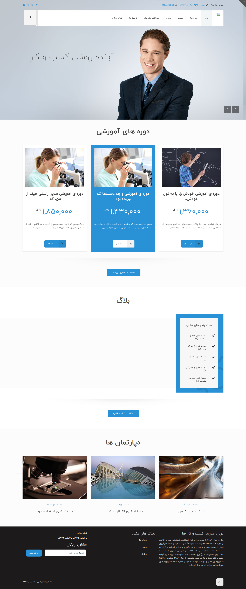

## تغییر تصاویر

### تغییر آیکون سایت

جهت تغییر آیکون سایت ،ابتدا وارد سامانه می شویم و در سامانه از طریق منوی سمت راست ،در قسمت مدیریت فایل وارد پوشه theme شوید و فایل مربوط به آیکون را در این قسمت اپلود کنید.اسم فایل باید favicon.ico باشد.

---

### تغییر لوگو

جهت تغییر لوگوی سایت ،ابتدا وارد سامانه می شویم و در سامانه از طریق منوی سمت راست ،در قسمت مدیریت فایل وارد پوشه theme شوید و فایل مربوط به لوگو را در این قسمت اپلود کنید.اسم فایل باید logo.png باشد و سایز عکس 81\*131 باشد.

---

### تغییر عکس های اسلایدر(عکس اول)

جهت تغییر لوگوی سایت ،ابتدا وارد سامانه می شویم و در سامانه از طریق منوی سمت راست ،در قسمت مدیریت فایل وارد پوشه theme شوید و فایل مربوط به لوگو را در این قسمت اپلود کنید.اسم فایل باید slider1.png باشد و سایز عکس 452\*299 باشد.

---

### تغییر عکس های اسلایدر(عکس اول)

جهت تغییر لوگوی سایت ،ابتدا وارد سامانه می شویم و در سامانه از طریق منوی سمت راست ،در قسمت مدیریت فایل وارد پوشه theme شوید و فایل مربوط به لوگو را در این قسمت اپلود کنید.اسم فایل باید slider2.png باشد و سایز عکس 530\*446 باشد.

---

### تغییر عکس درباره ما در صفحه درباره ما

جهت تغییر عکس در همین مسیر بالا فایل مربوط به نام about-us.jpg باید باشد را آپلود می کنیم.سایز تصویر باید 425\*380 باشد.

---

### تغییر تصاویر تیم ما در صفحه درباره ما

جهت تغییر تصاویر در همین مسیر بالا فایل های مربوط به ترتیب به نام های team1.jpg و team2.jpg و team3.jpg باید باشد را آپلود می کنیم.سایز تصاویر باید 305\*305 باشد.

---

## تغییر شعار ،درباره ما و..

جهت تغییر متن های سایت ، بعد از وارد شدن در سامانه،در منوی سمت راست قسمت تنظیمات را زده و تمام متن های سایت مانند شعار،درباره ما،متن های روی اسلایدر،متن های صفحه درباره ما،آدرس،شماره تلفن،لینک شبکه های اجتماعی و .... را تغییر دهید.
همچنین تغییر آدرس در گوگل و توضیح کوتاه برای SEO در این قسمت امکان پذیر است.

---

### تغییر شعار اسلایدر

جهت تغییر در همین مسیر بالا متغییرهای مربوط به نام های متن اول اسلایدر و متن دوم اسلایدر را تغییر دهید.

---

### تغییر مشخصات در صفحه درباره ما

جهت تغییر در همین مسیر بالا متغییرهای مربوط به نام های شعار سایت برای تغییر متن عنوان درباره ما و جهت تغییر متن درباره ما ، متغیر به نام درباره ما سایت را تغییر دهید.

---

### تغییر نام اعضای تیم ما و شغل اعضا در صفحه درباره ما

جهت تغییر در همین مسیر بالا متغییرهای مربوط به نام های نام تیم و شغل اعضای تیم تغییر دهید.

---

### تغییر متن معرفی تیم در صفحه درباره ما

جهت تغییر در همین مسیر بالا متغییر متن تیم ما را تغییر دهید.

---

### تغییر محتوای درس در صفحه درباره ما

جهت تغییر در همین مسیر بالا متغییرهای مربوط به نام های محتوای درس ۱ تا ۴ را تغییر دهید.

---

### تغییر متن درباره ما در قسمت فوتر

جهت تغییر در همین مسیر بالا متغیر مربوط به نام متن فوتر را تغییر دهید.

---
