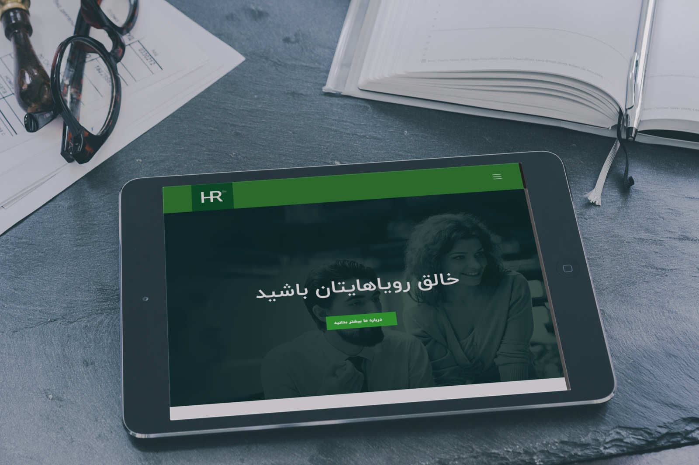

## Very short description of the package

[](https://packagist.org/packages/dpsoft/mehr4-theme-honarforoush)
[](https://packagist.org/packages/dpsoft/mehr4-theme-honarforoush)

BeTheme-(hr)




## Installation

You can install the package via composer:

```bash
composer require dpsoft/mehr4-theme-honarforoush
```

## Usage

**راهنمای  مدیریت سایت **
____
## تغییر تصاویر

### تغییر لوگو

جهت تغییر لوگوی سایت ،ابتدا وارد سامانه می شویم و در سامانه از طریق منوی سمت راست ،در قسمت مدیریت فایل وارد پوشه theme شوید و فایل مربوط به لوگو را در این قسمت اپلود کنید.اسم فایل باید logo.png باشد و سایز عکس 97*116 باشد
___
### تغییر اسلایدر

جهت تغییر اسلایدر در همین مسیر بالا فایل مربوط یه اسلایدر که نام آن slider.jpg باید باشد را آپلود می کنیم.سایز تصویر باید 1100*1920 باشد.
___

### تغییر آیکن های زیر اسلایدر در صفحه اصلی
جهت تغییر عکس در همین مسیر بالا فایل مربوط یه اسلایدر که نام آن ها  icon3.png  icon2.png  icon1.png باید باشد را آپلود می کنیم.سایز تصویر باید 100*100 باشد
___

### تغییر آیکن های  درباره ما در صفحه اصلی
جهت تغییر عکس در همین مسیر بالا فایل مربوط یه اسلایدر که نام آن ها 
  4.png 3.png  2.png  1.png باید باشد را آپلود می کنیم.سایز تصویر باید 161*120 باشد
___

### تغییر بخش تبلیغات در صفحه اصلی

جهت تغییر عکس در همین مسیر بالا فایل مربوط یه عکس بخش تبلیغات که نام  adv.png  باید باشد را آپلود می کنیم.سایز تصویر باید 536*1850 باشد

___
### تغییر بخش ویديو در صفحه اصلی
bg-video.jpg : نام عکس 
سایز عکس :   1300*1920
نام ویديو: 
video.mp4

.جهت تغییر عکس در همین مسیر بالا فایل مربوط یه عکس بخش ویديو که نام  bg-video.jpg  باید باشد را آپلود می کنیم.سایز تصویر باید 1300*1920 باشد
 ویدیو را در بخش مدیریت فایل با نام video.mp4
آپلود شود. 
___

### تغییر بخش اساتید در صفحه اصلی

.جهت تغییر عکس در همین مسیر بالا فایل مربوط یه عکس بخش اساتید که نام  teacher.png  باید باشد را آپلود می کنیم.سایز تصویر باید 290*337 باشد

___
### تغییر  هدر تصویر صفحه پست های مربوط به بلاگ
جهت تغییر عکس در همین مسیر بالا فایل مربوط یه اسلایدر که نام آن ها 
  course-main.jpg  باید باشد را آپلود می کنیم.سایز تصویر باید 800*1920 باشد
___
### تغییر عکس دپارتمان ها
جهت تغییر عکس دپارتمان ها از طریق سامانه مهر
تصاویر را انتخاب کنید و سایز آن باید 90*90 باشد.
___
### تغییر عکس درباره ما در صفحه اصلی
جهت تغییر عکس در همین مسیر بالا فایل مربوط یه اسلایدر که نام آن  course-main.jpg باید باشد را آپلود می کنیم.سایز تصویر باید 460*824 باشد.
 ___

### تغییر عکس تماس با ما در صفحه تماس با ما
جهت تغییر عکس در همین مسیر بالا فایل مربوط یه عکس اول صفحه تماس با ما که نام آن contact.png باید باشد را آپلود می کنید
 هست که سایز آن 466*481 پیکسل می باشد.
___

### تغییر عکس بالای  صفحه دوره ها 
جهت تغییر عکس  صفحه دوره ها
تصویری به نام course-main.jpg را در سامانه مهر آپلود کنید.1920*445
___

### تغییر عکس بالای  صفحه سوالات متداول 
جهت تغییر عکس  صفحه دوره ها
تصویری به نام blog-main.jpg را در سامانه مهر آپلود کنید.1920*445
___
### تغییر شعار،عناوین اسلایدر ،درباره ما  
جهت تغییر متن های سایت ، بعد از وارد شدن در سامانه،در منوی سمت راست قسمت تنظیمات را زده و تمام متن های سایت مانند شعار،درباره ما،متن های روی اسلایدر،متن های صفحه درباره ما،آدرس،شماره تلفن،لینک شبکه های اجتماعی و .... را تغییر دهید.
همچنین تغییر آدرس در گوگل  و توضیح کوتاه برای SEO در این قسمت امکان پذیر است.	
___
### تغییر صفحه سوالات متداول
وارد سامانه میشویم و وارد منوی سمت راست به نام صفحات می شویم.
صفحه ای به نام پرسش و پاسخ وجود دارد که با تغییر متن های این صفحه، صفحه سوالات متداول هم تغییر می کند.
می توان در قسمت سئو برای این صفحه ، متا تگ و دیسکریپشن جدا تعریف کرد.
___

### تغییر متن شعار اسلایدر 
جهت تغییر در همین مسیر بالا متغییرهای مربوط به نام متن اول اسلایدر را تغییر دهید.
___

### تغییرمتن آیکن های زیر اسلایدر 
جهت تغییر در همین مسیر بالا متغییرهای مربوط به نام  متن آیکن اول صفحه اصلی  تا متن سوم را متغییر دهید.
___
### تغییرمتن اساتید 
جهت تغییر در همین مسیر بالا متغییر مربوط به  متن اساتید را  تغییر دهید.
___
###  تغییر متن بخش تبلیغات در صفحه اصلی
  جهت تغییر در همین مسیر بالا متغییرهای مربوط عنوان تبلیغاتی صفحه اول
و متن تبلیغاتی صفحه اول
 را تغییر دهید.
___

### تغییرمتن درباره ما در صفحه درباره ما   
جهت تغییر در همین مسیر بالا متغییرهای مربوط متن درباره ما صفحه درباره ما
 را تغییر دهید.
___
### تغییرمتن اعضای تیم در صفحه درباره ما 
جهت تغییر در همین مسیر بالا متغییرهای مربوط اعضای تیم از یک تا سه و شغل اعضای تیم از یک تا سه
 را تغییر دهید.
___
### تغییرمتن آیکن ها در صفحه درباره ما 
جهت  تغییرمتن آیکن ها در همین مسیر بالا متغییرهای مربوط آیکن 1 صفحه درباره ما
الی 4 
 را تغییر دهید.
___

### تغییر عنوان مربوط به محتوای آموزشی
  
جهت تغییر در همین مسیر بالا ، متغیر عنوان محتوای آموزشی 1 تا 4 را تغییر دهید
___
### Security

If you discover any security related issues, please email info@dpsoft.ir instead of using the issue tracker.

## Credits

- [zahrayavari](http://mygitlab.ir/dpsoft)


## License

The Apache License 2. Please see [License File](LICENSE.md) for more information.

