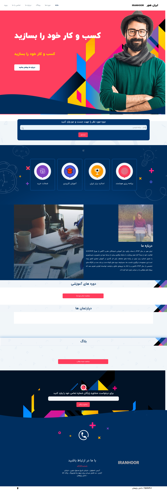

## Installation

You can install the package via composer:

```bash
composer require dpsoft/mehr4-theme-iranhoor
```

## Usage

**راهنمای  مدیریت سایت **
____

### تغییر لوگو

جهت تغییر لوگوی سایت ،ابتدا وارد سامانه می شویم و در سامانه از طریق منوی سمت راست ،در قسمت مدیریت فایل وارد پوشه theme شوید و فایل مربوط به لوگو را در این قسمت اپلود کنید.اسم فایل باید logo.png باشد .
___
### تغییر اسلایدر

جهت تغییر اسلایدر در همین مسیر بالا فایل مربوط یه اسلایدر که نام آن home_intro.jpg باید باشد را آپلود می کنیم.سایز تصویر باید 890*1920 باشد.
___
### تغییر آیکن های  درباره ما در صفحه اصلی
جهت تغییر عکس در همین مسیر بالا فایل مربوط یه اسلایدر که نام آن ها  home_icon_pic2.png  home_icon_pic1.png  home_icon_pic4.png home_icon_pic3.png باید باشد را آپلود می کنیم.سایز تصویر باید 146*146 باشد

### تغییر عکس درباره ما در صفحه اصلی
جهت تغییر عکس اول در همین مسیر بالا فایل مربوط یه اسلایدر که نام آن home_about.jpg باید باشد را آپلود می کنیم.سایز تصویر باید 319*300 باشد.
جهت تغییر عکس دوم  در همین مسیر بالا فایل مربوط یه اسلایدر که نام آن about-video.png باید باشد را آپلود می کنیم.سایز تصویر باید 634*600 باشد.


### تغییر عکس تماس با ما در صفحه تماس با ما
جهت تغییر عکس در همین مسیر بالا فایل مربوط یه عکس اول صفحه تماس با ما که نام آن contact2.jpg باید باشد را آپلود می کنید.سایز تصویر باید243*835 باشد.عکس دوم این صفحه هم contact1.jpg هست که سایز آن 294*294 پیکسل می باشد.

### تغییر عکس درباره ما
جهت تغییر عکس در همین مسیر بالا فایل مربوط یه عکس اول صفحه درباره که نام آن  about.png باید باشد را آپلود می کنید.سایز تصویر باید  752*706  باشد.عکس دوم این صفحه هم home_about.png هست که سایز آن 180*660 پیکسل می باشد.عکس سوم:about2.jpg با سایز 600*638   عکس چهارم:about3.jpg سایز:260*300 و عکس چهارم:about4.jpg سایز:260*300 می باشد.عکس های اعضای تیم هم team4.jpg team3.jpg team2.jpg team1.jpg با سایز 276*276 می باشد.


### تغییر شعار،عناوین اسلایدر ،درباره ما  
جهت تغییر متن های سایت ، بعد از وارد شدن در سامانه،در منوی سمت راست قسمت تنظیمات را زده و تمام متن های سایت مانند شعار،درباره ما،متن های روی اسلایدر،متن های صفحه درباره ما،آدرس،شماره تلفن،لینک شبکه های اجتماعی و .... را تغییر دهید.
همچنین تغییر آدرس در گوگل  و توضیح کوتاه برای SEO در این قسمت امکان پذیر است.	


### تغییر صفحه سوالات متداول

وارد سامانه میشویم و وارد منوی سمت راست به نام صفحات می شویم.
صفحه ای به نام پرسش و پاسخ وجود دارد که با تغییر متن های این صفحه، صفحه سوالات متداول هم تغییر می کند.
می توان در قسمت سئو برای این صفحه ، متا تگ و دیسکریپشن جدا تعریف کرد.

### تغییر شعارهای اسلایدر 
جهت تغییر در همین مسیر بالا متغییرهای مربوط به نام های متن اول اسلایدر و متن دوم اسلایدر  را تغییر دهید.
___

### تغییرمتن آیکن های زیر اسلایدر وشعارآیکن ها  
جهت تغییر در همین مسیر بالا متغییرهای مربوط به نام  شعار آیکن های زیر اسلایدر
                                                    و آیکن یک الی چهار صفحه اصلی تغییر دهید.
___

### تغییرمتن آیکن درباره ما در صفحه اصلی  
جهت تغییر در همین مسیر بالا متغییرهای مربوط به نام  درباره ما-صفحه اصلی
 را تغییر دهید.
___

### تغییرمتن درباره ما در صفحه اصلی   
جهت تغییر در همین مسیر بالا متغییرهای مربوط به متن درباره ما-صفحه اصلی
 را تغییر دهید.
___
### تغییرمتن شعار درباره ما در صفحه درباره ما   
جهت تغییر در همین مسیر بالا متغییرهای مربوط به شعار درباره ما در صفحه درباره ما را تغییر دهید.
___
### تغییرمتن درباره ما در صفحه درباره ما   
جهت تغییر در همین مسیر بالا متغییرهای مربوط متن درباره ما صفحه درباره ما
 را تغییر دهید.
___
### تغییرمتن اعضای تیم در صفحه درباره ما 
جهت تغییر در همین مسیر بالا متغییرهای مربوط اعضای تیم از یک تا چهار و شغل اعضای تیم از یک تا چهار
 را تغییر دهید.
___

### تغییر عنوان مربوط به محتوای آموزشی
  
جهت تغییر در همین مسیر بالا ، متغیر عنوان محتوای آموزشی 1 تا 4 را تغییر دهید
___


