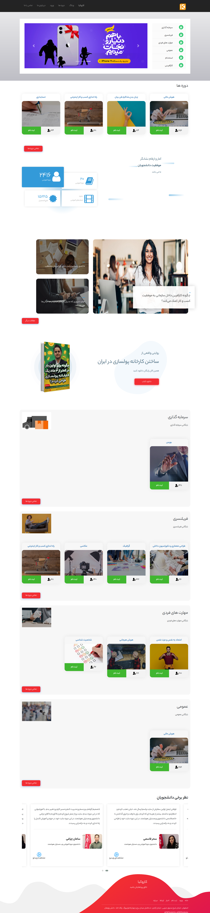

## Installation

:You can install the package via composer

```bash
composer require dpsoft/mehr4-theme-minimal
```
```bash
php artisan mehr4-theme-minimal:install
```

## Usage

**راهنمای  مدیریت سایت karokia.ac**
____
## تغییر تصاویر

### تغییر آیکون سایت

جهت تغییر آیکون سایت ،ابتدا وارد سامانه می شویم و در سامانه از طریق منوی سمت راست ،در قسمت مدیریت فایل وارد پوشه theme شوید و فایل مربوط به آیکون را در این قسمت اپلود کنید.اسم فایل باید favicon.png باشد.
___
### تغییر لوگو header

جهت تغییر لوگوی سایت ،ابتدا وارد سامانه می شویم و در سامانه از طریق منوی سمت راست ،در قسمت مدیریت فایل وارد پوشه theme شوید و فایل مربوط به لوگو را در این قسمت اپلود کنید.اسم فایل باید logo.png باشد و سایز عکس 70*117 باشد.

___

### تغییر بکگراند header

جهت تغییر بکگراند صفحه اصلی در همین مسیر بالا فایل مربوط به نام home-bg.jpg را آپلود می کنیم.سایز تصویر باید 600*1400 باشد.
___

### تغییر بکگراند header در صفحه پست و دوره
جهت تغییر عکس در همین مسیر بالا فایل مربوط به نام bg-header.jpg را آپلود می کنیم.سایز تصویر باید 1200*1920 باشد.
___
### تغییر عکس کتاب در صفحه اصلی 
جهت تغییر عکس در همین مسیر بالا فایل مربوط به نام book.png را آپلود می کنیم.سایز تصویر باید 350*201 باشد.
___
### تغییر تصاویر دانشجویان در بخش نظرات دانشجویان در صفحه اصلی
جهت تغییر عکس ها در همین مسیر بالا فایل های مربوطه را به ترتیب از راست به چپ صحفه student1.jpg،student2.jpg،student3.jpg،student4.jpg باید باشد را آپلود می کنیم.سایز تصاویر باید 131*175 باشد.
___
### تغییر تصویر در صفحه درباره ما  
جهت تغییر عکس در همین مسیر بالا فایل مربوط به نام about.jpg باید باشد را آپلود می کنیم.سایز تصویر باید 800*1200 باشد.

___

## تغییر شعار،عناوین اسلایدر ،درباره ما  
جهت تغییر متن های سایت ، بعد از وارد شدن در سامانه،در منوی سمت راست قسمت تنظیمات را زده و تمام متن های سایت مانند شعار،درباره ما،متن های روی اسلایدر،متن های صفحه درباره ما،آدرس،شماره تلفن،لینک شبکه های اجتماعی و .... را تغییر دهید.
همچنین تغییر آدرس در گوگل  و توضیح کوتاه برای SEO در این قسمت امکان پذیر است.	

___
### تغییر نام دانشجوی نظر دهنده در صفحه اصلی
جهت تغییر در همین مسیر بالا متغییرهای مربوط به نام های student.name1 تا student.name4 را تغییر دهید.
___
### تغییر نظر دانشجوی نظر دهنده در صفحه اصلی
جهت تغییر در همین مسیر بالا متغییرهای مربوط به نام های student.text1 تا student.text4 را تغییر دهید.
___
### تغییر نام دوره دانشجوی نظر دهنده در صفحه اصلی
جهت تغییر در همین مسیر بالا متغییرهای مربوط به نام های student.course1 تا student.course4 را تغییر دهید.
___
### تغییر نام اعضای تیم ما در صفحه درباره ما 
جهت تغییر در همین مسیر بالا متغییرهای مربوط به نام های person.name1 تا person.name3 را تغییر دهید.
___
### تغییر موقعیت اعضای تیم ما در صفحه درباره ما 
جهت تغییر در همین مسیر بالا متغییرهای مربوط به نام های person.position1 تا person.position3 را تغییر دهید.
___
### تغییر نام نویسنده متن در صفحه درباره ما 
جهت تغییر در همین مسیر بالا متغییر مربوط به نام site.author را تغییر دهید.
___
### تغییر معرفی سایت در صفحه درباره ما
جهت تغییر در همین مسیر بالا متغییر مربوط به نام site.decs را تغییر دهید.
___
### تغییر قسمت چرا؟‌درصفحه درباره ما
جهت تغییر در همین مسیر بالا متغییر مربوط به نام site.decs2 را تغییر دهید.
___
### تغییر تعداد دانشجو ها در صفحه اصلی
جهت تغییر در همین مسیر بالا متغییر مربوط به نام number.student را تغییر دهید.
___
### تغییر تعداد دوره های آموزشی در صفحه اصلی
جهت تغییر در همین مسیر بالا متغییر مربوط به نام number.course را تغییر دهید.
___

### تغییر تعداد  فارغ التحصیلان در صفحه اصلی
جهت تغییر در همین مسیر بالا متغییر مربوط به نام number.Graduated را تغییر دهید.
___

### تغییر تعداد ساعات دوره های آموزشی در صفحه اصلی
جهت تغییر در همین مسیر بالا متغییر مربوط به نام number.hours را تغییر دهید.
___
