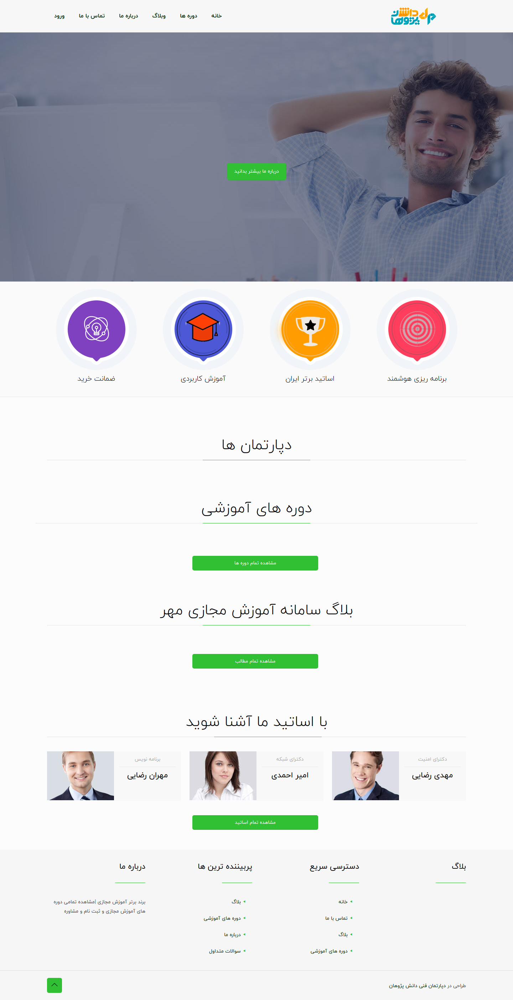

---

## تغییر تصاویر

### تغییر لوگو

جهت تغییر لوگوی سایت ،ابتدا وارد سامانه می شویم و در سامانه از طریق منوی سمت راست ،در قسمت مدیریت فایل وارد پوشه theme شوید و فایل مربوط به لوگو را در این قسمت اپلود کنید.اسم فایل باید logo.png باشد و سایز عکس 57\*213 باشد

---

### تغییر اسلایدر

جهت تغییر اسلایدر در همین مسیر بالا فایل مربوط یه اسلایدر که نام آن slider.jpg باید باشد را آپلود می کنیم.سایز تصویر باید 1100\*1920 باشد.

---

### تغییر آیکن های زیر اسلایدر در صفحه اصلی

جهت تغییر عکس در همین مسیر بالا فایل مربوط یه اسلایدر که نام آن ها home-icon3.png home-icon2.png home-icon1.png باید باشد را آپلود می کنیم.سایز تصویر باید 112\*112 باشد

---

### تغییر آیکن های درباره ما در صفحه اصلی

جهت تغییر عکس در همین مسیر بالا فایل مربوط یه اسلایدر که نام آن ها
icon4.png icon3.png icon2.png icon1.png باید باشد را آپلود می کنیم.سایز تصویر باید 227\*227 باشد

---

### تغییر هدر تصویر صفحه پست های مربوط به بلاگ

جهت تغییر عکس در همین مسیر بالا فایل مربوط یه اسلایدر که نام آن ها
subheader.jpg باید باشد را آپلود می کنیم.سایز تصویر باید 800\*1920 باشد

---

### تغییر عکس دپارتمان ها

جهت تغییر عکس درباره ما باید از طریق سامانه مهر تصاویر را انتخاب کنید و سایز آن باید 90\*90 باشد.

---

### تغییر عکس درباره ما در صفحه اصلی

جهت تغییر عکس در همین مسیر بالا فایل مربوط یه اسلایدر که نام آن about.png باید باشد را آپلود می کنیم.سایز تصویر باید 460\*824 باشد.

### تغییر آیکن های درباره ما در صفحه اصلی

جهت تغییر عکس در همین مسیر بالا فایل مربوط یه اسلایدر که نام آن ها 1 2 3 4 5 6 و فرمت آن png می باشد.
یعنی 1.png.سایز تصویر باید 112\*112 باشد

---

### تغییر عکس تماس با ما در صفحه تماس با ما

جهت تغییر عکس در همین مسیر بالا فایل مربوط یه عکس اول صفحه تماس با ما که نام آن contact.jpg باید باشد را آپلود می کنید
هست که سایز آن 780\*780 پیکسل می باشد.

---

### تغییر شعار،عناوین اسلایدر ،درباره ما

جهت تغییر متن های سایت ، بعد از وارد شدن در سامانه،در منوی سمت راست قسمت تنظیمات را زده و تمام متن های سایت مانند شعار،درباره ما،متن های روی اسلایدر،متن های صفحه درباره ما،آدرس،شماره تلفن،لینک شبکه های اجتماعی و .... را تغییر دهید.
همچنین تغییر آدرس در گوگل و توضیح کوتاه برای SEO در این قسمت امکان پذیر است.

---

### تغییر عکس بالای صفحات

جهت تغییر عکس صفحات مثل دوره ها و..
تصویری به نام header1.png را در سامانه مهر آپلود کنید.1920\*360

---

### تغییر عکس بالای صفحه وبلاگ

جهت تغییر عکس صفحات مثل دوره ها و..
تصویری به نام subheader.jpg را در سامانه مهر آپلود کنید.1920\*800

---

### تغییر شعار،عناوین اسلایدر ،درباره ما

جهت تغییر متن های سایت ، بعد از وارد شدن در سامانه،در منوی سمت راست قسمت تنظیمات را زده و تمام متن های سایت مانند شعار،درباره ما،متن های روی اسلایدر،متن های صفحه درباره ما،آدرس،شماره تلفن،لینک شبکه های اجتماعی و .... را تغییر دهید.
همچنین تغییر آدرس در گوگل و توضیح کوتاه برای SEO در این قسمت امکان پذیر است.

---

### تغییر صفحه سوالات متداول

وارد سامانه میشویم و وارد منوی سمت راست به نام صفحات می شویم.
صفحه ای به نام پرسش و پاسخ وجود دارد که با تغییر متن های این صفحه، صفحه سوالات متداول هم تغییر می کند.
می توان در قسمت سئو برای این صفحه ، متا تگ و دیسکریپشن جدا تعریف کرد.

---

### تغییر شعار اسلایدر

جهت تغییر در همین مسیر بالا متغییرهای مربوط به نام متن اول اسلایدر را تغییر دهید.

---

### تغییرمتن آیکن های زیر اسلایدر وشعارآیکن ها

جهت تغییر در همین مسیر بالا متغییرهای مربوط به نام شعار آیکن های زیر اسلایدر
و آیکن یک الی چهار صفحه اصلی تغییر دهید.

---

### تغییرمتن اساتید

جهت تغییر در همین مسیر بالا متغییرهای مربوط به نام استاد 1 الی 4 و مشخصات استاد 1 الی 4 را تغییر دهید.

---

### تغییرمتن شمارنده ها در صفحه درباره ما

جهت تغییر در همین مسیر بالا متغییرهای مربوط عنوان شمارنده صفحه درباره ما-۱
الی 4 و برلی تغییر شماره آن عنوان "شمارنده 1 صفحه درباره ما الی 4 "
را تغییر دهید.

---

### تغییرمتن درباره ما در صفحه درباره ما

جهت تغییر در همین مسیر بالا متغییرهای مربوط متن درباره ما صفحه درباره ما
را تغییر دهید.

---

### تغییرمتن اعضای تیم در صفحه درباره ما

جهت تغییر در همین مسیر بالا متغییرهای مربوط اعضای تیم از یک تا سه و شغل اعضای تیم از یک تا سه
را تغییر دهید.

---

### تغییرمتن آیکن ها در صفحه درباره ما

جهت تغییرمتن آیکن ها در همین مسیر بالا متغییرهای مربوط آیکن 1 صفحه درباره ما
الی 4
را تغییر دهید.

---

### تغییر عنوان مربوط به محتوای آموزشی

جهت تغییر در همین مسیر بالا ، متغیر عنوان محتوای آموزشی 1 تا 4 را تغییر دهید

---
