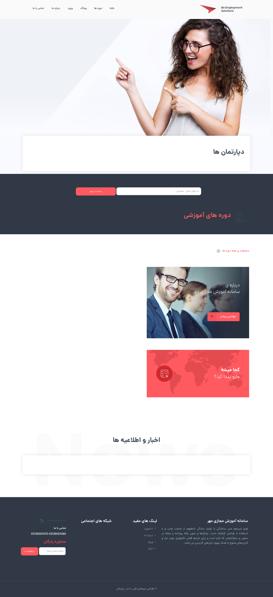

____
## تغییر تصاویر

### تغییر آیکون سایت

جهت تغییر آیکون سایت ،ابتدا وارد سامانه می شویم و در سامانه از طریق منوی سمت راست ،در قسمت مدیریت فایل وارد پوشه theme شوید و فایل مربوط به آیکون را در این قسمت اپلود کنید.اسم فایل باید favicon.ico باشد.
___
### تغییر لوگو header

جهت تغییر لوگوی سایت ،ابتدا وارد سامانه می شویم و در سامانه از طریق منوی سمت راست ،در قسمت مدیریت فایل وارد پوشه theme شوید و فایل مربوط به لوگو را در این قسمت اپلود کنید.اسم فایل باید logo.png باشد و سایز عکس 46*224 باشد.
___
### تغییر بکگراند header صفحه اصلی

جهت تغییر بکگراند صفحه اصلی در همین مسیر بالا فایل مربوط به نام background-home.jpg را آپلود می کنیم.سایز تصویر باید 615*1920 باشد.
___

### تغییر بکگراند درباره ما در صفحه اصلی
جهت تغییر عکس در همین مسیر بالا فایل مربوط به نام home-about.jpg را آپلود می کنیم.سایز تصویر باید 790*780 باشد.
___
### تغییر بکگراند هدر در صفحات دوره ها، وبلاگ و سوالات متداول
جهت تغییر عکس در همین مسیر بالا فایل مربوط به نام background-subheader3.jpg را آپلود می کنیم.سایز تصویر باید 870*1920 باشد.
___
### تغییر بکگراند هدر در صفحات ورود، ثبت نام و درباره ما
جهت تغییر عکس در همین مسیر بالا فایل مربوط به نام background-subheader2.jpg را آپلود می کنیم.سایز تصویر باید900*1920 باشد.
___
### تغییر عکس بخش "چرا...؟" در صفحه درباره ما
جهت تغییر عکس در همین مسیر بالا فایل مربوط به نام about.jpgباید باشد را آپلود می کنیم.سایز تصویر باید 763*780 باشد.
___
### تغییر عکس داستان ما در صفحه درباره ما
جهت تغییر عکس در همین مسیر بالا فایل مربوط به نام story.jpgباید باشد را آپلود می کنیم.سایز تصویر باید 793*780 باشد.
___
### تغییر عکس  صفحه ورود
جهت تغییر عکس در همین مسیر بالا فایل مربوط به نام login.jpgباید باشد را آپلود می کنیم.سایز تصویر باید 793*780 باشد.
___
### تغییر عکس  صفحه ثبت نام
جهت تغییر عکس در همین مسیر بالا فایل مربوط به نام register.jpgباید باشد را آپلود می کنیم.سایز تصویر باید 793*780 باشد.
___
### تغییر عکس در صفحه بازیابی
جهت تغییر عکس در همین مسیر بالا فایل مربوط به نام reset.jpgباید باشد را آپلود می کنیم.سایز تصویر باید 793*780 باشد.
___

### تغییر تصاویر تیم ما در صفحه درباره ما
جهت تغییر تصاویر در همین مسیر بالا فایل های مربوط به ترتیب به نام های person1.jpg و person2.jpg و person3.jpg  باید باشد را آپلود می کنیم.سایز تصاویر باید 500*350 باشد.
___

## تغییر شعار،عناوین اسلایدر ،درباره ما  
جهت تغییر متن های سایت ، بعد از وارد شدن در سامانه،در منوی سمت راست قسمت تنظیمات را زده و تمام متن های سایت مانند شعار،درباره ما،متن های روی اسلایدر،متن های صفحه درباره ما،آدرس،شماره تلفن،لینک شبکه های اجتماعی و .... را تغییر دهید.
همچنین تغییر آدرس در گوگل  و توضیح کوتاه برای SEO در این قسمت امکان پذیر است.	

___
### تغییر عنوان مشخصات در صفحه درباره ما 
جهت تغییر در همین مسیر بالا متغییرهای مربوط به نام های info.title1 تا info.title6 را تغییر دهید.
___
### تغییر متن مشخصات در صفحه درباره ما 
جهت تغییر در همین مسیر بالا متغییرهای مربوط به نام های info.text1 تا info.text6 را تغییر دهید.
___
### تغییر نام اعضای تیم ما در صفحه درباره ما 
جهت تغییر در همین مسیر بالا متغییرهای مربوط به نام های person.name1 تا person.name3 را تغییر دهید.
___
### تغییر موقعیت اعضای تیم ما در صفحه درباره ما 
جهت تغییر در همین مسیر بالا متغییرهای مربوط به نام های person.position1 تا person.position3 را تغییر دهید.
___
### تغییر نام نویسنده متن در صفحه درباره ما 
جهت تغییر در همین مسیر بالا متغییر مربوط به نام site.author را تغییر دهید.
___
### تغییر توضیح دوره ها در صفحه اصلی
جهت تغییر در همین مسیر بالا متغییر مربوط به نام course-about را تغییر دهید.
___
