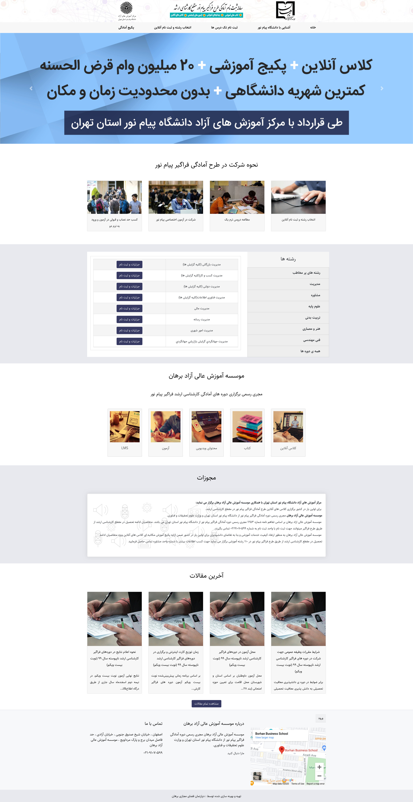

### تغییر تصاویر

### تغییر آیکون سایت

جهت تغییر آیکون سایت ،ابتدا وارد سامانه می شویم و در سامانه از طریق منوی سمت راست ،در قسمت مدیریت فایل وارد پوشه theme شوید و فایل مربوط به آیکون را در این قسمت اپلود کنید.اسم فایل باید favicon.ico باشد.

### تغییر لوگو header

تغییر لوگوی اول:logo1.png 100*98

تغییر لوگوی اول:logo2.png 340*76

تغییر لوگوی اول:logo3.png 98*96

### تغییر اسلایدر
slider1.jpg 509*1900

slider2.jpg 509*1900

slider3.jpg 509*1900

### تغییر بکگراند header

جهت تغییر بکگراند صفحه اصلی در همین مسیر بالا فایل مربوط به نام headerbg.jpg را آپلود می کنیم.سایز تصویر باید با سایز تصویر موجود یکسان باشد.

### نحوه شرکت در طرح آمادگی فراگیر پیام نور
این قسمت شامل ۴ تصویر می شود:

تصویر اول:sec1.img1.png 133*163

تصویر دوم:sec1.img2.png 270*163

تصویر سوم:sec1.img3.png 270*163

تصویر چهارم:sec1.img4.png 270*163

### رشته های پر مخاطب

برای نمایش دوره در این قسمت حتما باید به دوره
favourite
انتصاب داده شود

### تصاویر مربوط  به بخش خدمات
این قسمت شامل ۴ تصویر می شود:

تصویر اول:service1.png 133*146

تصویر دوم:service2.png 133*146

تصویر سوم:service3.png 133*146

تصویر چهارم:service4.png 133*146

### مجوزات
برای این قسمت حتما باید به پست تگ مجوزات انتصاب داده شود. میتوانید همان پست مجوزات موجود را هر بار ویرایش نمایید
#### مشاوره رایگان
کد محصول/کد ورودی/توکن سازمان قابل تغییر در تنظیمان پنل می باشند
#### صفحات موجود
تماس با ما/آشنایی با دانشگاه پیامنور/سوالات/پکیج آمادگی و مشاوره رایگان از قمست صفحات پنل قابل تغییر می باشند

### تعدا پست نمایشی در صفحه وبلاگ
در قسمت تنظیمات مقدار paginate.count  را تغییر دهید.در این سایت برای هماهنگی و نمایش بهتر پست ها بهتر است این مقدار مضربی از عدد ۳ باشد

#### قیمت کلی همه ی پکیج ها
در تنظیمات سایت  مقدار global-price تغییر دهید

#### درصد تخفیف
در قسمت تنظیمات سایت مقدار discount-course را تغییر دهید
#### ظرفیت ثبتنام
در ثسمت تنظیمات پنل  مقدار registration-capacity تغییر دهید
#### تک درس
در صورت افزودن تک درس و انتصاب تگ تک درس لطفا مراتب را به بخش فنی اطلاع دهید تا به لیست افزوده گردد
#### سرفص جدید
در صورت اضافه شدن سرفصل جدیدی به سامانه لطفا مراتب را به بخش فنی اطلاع دهید

### مقدار قابل پرداخت
لطفا دقت نمایید که مقدار قابل پرداخت باید همان مقداری باشد که بعد از تخفیف محاسبه می نمایید و در قسمت قیمت هر دوره وارد نمایید

### شعار،عناوین

جهت تغییر متن های سایت ، بعد از وارد شدن در سامانه،در منوی سمت راست قسمت تنظیمات را زده و تمام متن های سایت مانند شعار،درباره ما،متن های روی اسلایدر،متن های صفحه درباره ما،آدرس،شماره تلفن،لینک شبکه های اجتماعی و اینماد و .... را تغییر دهید.
همچنین تغییر آدرس در گوگل  و توضیح کوتاه برای SEO در این قسمت امکان پذیر است.

