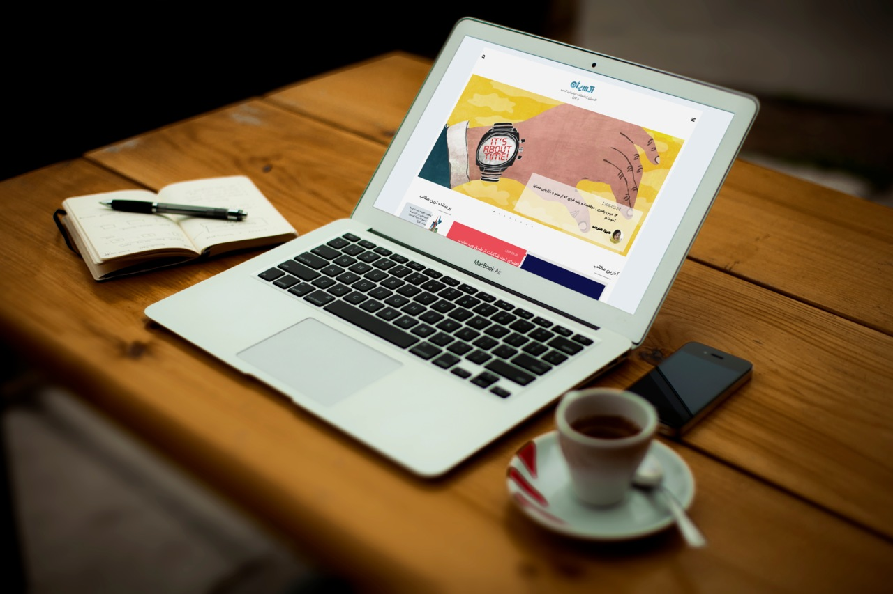

# Very short description of the package

This is where your description should go. Try and limit it to a paragraph or two, and maybe throw in a mention of what PSRs you support to avoid any confusion with users and contributors.

## Installation

You can install the package via composer:

composer require dpsoft/mehr4-theme-odo

## Usage

**راهنمای  مدیریت سایت **
____
## تغییر تصاویر
___
### تغییر لوگو

جهت تغییر لوگوی سایت ،ابتدا وارد سامانه می شویم و در سامانه از طریق منوی سمت راست ،در قسمت مدیریت فایل وارد پوشه theme شوید و فایل مربوط به لوگو را در این قسمت اپلود کنید.اسم فایل باید logo.png باشد و سایز عکس 135*47 باشد.

___
### تغییر اسلایدر
تصویر اسلایدر در واقع تصویر همان پست های منتشر شده هستند که سایز آن 1138*440 می باشد.

______

### تغییر شعار زیر لوگو،فوتر 
جهت تغییر متن های سایت ، بعد از وارد شدن در سامانه،در منوی سمت راست قسمت تنظیمات را زده و تمام متن های سایت مانند شعار،درباره ما،متن های درباره ما،آدرس،شماره تلفن،لینک شبکه های اجتماعی و .... را تغییر دهید.
همچنین تغییر آدرس در گوگل  و توضیح کوتاه برای SEO در این قسمت امکان پذیر است.	

### Security

If you discover any security related issues, please email sadeghpm@gmail.com instead of using the issue tracker.

## Credits

- [zahrayavari](http://mygitlab.ir/dpsoft)

## License

The Apache License 2. Please see [License File](LICENSE.md) for more information.

