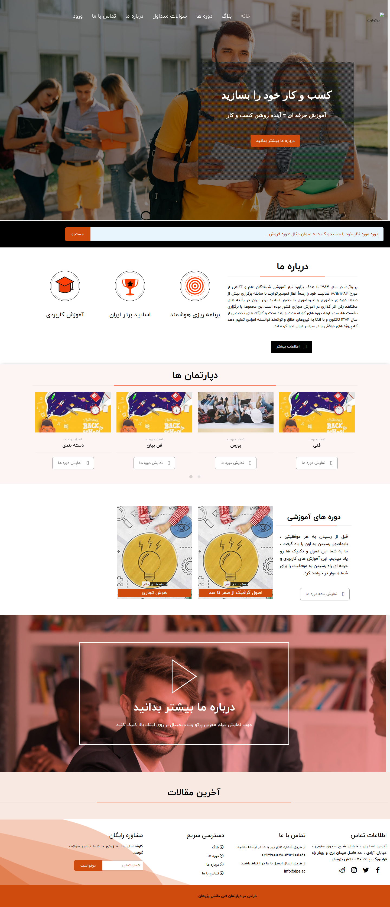

---

## تغییر تصاویر

### تغییر لوگو

جهت تغییر لوگوی سایت ،ابتدا وارد سامانه می شویم و در سامانه از طریق منوی سمت راست ،در قسمت مدیریت فایل وارد پوشه theme شوید و فایل مربوط به لوگو را در این قسمت اپلود کنید.اسم فایل باید logo.png باشد و سایز عکس 52\*223 باشد.

---

### تغییر اسلایدر

جهت تغییر اسلایدر در همین مسیر بالا فایل مربوط یه اسلایدر که نام آن home_intro.jpg باید باشد را آپلود می کنیم.سایز تصویر باید 1269\*1903 باشد.

---

### تغییر آیکن های درباره ما در صفحه اصلی

جهت تغییر عکس در همین مسیر بالا فایل مربوط یه اسلایدر که نام آن ها home-icon3.png home-icon2.png home-icon1.png باید باشد را آپلود می کنیم.سایز تصویر باید 112\*112 باشد

### تغییر عکس درباره ما در صفحه اصلی

جهت تغییر عکس در همین مسیر بالا فایل مربوط یه اسلایدر که نام آن about.png باید باشد را آپلود می کنیم.سایز تصویر باید 460\*824 باشد.

### تغییر آیکن های درباره ما در صفحه اصلی

جهت تغییر عکس در همین مسیر بالا فایل مربوط یه اسلایدر که نام آن ها 1 2 3 4 5 6 و فرمت آن png می باشد.
یعنی 1.png.سایز تصویر باید 112\*112 باشد

### تغییر تصاویر هدر مربوط به هر صفحه

برای تغییر تصاویر بنر موجود در هر صفحه باید عکس مربوطه را مدیریت فایل سامانه در پوشه theme اپلود کنید.

---

عکس بالای صفحه درباره ما تصویری به نام about-head.png با سایز 1920\*600

---

عکس بالای صفحه دوره ها تصویری به نام course-head.png با سایز 1920\*600

---

عکس بالای صفحه سوالات متداول تصویری به نام general-head.png با سایز 1920\*600

---

عکس بالای صفحه تماس با ما تصویری به نام contact-head.png با سایز 1920\*600

---

عکس بالای صفحه بلاگ تصویری به نام blog-head.png با سایز 1920\*600

---

### تغییر عکس تماس با ما در صفحه تماس با ما

جهت تغییر عکس در همین مسیر بالا فایل مربوط یه عکس اول صفحه تماس با ما که نام آن contact.jpg باید باشد را آپلود می کنید.سایز تصویر باید 1100*700 باشد.عکس دوم این صفحه هم contact2.jpg هست که سایز آن 586*378 پیکسل می باشد.

---

### تغییر شعار،عناوین اسلایدر ،درباره ما

جهت تغییر متن های سایت ، بعد از وارد شدن در سامانه،در منوی سمت راست قسمت تنظیمات را زده و تمام متن های سایت مانند شعار،درباره ما،متن های روی اسلایدر،متن های صفحه درباره ما،آدرس،شماره تلفن،لینک شبکه های اجتماعی و .... را تغییر دهید.
همچنین تغییر آدرس در گوگل و توضیح کوتاه برای SEO در این قسمت امکان پذیر است.

---

### تغییر صفحه سوالات متداول

وارد سامانه میشویم و وارد منوی سمت راست به نام صفحات می شویم.
صفحه ای به نام پرسش و پاسخ وجود دارد که با تغییر متن های این صفحه، صفحه سوالات متداول هم تغییر می کند.
می توان در قسمت سئو برای این صفحه ، متا تگ و دیسکریپشن جدا تعریف کرد.

---

## تغییر شعار،عناوین اسلایدر ،درباره ما

جهت تغییر متن های سایت ، بعد از وارد شدن در سامانه،در منوی سمت راست قسمت تنظیمات را زده و تمام متن های سایت مانند شعار،درباره ما،متن های روی اسلایدر،متن های صفحه درباره ما،آدرس،شماره تلفن،لینک شبکه های اجتماعی و .... را تغییر دهید.
همچنین تغییر آدرس در گوگل و توضیح کوتاه برای SEO در این قسمت امکان پذیر است.

---

### تغییر شعارهای اسلایدر

جهت تغییر در همین مسیر بالا متغییرهای مربوط به نام های متن اول اسلایدر و متن دوم اسلایدر را تغییر دهید.

---

### تغییرعنوان آیکن های صفحه اصلی زیر اسلایدر

جهت تغییر در همین مسیر بالا متغییرهای مربوط به نام های متن آیکن اول صفحه اصلی تا آیکن سوم صفحه اصلی را تغییر دهید.

---

### تغییرمتن آیکن درباره ما در صفحه اصلی

جهت تغییر در همین مسیر بالا متغییرهای مربوط به نام درباره ما-صفحه اصلی
را تغییر دهید.

---

### تغییرمتن توضیح دوره ها در صفحه اول

جهت تغییر در همین مسیر بالا متغییرهای مربوط به نام متن دوره ها صفحه اصلی
را تغییر دهید.

---

### تغییرمتن قسمت نمایش فیلم

جهت تغییر در همین مسیر بالا متغییرهای متن اول ویدئو ص اصلی
و متن دوم ویدئو ص اصلی را تغییر دهید.

---

### تغییرمتن درباره ما در صفحه درباره ما

جهت تغییر در همین مسیر بالا متغییرهای مربوط به متن درباره سایت را تغییر دهید.

---

### تغییر شعار ابتدایی درباره ما در صفحه درباره ما

جهت تغییر در همین مسیر بالا متغییرهای مربوط به متن اول صفحه درباره سایت را تغییر دهید.

---

### تغییر متن آیکن ها در صفحه درباره ما

جهت تغییر در همین مسیر بالا متغییرهای مربوط به آیکن اول صفحه درباره ما الی آیکن ششم صفحه درباره ما را تغییر دهید.

---

### تغییر متن آیکن ها در صفحه دوره ها

جهت تغییر در همین مسیر بالا متغییرهای مربوط به آیکن اول دوره هاُآیکن دوم دوره هاُآیکن سوم دوره ها را تغییر دهید.

---

### تغییرعنوان تیم ما و عنوان شغلی اعضا تیم در صفحه درباره ما

جهت تغییر در همین مسیر بالا متغییرهای اعضای تیم ۱ تا ۴ و شغل اعضای تیم ۱ تا ۴ را تغییر دهید.

---

### تغییر ویدئو

جهت تغییر ویدیو در قسمت درباره ما صفحه اصلی سایت ،ابتدا وارد سامانه می شویم و در سامانه از طریق منوی سمت راست ،در قسمت مدیریت فایل وارد پوشه theme شوید و فایل مربوط به فیلم را در این قسمت اپلود کنید.اسم فایل باید video.mp4 باشد

---

### تغییر عنوان مربوط به محتوای آموزشی

جهت تغییر در همین مسیر بالا ، متغیر عنوان محتوای آموزشی 1 تا 4 را تغییر دهید

---
