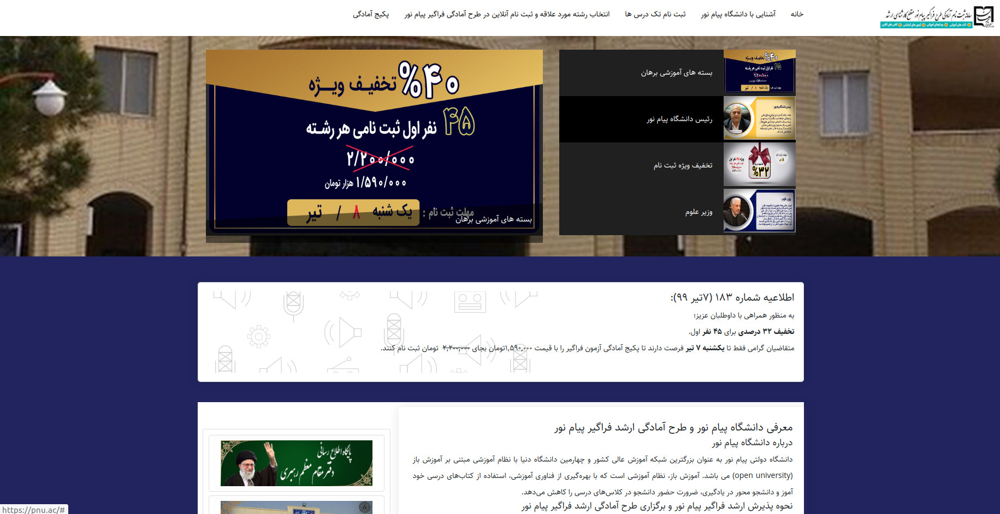

## Very short description of the package

[](https://packagist.org/packages/dpsoft/mehr4-theme-pnuac)
[](https://packagist.org/packages/dpsoft/mehr4-theme-pnuac)

BeTheme-Recipes2



## Installation

You can install the package via composer:

```bash
composer require dpsoft/mehr4-theme-pnuac
```
```bash
php artisan mehr4-theme-pnuac:install
```

## Usage

**راهنمای  مدیریت سایت pnuac**
____
## تغییر تصاویر

### تغییر آیکون سایت

جهت تغییر آیکون سایت ،ابتدا وارد سامانه می شویم و در سامانه از طریق منوی سمت راست ،در قسمت مدیریت فایل وارد پوشه theme شوید و فایل مربوط به آیکون را در این قسمت اپلود کنید.اسم فایل باید favicon.ico باشد.
___
### تغییر لوگو header

جهت تغییر لوگوی سایت ،ابتدا وارد سامانه می شویم و در سامانه از طریق منوی سمت راست ،در قسمت مدیریت فایل وارد پوشه theme شوید و فایل مربوط به لوگو را در این قسمت اپلود کنید.اسم فایل باید logo-header.png باشد و سایز عکس 50*148 باشد.
___

### تغییر لوگو footer

جهت تغییر لوگوی سایت ،ابتدا وارد سامانه می شویم و در سامانه از طریق منوی سمت راست ،در قسمت مدیریت فایل وارد پوشه theme شوید و فایل مربوط به لوگو را در این قسمت اپلود کنید.اسم فایل باید logo-footer.png باشد و سایز عکس 50*212 باشد.
___

### تغییر بکگراند header

جهت تغییر بکگراند صفحه اصلی در همین مسیر بالا فایل مربوط به نام background.jpg را آپلود می کنیم.سایز تصویر باید با سایز تصویر موجود یکسان باشد.
___

###پست های موجود در هدر
چهار پست در هدر نمایش داده می شود که همه ی این چهار مورد باید از نوع پست های ویژه و انتشار یافته باشند.

###اطلاعیه

برای این قسمت حتما باید به پست تگ اطلاعیه انتصاب داده شود. میتوانید همان پست اطلاعیه موجود را هر بار ویرایش نمایید

###معرفی دانشگاه پیامنور
برای این قسمت باید به پست تگ معرفی انتصاب بدهید .میتوانید همان پست موجود با تگ معرفی را ویرایش نمایید

###مشاوره رایگان
کد محصول/کد ورودی/توکی سازمان قابل تغییر در تنظیمان پنل می باشند
###صفحات موجود
تماس با ما/آشنایی با دانشگاه پیامنور/سوالات/پکیج آمادگی و مشاوره رایگان از قمست صفحات پنل قابل تغییر می باشند

### تعدا پست نمایشی در صفحه وبلاگ
در قسمت تنظیمات مقدار paginate.count  را تغییر دهید.در این سایت برای هماهنگی و نمایش بهتر پست ها بهتر است این مقدار مضربی از عدد ۳ باشد

###قیمت کلی همه ی پکیج ها

در تنظیمات سایت  مقدار global-price تغییر دهید

### درصد تخفیف
در قسمت تنظیمات سایت مقدار discount-course را تغییر دهید

###ظرفیت ثبتنام
در ثسمت تنظیمات پنل  مقدار registration-capacity تغییر دهید

###تک درس
در صورت افزودن تک درس و انتصاب تگ تک درس لطفا مراتب را به بخش فنی اطلاع دهید تا به لیست افزوده گردد

###سرفص جدید
در صورت اضافه شدن سرفصل جدیدی به سامانه لطفا مراتب را به بخش فنی اطلاع دهید

### مقدار قابل پرداخت
لطفا دقت نمایید که مقدار قابل پرداخت باید همان مقداری باشد که بعد از تخفیف محاسبه می نمایید و در قسمت قیمت هر دوره وارد نمایید
___


### Security

If you discover any security related issues, please email info@dpsoft.ir instead of using the issue tracker.

## Credits

- [mahdavi](http://mygitlab.ir/dpsoft)

## License

The Apache License 2. Please see [License File](LICENSE.md) for more information.
