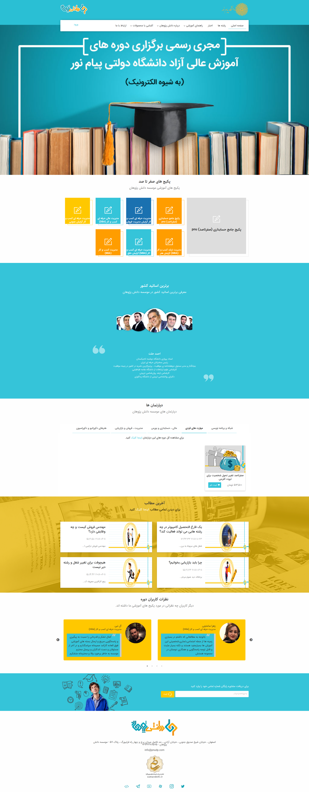

---

## تغییر تصاویر

### تغییر لوگو

جهت تغییر لوگوی سایت تصویر را در قسمت مدیریت فایل سایت آپلود کرده و آدرس لوگو را در قسمت تنظیمات مربوط به لوگو جایگزین می کنیم.
327\*677 سایز لوگوی پیش فرض  
می باشد.
favicon تغییر لوگوی موبایل و
از همین طریق
امکان پذیر است.
نام تصویر لوگو:
logo.png

---

### تغییر اسلایدر

جهت تغییر اسلایدر سایت تصویر را در قسمت مدیریت فایل سایت آپلود کرده و آدرس تصویر اسلایدر را در قسمت تنظیمات مربوط به اسلایدر جایگزین می کنیم.
1024\*496 سایز پیش فرض  
می باشد.
نام تصویر:
pnudp-slideripayamnoor-university3.jpg

---

## تغییر شعار،عناوین اسلایدر ،درباره ما ،توکن سازمانی

جهت تغییر متن های سایت ، بعد از وارد شدن در سامانه،در منوی سمت راست قسمت تنظیمات را زده و تمام متن های سایت مانند شعار،درباره ما،متن های روی اسلایدر،متن های صفحه درباره ما،آدرس،شماره تلفن،لینک شبکه های اجتماعی و توکن سازمانی , .... را تغییر دهید.
همچنین تغییر آدرس در گوگل و توضیح کوتاه برای SEO در این قسمت امکان پذیر است.

---

### تغییر تصویر زمینه وبلاگ

جهت تغییر تصویر زمینه وبلاگ سایت تصویر را در قسمت مدیریت فایل سایت آپلود کرده و آدرس تصویر زمینه وبلاگ را در قسمت تنظیمات مربوط به تصویر زمینه وبلاگ جایگزین می کنیم.
1366\*701 سایز پیش فرض  
می باشد.

---

## تغییر قسمت اساتید

اساتید از طریق بخش کاربران قابل تغییر می باشد و جهت تغییر اطلاعات آن متاهای هر استاد را تغییر دهید.مثلا برای تغییر آواتار کافیست ابتدا تصویر را در قسمت مدیریت فایل آپلود کرده و آدرس آن را در متای avatar قرار دهید.

---
