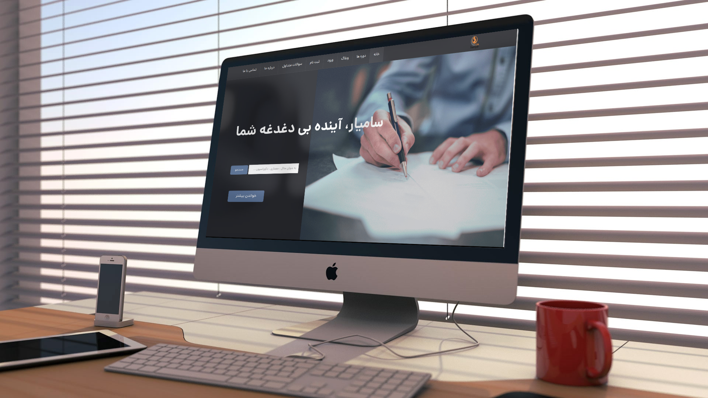

[](https://packagist.org/packages/dpsoft/mehr4-theme-samyarcpa)
[](https://packagist.org/packages/dpsoft/mehr4-theme-samyarcpa)




## Installation

:You can install the package via composer

```bash
composer require dpsoft/mehr4-theme-samyarcpa
```
```bash
php artisan mehr4-theme-samyarcpa:install
```

## Usage


**راهنمای  مدیریت سایت samyarcpa**
____
## تغییر تصاویر

### تغییر لوگو

جهت تغییر لوگوی سایت ،ابتدا وارد سامانه می شویم و در سامانه از طریق منوی سمت راست ،در قسمت مدیریت فایل وارد پوشه theme شوید و فایل مربوط به لوگو را در این قسمت اپلود کنید.اسم فایل باید logo.png باشد و سایز عکس 20*239 باشد.
___
### تغییر بکگراند

جهت تغییر بکگراند صفحه اصلی در همین مسیر بالا فایل مربوط به نام  home_background.png را آپلود می کنیم.سایز تصویر باید 765*1920 باشد.
___
### تغییر favicon 
جهت تغییر favicon  در همین مسیر بالا فایل مربوط به نام favicon.ico را آپلود می کنیم.
___

### تغییر تصاویر درباره ما در صفحه اصلی
جهت تغییر تصاویر اصلی (بزرگ) در همین مسیر بالا فایل های مربوط به نام های home_about1.jpg,home_about2.jpg را آپلود می کنیم.سایز تصاویر باید528*780 باشد.
جهت تغییر تصاویر اسلایدر (کوچک) در همین مسیر بالا فایل های مربوط به نام های home_about1-85x85 و home_about2-85x85 را آپلود میکنیم.سایز تصاویر باید 85*85 باشد.
___
### تغییر عکس درباره ما در صفحه درباره ما 
جهت تغییر عکس در همین مسیر بالا فایل مربوط به نام about.jpg را آپلود می کنیم.سایز تصویر باید 533*800 باشد.
___
### تغییر عکس های تیم ما در صفحه درباره ما 
جهت تغییر تصاویر در همین مسیر بالا فایل های مربوط به نام های person1.jpg,person2.jpg,person3.jpgباید باشد را آپلود می کنیم.سایز تصویر باید 85*85 باشد.
___

## تغییر شعار،عناوین اسلایدر ،درباره ما  
جهت تغییر متن های سایت ، بعد از وارد شدن در سامانه،در منوی سمت راست قسمت تنظیمات را زده و تمام متن های سایت مانند شعار،درباره ما،متن های روی اسلایدر،متن های صفحه درباره ما،آدرس،شماره تلفن،لینک شبکه های اجتماعی و .... را تغییر دهید.
همچنین تغییر آدرس در گوگل  و توضیح کوتاه برای SEO در این قسمت امکان پذیر است.	

___
### تغییر عنوان مشخصات در صفحه درباره ما 
جهت تغییر در همین مسیر بالا متغییرهای مربوط به نام های info.title1 تا info.title6 را تغییر دهید.
___
### تغییر متن مشخصات در صفحه درباره ما 
جهت تغییر در همین مسیر بالا متغییرهای مربوط به نام های info.text1 تا info.text6 را تغییر دهید.
___
### تغییر نام اعضای تیم ما در صفحه درباره ما 
جهت تغییر در همین مسیر بالا متغییرهای مربوط به نام های person.name1 تا person.name3 را تغییر دهید.
___
### تغییر موقعیت اعضای تیم ما در صفحه درباره ما 
جهت تغییر در همین مسیر بالا متغییرهای مربوط به نام های person.position1 تا person.position3 را تغییر دهید.
___

### تغییر توضیح اعضای تیم ما در صفحه درباره ما 
جهت تغییر در همین مسیر بالا متغییرهای مربوط به نام های person.text1 تا person.text3 را تغییر دهید.
___
### تغییر نام نویسنده متن در صفحه درباره ما 
جهت تغییر در همین مسیر بالا متغییر مربوط به نام site.author را تغییر دهید.
___
### تغییر محتوای درس در صفحه دوره 
جهت تغییر در همین مسیر بالا متغییرهای مربوط به نام های course.content1 تا course.content4 را تغییر دهید.
___
### تغییر متن زیر دوره های آموزشی در صفحه اصلی
جهت تغییر در همین مسیر بالا متغییر مربوط به نام course.information را تغییر دهید.
___
