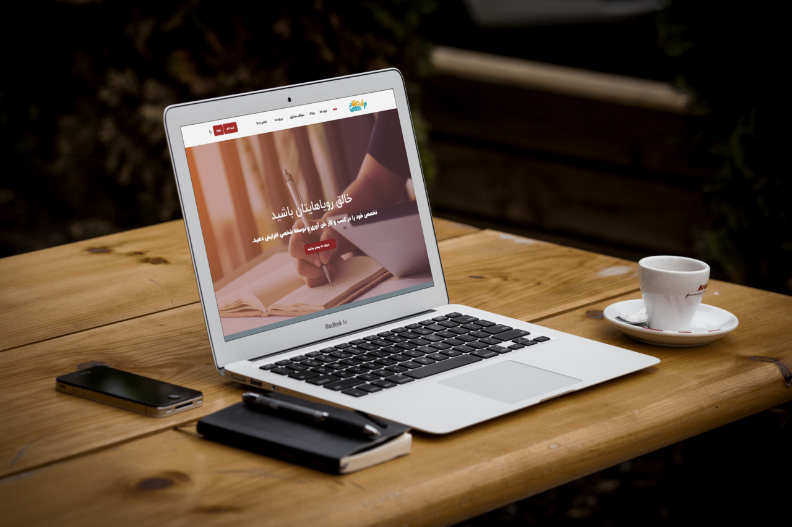

[](https://packagist.org/packages/dpsoft/mehr4-theme-sharifmodir)
[](https://packagist.org/packages/dpsoft/mehr4-theme-sharifmodir)




## Installation

:You can install the package via composer

```bash
composer require dpsoft/mehr4-theme-sharifmodir
```

## Usage

**راهنمای  مدیریت سایت **
____
## تغییر تصاویر

### تغییر لوگو

جهت تغییر لوگوی سایت ،ابتدا وارد سامانه می شویم و در سامانه از طریق منوی سمت راست ،در قسمت مدیریت فایل وارد پوشه theme شوید و فایل مربوط به لوگو را در این قسمت اپلود کنید.اسم فایل باید logo.png باشد و سایز عکس 57*213 باشد.
___
### تغییر اسلایدر

جهت تغییر اسلایدر در همین مسیر بالا فایل مربوط یه اسلایدر که نام آن slider.jpg باید باشد را آپلود می کنیم.سایز تصویر باید 853*1920 باشد.
___

### تغییر عکس درباره ما در صفحه اصلی
جهت تغییر عکس در همین مسیر بالا فایل مربوط یه اسلایدر که نام آن about-home.png باید باشد را آپلود می کنیم.سایز تصویر باید 364*824 باشد.
______

### تغییر عکس درباره ما در منوی اصلی
جهت تغییر عکس در همین مسیر بالا فایل مربوط یه اسلایدر که نام آن about-us.jpg باید باشد را آپلود می کنیم.سایز تصویر باید 425*380 باشد.
___

### تغییر عکس تماس با ما در صفحه تماس با ما
جهت تغییر عکس در همین مسیر بالا فایل مربوط یه عکس اول صفحه تماس با ما که نام آن contact.jpg باید باشد را آپلود می کنید.سایز تصویر باید 1100*700 باشد.عکس دوم این صفحه هم contact.jpg هست که سایز آن 184*276 پیکسل می باشد.

___
### تغییر شعار،عناوین اسلایدر ،درباره ما و...  
جهت تغییر متن های سایت ، بعد از وارد شدن در سامانه،در منوی سمت راست قسمت تنظیمات را زده و تمام متن های سایت مانند شعار،درباره ما،متن های روی اسلایدر،متن های صفحه درباره ما،آدرس،شماره تلفن،لینک شبکه های اجتماعی و .... را تغییر دهید.
همچنین تغییر آدرس در گوگل  و توضیح کوتاه برای SEO در این قسمت امکان پذیر است.	


### تغییر صفحه سوالات متداول

وارد سامانه میشویم و وارد منوی سمت راست به نام صفحات می شویم.
صفحه ای به نام پرسش و پاسخ وجود دارد که با تغییر متن های این صفحه، صفحه سوالات متداول هم تغییر می کند.
می توان در قسمت سئو برای این صفحه ، متا تگ و دیسکریپشن جدا تعریف کرد.

___

### تغییر شعار،عناوین اسلایدر ،درباره ما  
جهت تغییر متن های سایت ، بعد از وارد شدن در سامانه،در منوی سمت راست قسمت تنظیمات را زده و تمام متن های سایت مانند شعار،درباره ما،متن های روی اسلایدر،متن های صفحه درباره ما،آدرس،شماره تلفن،لینک شبکه های اجتماعی و .... را تغییر دهید.
همچنین تغییر آدرس در گوگل  و توضیح کوتاه برای SEO در این قسمت امکان پذیر است.	
___


### تغییر شعارهای اسلایدر 
جهت تغییر در همین مسیر بالا متغییرهای مربوط به نام های متن اول اسلایدر و متن دوم اسلایدر  را تغییر دهید.
___
### تغییر متن زیر اسلایدر 
جهت تغییر در همین مسیر بالا متغییر مربوط به نام متن زیر اسلایدر  را تغییر دهید.
___

### تغییرمتن آیکن درباره ما در صفحه اصلی  
جهت تغییر در همین مسیر بالا متغییرهای مربوط به نام  درباره ما-صفحه اصلی
 را تغییر دهید.
___

### تغییرمتن درباره ما در صفحه درباره ما   
جهت تغییر در همین مسیر بالا متغییرهای مربوط به متن درباره سایت را تغییر دهید.
___

### تغییر متن آیکن ها در صفحه درباره ما   
جهت تغییر در همین مسیر بالا متغییرهای مربوط به آیکن اول صفحه درباره ما الی آیکن ششم صفحه درباره ما را تغییر دهید.
___
### تغییر متن راه های ارتباطی در صفحه درباره ما   
جهت تغییر در همین مسیر بالا متغییرهای مربوط به آیکن اول راه های ارتباطی  صفحه درباره ما الی آیکن سوم راه های ارتباطی  صفحه درباره ما را تغییر دهید.

___
### تغییر متن آیکن ها در صفحه دوره ها  
جهت تغییر در همین مسیر بالا متغییرهای مربوط به آیکن اول دوره هاو آیکن دوم دوره هاو آیکن سوم دوره ها وهمچنین توضیح آیکن اول دوره ها تا توضیح آیکن سوم دوره ها را تغییر دهید.
___

### تغییر عنوان مربوط به محتوای آموزشی
  
جهت تغییر در همین مسیر بالا ، متغیر عنوان محتوای آموزشی 1 تا 4 را تغییر دهید
___

