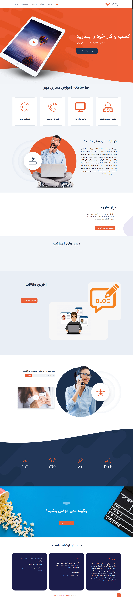

____
## تغییر تصاویر

### تغییر لوگو

جهت تغییر لوگوی سایت ،ابتدا وارد سامانه می شویم و در سامانه از طریق منوی سمت راست ،در قسمت مدیریت فایل وارد پوشه theme شوید و فایل مربوط به لوگو را در این قسمت اپلود کنید.اسم فایل باید logo.png باشد و سایز عکس 90*136 باشد
___
### تغییر اسلایدر

جهت تغییر اسلایدر در همین مسیر بالا فایل مربوط یه اسلایدر که نام آن slider1.jpg باید باشد را آپلود می کنیم.سایز تصویر باید 880*1920 باشد.
این تصویر زمینه اسلایدر است
تصویر دوم اسلایدر slider2.jpg با سایز 1519*726 می باشد
و تصویر سوم آن که اصلا نباید پاک شود به نام overlay.png می باشد که عکس خمیدگی زیر اسلایدر می باشد.
___

### تغییر آیکن های زیر اسلایدر در صفحه اصلی
جهت تغییر عکس در همین مسیر بالا فایل مربوط یه اسلایدر که نام آن ها  icon4.png  icon3.png  icon2.png  icon1.png باید باشد را آپلود می کنیم.سایز تصویر باید 100*200 باشد
___
### تغییر عکس درباره ما در صفحه اصلی 
   سایز:576*700  
  نام عکس:about-home.png
  ___
### تغییر عکس دپارتمان ها  در صفحه اصلی 
  تغییر عکس از طریق سامانه مهر امکان پذیر می باشد . سایز:143*324 
  ___
### تغییر عکس پس زمینه دوره ها در صفحه اصلی 
   سایز:627*1850  
  نام عکس:course-bg-home.png
___
### تغییر عکس آخرین مقالات در صفحه اصلی 
   سایز:623*780  
  نام عکس:blog-home.png
___
### تغییر عکس بخش مشاوره رایگان 
عکس اول:    
   سایز:606*780  
  نام عکس:contact-home1.png
    عکس دوم:
     سایز:606*780  
    نام عکس:contact-home2.png
    عکس سوم زمانی که موس روی عکس دوم رفت:
       سایز:606*780  
        contact-home2-hover.png: نام عکس
___
### تغییر عکس قسمت چگونه مدیر موفقی باشیم؟

   سایز:635*979  
  نام عکس:adv-home.png
    ___
### تغییر  هدر تصویر صفحه بلاگ
   سایز:900*1920  
  نام عکس:blog-page.png
___
### تغییر  هدر تصویر پست 
   سایز:900*1920  
  نام عکس:post.png
___
### تغییر  هدر تصویر صفحه  درباره ما
   سایز:900*1920  
     نام عکس:header-about.png
___
### تغییر  هدر تصویر صفحه  تماس با ما
   سایز:900*1920  
  نام عکس:header-contact.png
___
### تغییر  هدر تصویر صفحه  بلاگ
   سایز:900*1920  
  نام عکس:blog-page.png
___
### تغییر  هدر تصویر صفحه سوالات متداول  
   سایز:900*1920  
  نام عکس:header-page.png
___
### تغییر  هدر تصویر صفحه دوره ها   
   سایز:900*1920  
  نام عکس:header-page.png
___
### تغییر  هدر تصویر صفحه ورود و ثبت نام   
   سایز:900*1920  
  نام عکس:login-page.png
___
### تغییر عکس تماس با ما در صفحه تماس با ما
   سایز:635*635  
  نام عکس:contact.jpg
___
### تغییر صفحه سوالات متداول

وارد سامانه میشویم و وارد منوی سمت راست به نام صفحات می شویم.
صفحه ای به نام پرسش و پاسخ وجود دارد که با تغییر متن های این صفحه، صفحه سوالات متداول هم تغییر می کند.
می توان در قسمت سئو برای این صفحه ، متا تگ و دیسکریپشن جدا تعریف کرد.
___
### تغییر عکس بالای  صفحه دوره ها 

   سایز:622*1920  
  نام عکس:course.jpg
___
## تغییر شعار،عناوین اسلایدر ،درباره ما  
جهت تغییر متن های سایت ، بعد از وارد شدن در سامانه،در منوی سمت راست قسمت تنظیمات را زده و تمام متن های سایت مانند شعار،درباره ما،متن های روی اسلایدر،متن های صفحه درباره ما،آدرس،شماره تلفن،لینک شبکه های اجتماعی و .... را تغییر دهید.
همچنین تغییر آدرس در گوگل  و توضیح کوتاه برای SEO در این قسمت امکان پذیر است.	

___
### تغییر شعارهای اسلایدر 
جهت تغییر در همین مسیر بالا متغییرهای مربوط به نام های متن اول اسلایدر و متن دوم اسلایدر  را تغییر دهید.
___
### تغییرعنوان آیکن های صفحه اصلی زیر اسلایدر  
جهت تغییر در همین مسیر بالا متغییرهای مربوط به نام های متن آیکن اول صفحه اصلی تا آیکن چهارم صفحه اصلی را تغییر دهید.
___
### تغییرمتن آیکن درباره ما در صفحه اصلی  
جهت تغییر در همین مسیر بالا متغییرهای مربوط به نام  درباره ما-صفحه اصلی
 را تغییر دهید.
___
### تغییرمتن توضیحی دپارتمان ها در صفحه اصلی  
جهت تغییر در همین مسیر بالا متغییرهای مربوط به نام های متن آیکن اول صفحه اصلی تا آیکن چهارم صفحه اصلی را تغییر دهید.
___
### تغییرمتن  ۴ آیکن شمارنده در صفحه اصلی  
جهت تغییر در همین مسیر بالا متغییرهای مربوط به نام های عنوان شمارنده شماره ۱ الی ۴ را تغییر دهید.
___
### تغییرمتن تبلیغاتی در صفحه اصلی  
جهت تغییر در همین مسیر بالا متغییرهای مربوط به متن تبلیغاتی صفحه اول را تغییر دهید.
___
### تغییرمتن درباره ما در بخش فوتر صفحه اصلی   
جهت تغییر در همین مسیر بالا متغییرهای مربوط به متن درباره ما فوتر را تغییر دهید.
___
### تغییرمتن درباره ما در صفحه درباره ما   
جهت تغییر در همین مسیر بالا متغییرهای مربوط به متن درباره سایت را تغییر دهید.
___
### تغییرعنوان تیم ما و عنوان شغلی اعضا تیم در صفحه درباره ما   
جهت تغییر در همین مسیر بالا متغییرهای اعضای تیم ۱ تا ۴ و شغل اعضای تیم ۱ تا ۴  را تغییر دهید.
___
### تغییر عنوان مربوط به محتوای آموزشی
جهت تغییر در همین مسیر بالا ، متغیر عنوان محتوای آموزشی 1 تا 4 را تغییر دهید
___

